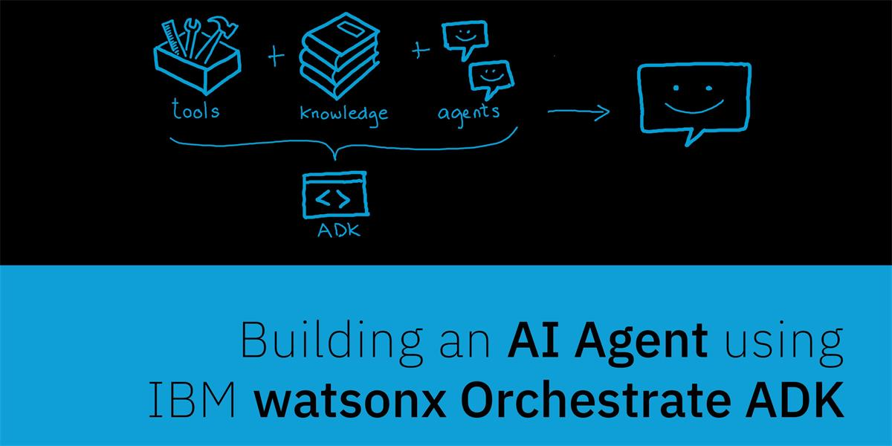

# 🧑‍💼 Bem vindo ao IBM watsonx Orchestrate Agent Development Kit 

O <b>watsonx Orchestrate Agent Development Kit (ADK)</b> é a parte do Orchestrate voltada para desenvolvedores que desejam criar <b>agente, ferramentas (tools)</b> e <b>fluxos (flows)</b> de forma prática e escalável, oferecendo um conjunto de recursos projetados para simplificar tanto a <b>criação</b> quanto a <b>implantação</b> desses componentes, garantindo integração fluida e alta interoperabilidade.

Disponível como uma biblioteca <b>Python</b> e através também de um terminal de linha de comando**, o ADK permite que equipes técnicas configurem agentes com rapidez, além de oferecer suporte à integração com ferramentas e agentes criados em outras plataformas. 

Com isso, desenvolvedores podem construir soluções personalizadas que automatizam tarefas, conectam sistemas e ampliam a capacidade de orquestração inteligente.

## 🤔 Primeiros passos 

Este guia orienta você na instalação do ADK, na configuração do seu ambiente de desenvolvimento local e na implantação do seu primeiro agente em uma instância do <b>watsonx Orchestrate SaaS.</b> Comece a criar agentes de IA flexíveis e reutilizáveis ​​imediatamente.

### 🎯 Ambiente 

Certifique-se de solicitar ao intrutor deste bootcamp um ambiente pronto com para a execução dos labs. Em outro momento você pode instalar o ADK na sua própria estação de trabalho Windows, Linux ou masOS seguindo os passos descritos na documentaçao 👉 https://developer.watson-orchestrate.ibm.com/getting_started/installing.

## 🔧 LABS 

[1. Hello Word](labs/hello-word/README.md) 
[2. Criando tools e agentes](labs/ADK%20-%20Creating%20tools%20and%20agents%20-%20Lab%20guide%20-%20V250010.PDF) 
[3. Criando tools e agentes com o copiloto](labs/ADK%20-%20Create%20and%20improve%20agents%20with%20copilot%20-%20Lab%20guide%20-%20V250910.PDF) 
[4. Colaborando agentes com python e langfuse](labs/ADK%20-%20Collaborating%20agents%20%20-%20Python%20e%20LangFuse%20-%20Lab%20guide%20-V250910.PDF) 

