# 🎛️ Laboratório do Agentic Control Plane

🚧 🚧 🚧 EM PROGRESSO 🚧 🚧 🚧 

## Visão Geral

O Agentic Control Plane oferece às empresas uma maneira centralizada de gerenciar, observar e otimizar agentes em equipes, ferramentas, modelos e runtimes, sejam eles construídos no watsonx Orchestrate ou executando em outro lugar.

Após ter visto a demonstração do seu instrutor, esperamos que agora você esteja começando a ver como as organizações podem trazer consistência, visibilidade e confiança para todo o seu ecossistema agêntico.

Neste laboratório, experimentaremos em primeira mão o Agentic Control Plane (ACP) no watsonx Orchestrate. Tenha em mente que os benefícios do ACP são mais fáceis de ver quanto mais agentes e ferramentas você tiver construído e implantado, no watsonx Orchestrate e externamente, e quanto mais você tiver interagido com eles para obter alguns dados reais.
Se neste bootcamp você está trabalhando em um tenant compartilhado do watsonx Orchestrate, você deve ser capaz de ver pelo menos vários agentes diferentes que você e outros criaram em outras partes do bootcamp. Caso contrário, se você tem seu próprio tenant dedicado do wxO, você pode ver apenas alguns agentes no dashboard do ACP. De qualquer forma, você poderá experimentar e aprender sobre os benefícios do Agentic Control Plane em primeira mão! Vamos começar!

## Pré-requisitos

Verifique com seu instrutor que você tem:
* watsonx Orchestrate (versão Agentic Control Plane)
* direitos de admin ao tenant wxO (necessário para poder acessar toda a funcionalidade do ACP)

## 🔍 Explorar o Control Plane

Agora que você e sua equipe construíram e experimentaram com vários agentes, podemos explorar o Agentic Control Plane no watsonx Orchestrate.
Vamos dar uma olhada mais de perto em como o Agentic Control Plane no watsonx Orchestrate pode ajudá-lo a governar, controlar, depurar e proteger agentes e modelos de IA.

## O Dashboard

Clique em **IBM watsonx Orchestrate** no canto superior esquerdo para voltar à tela de boas-vindas/dashboard. O dashboard é a experiência inicial do Control Plane — o ponto de partida para gerenciar seu ecossistema agêntico.

A partir daqui, as equipes podem ver rapidamente métricas-chave de desempenho e a saúde geral de seu ambiente de Agentes de IA.

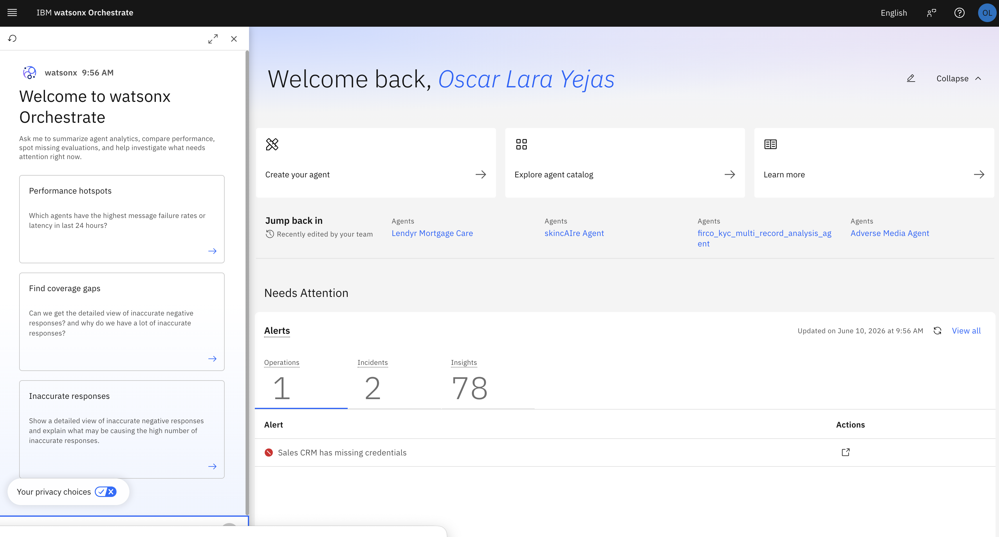

No topo, os usuários podem criar novos agentes, explorar o catálogo de agentes ou voltar ao trabalho recente:

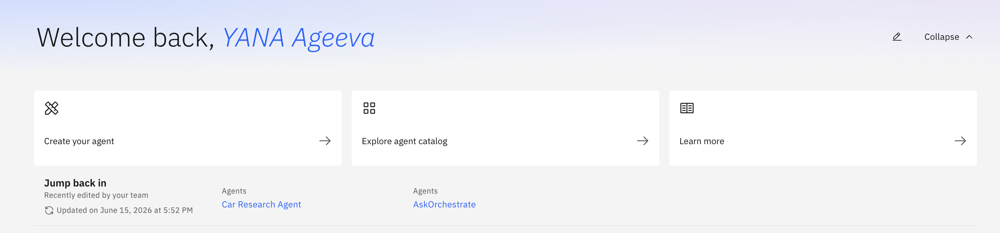

A seção **Needs Attention** destaca problemas em todo o ambiente de agentes de IA que podem requerer acompanhamento:

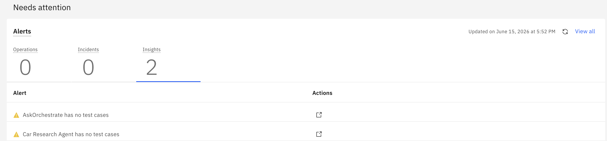

Aqui, as equipes podem monitorar alertas operacionais, incidentes e insights como credenciais ausentes, hotspots de desempenho ou lacunas de avaliação, e rapidamente investigar as ações necessárias para manter os agentes saudáveis e confiáveis.

Na seção **Platform Analytics**, você pode inspecionar resumos de modelos e controles: total de modelos, modelos em uso e controles por asset para validar cobertura de integração. Você também pode adicionar novos controles para seus modelos, agentes e ferramentas:

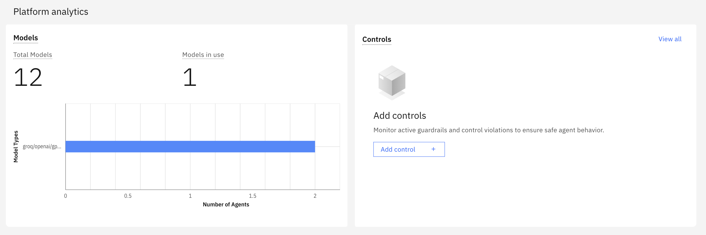

Veremos como adicionar controles [mais tarde neste laboratório](#controles-empresariais-e-de-assets)

A seção **Agent Analytics** permite revisar agentes ativos, mensagens, mensagens falhadas e métricas de latência para identificar regressões ou picos recentes:

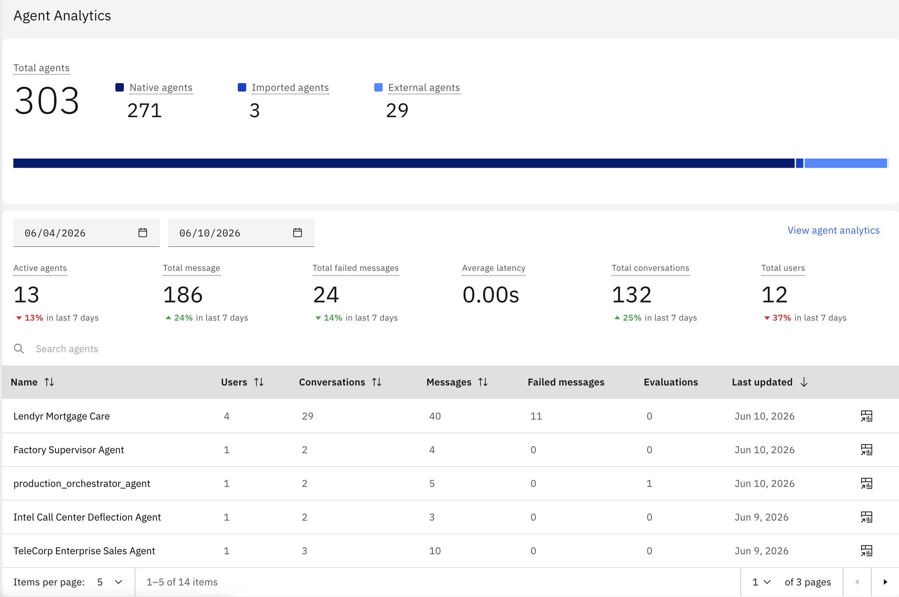

Vamos voltar à seção **Needs Attention** para ver os diferentes tipos de alertas.

## Needs Attention

Vamos ver os diferentes tipos de alertas disponíveis na seção **Needs Attention** - Operations, Incidents e Insights.

Primeiro, temos alertas de _Operations_. Estes são bloqueadores operacionais com uma correção conhecida, por exemplo, credenciais de conexão ausentes:

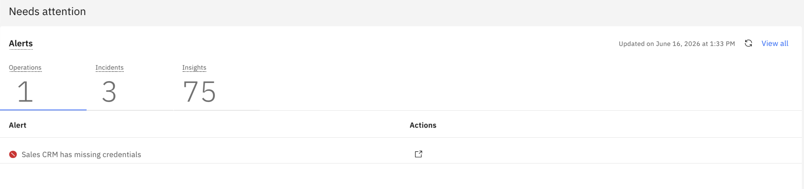

Em seguida, temos alertas de _Incidents_. Estes são alertas de produção que requerem investigação. Selecione o tile de contagem de Incidents para filtrar a lista de alertas para itens de nível de incidente:

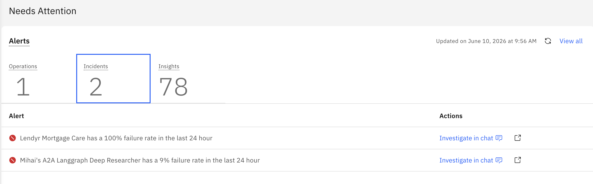

Note como a lista de alertas mudou. Agora você pode ver que temos um alerta indicando que um de nossos agentes de IA tem uma taxa de falha de 9% nas últimas 24 horas.

Em seguida, temos os alertas de _Insights_. Estas são recomendações para melhorar a qualidade e prontidão dos agentes. Clique na contagem de Insights agora para vê-los:

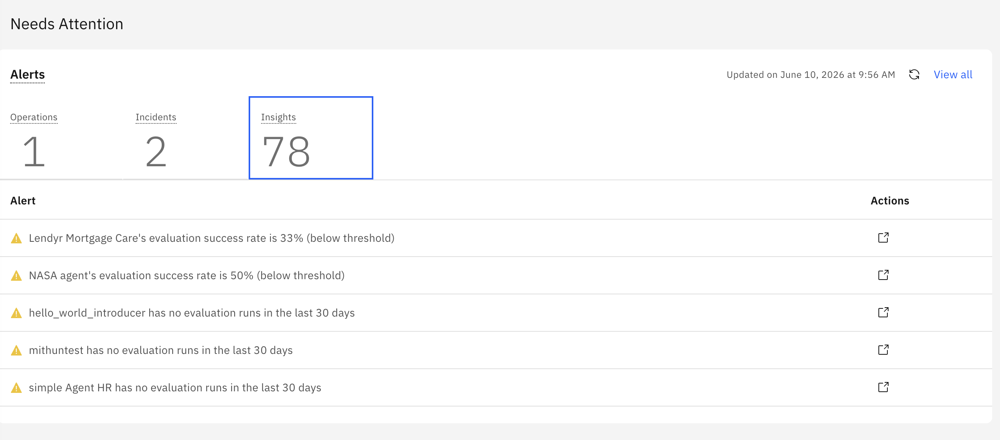

Insights ajudam você a entender causas raiz e evidências ligadas a agentes e ferramentas com falhas.

### Explorar alertas operacionais

Vamos tentar abrir um dos alertas para ver o que acontece. Selecione a métrica **Operations** para revisar avisos operacionais novamente. Se tivéssemos algum alerta de operations, eles apareceriam aqui na lista. Se você não tiver nenhum, pode criar um indo em connections e criando uma com credenciais ausentes:

**TODO**: adicionar passos para gerar um alerta de operations para credenciais ausentes

Note que o watsonx Orchestrate abriu a página de Connections onde podemos inspecionar credenciais xxx.

<!-- Um ícone vermelho no Bearer Token mostra que a conexão ainda não está configurada nos ambientes Draft e Live. Isso permite que as equipes identifiquem e resolvam rapidamente o problema de conexão:

**TODO**: adicionar screenshot -->

Vamos continuar nosso tour pelo Control Plane. Clique no logo **watsonx Orchestrate** no canto superior esquerdo para voltar à tela inicial.

## Agent Analytics

Da seção **Agent Analytics**, as equipes podem passar de insights de nível de ambiente para investigação específica de agentes.

Esta tabela mostra métricas-chave para cada agente, incluindo usuários, conversas, mensagens, mensagens falhadas, avaliações e data da última atualização.

A partir desta tabela, as equipes podem investigar qualquer agente para uma análise mais profunda.

Se você selecionar um agente específico, pode abrir a visualização do agent builder e inspecionar sua configuração. Ao fazer isso, passamos de insights do Control Plane para o próprio agente. Aqui, podemos explorar seu modelo, instruções, ferramentas e comportamento para investigar problemas mais profundamente, conectando sinais à ação. Volte ao dashboard do Control Plane **watsonx Orchestrate**.

De volta em **Agent Analytics**, clique no ícone de analytics para uma linha de agente específica para abrir a página de analytics detalhada daquele agente e passar de visualizações de nível de plataforma para diagnósticos de nível de agente.

Na página **Agent Analytics**, você pode inspecionar o gráfico de tendência de uso do agente para identificar picos de volume de mensagens e falhas ao longo do tempo.

Mais abaixo na página Agent Analytics, você pode ver as classificações de feedback dos usuários para o agente em questão, bem como números de PII de Input e Output e pontuação de Toxicity.

Na seção Artifact Performance, você pode ver os números de uso das ferramentas que este agente usa. Isso inclui contagem de uso de ferramentas, latência e taxa de falha.

Agora, vamos mudar para a aba **Conversations** para ver uma lista das sessões do agente com usuários em produção; é aqui que analytics encontram evidências para que você possa examinar trocas exatas de usuários.

Nesta tela, você pode ver uma lista das interações do agente com usuários. Vamos clicar em um thread de conversa da coluna esquerda para carregar a transcrição, metadados e identificadores de usuário daquela sessão.

Quando você seleciona uma conversa da lista, pode ver seus detalhes no lado direito da tela, incluindo o ID da conversa, o ID do usuário que teve esta conversa com o agente, quando a conversa começou, entre outras informações.

Você pode inspecionar a resposta do agente e clicar no ícone de debug ao lado da resposta para abrir a **visualização de Debug** e rastrear o caminho de execução tomado para esta conversa:

**TODO** inserir screenshot

### Depurando agentes

Esta é a visualização de Debug. Aqui, podemos revisar a topologia do Agente e a linha do tempo de execução lado a lado.

No lado direito, podemos ver cada passo da conversa que estamos depurando atualmente. Vamos tentar clicar no passo de raciocínio do Agente.

Note que dois nós na topologia do agente estão destacados.
Isso mostra quais componentes estão ativamente envolvidos neste passo da conversa, facilitando rastrear como o agente está raciocinando, roteando e usando suas ferramentas e conhecimento.

Selecione outro passo de conversa para ver a topologia atualizar.

O nó da ferramenta xxx agora está destacado.

Isso ajuda as equipes a identificar rapidamente qual componente do agente foi usado durante cada passo, facilitando entender o fluxo do agente e identificar onde investigar ao depurar o comportamento do agente.

A aba Summary mostra detalhes-chave para o passo de conversa selecionado.

Aqui, você pode revisar a requisição de entrada, resposta de saída e resultados de teste para este passo, facilitando entender o que aconteceu e validar se o agente se comportou como esperado.

Agora, clique na aba input.

A **aba Input** mostra os dados passados para o passo selecionado.

Aqui, as equipes podem revisar a requisição, profundidade do agente, flags de execução e outros detalhes de entrada para entender o contexto que o agente usou para invocar a ferramenta para este passo.

A **aba Output** mostra a saída do passo selecionado.

Você pode usá-la para confirmar que a ferramenta produziu a resposta esperada. Isso ajuda as equipes a validar a qualidade dos dados e identificar rapidamente onde um problema pode ter ocorrido.

Finalmente, clique na aba Node Logs.

A **aba Node logs** mostra os detalhes de execução para o passo selecionado, incluindo dados de nível de trace e metadados.
Use-a para solucionar problemas, validar caminhos de orquestração e entender como o passo se encaixa na execução geral.

A seção **About** mostra detalhes-chave para o componente selecionado, incluindo seu propósito e informações de execução como duração e comportamento assíncrono.

Se você gostaria de experimentar depurar um problema real e ver o painel de Debug em ação, pode seguir [o laboratório de debugging](link_here)

Vamos fechar a visualização de **Debug** e retornar à lista de conversas do agente.

### Agent Chat / Analytics - Aprenda como seus agentes e workflows estão performando.

Clique no breadcrumb **Analytics** para navegar para a página de analytics mais ampla do agente.

A página **Analytics** fornece uma visão ampla da atividade de agentes em todo o ambiente.
Ela ajuda as equipes a comparar uso, feedback, falhas e desempenho entre agentes para identificar tendências e áreas que precisam de atenção.

Clique no logo *watsonx Orchestrate* no canto superior esquerdo para retornar à página inicial do Control Plane.

## Agente de IA do Control Plane

O Control Plane inclui um Agente de IA adaptado ao seu ambiente de agentes.
As equipes podem fazer perguntas em linguagem natural para entender rapidamente desempenho, falhas e tendências.

Vamos pedir ao Agente para encontrar os agentes com baixas taxas de sucesso para esta semana:

**TODO**: mostrar screenshot

Em vez de comparar manualmente dados de desempenho entre agentes, as equipes podem usar linguagem natural para destacar os agentes que podem precisar de atenção.

O Agente converte perguntas em insights visuais, destacando baixas taxas de sucesso e tendências-chave para investigar.

Esse é o poder do Agente de IA do Control Plane no watsonx Orchestrate.

## Controles Empresariais e de Assets

Controles ajudam a aplicar regras que governam como seus agentes, modelos e ferramentas MCP se comportam. Eles podem ser aplicados no nível de asset para agentes, modelos e ferramentas MCP, ou no nível empresarial, afetando toda a instância através de políticas, salvaguardas e comportamentos de plataforma que suportam operação confiável e em conformidade.

Você pode adicionar novos controles diretamente do dashboard. Vá para a seção **Platform Analytics** e clique em **Add control** sob **Controls**:

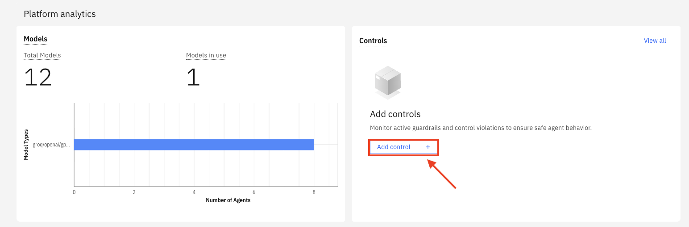

### Asset Controls

Primeiro vamos explorar asset controls. Eles podem ser aplicados a modelos, agentes e ferramentas MCP. Primeiro, você cria um controle, depois atribui os assets certos (por exemplo, agentes ou modelos) a ele. Vamos ver isso em ação!

Clique em **Create Control**:

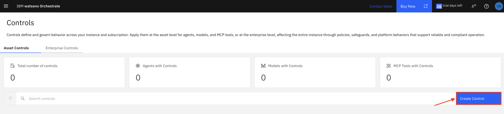

Vamos focar em controles de agentes aqui, mas para completude, dê uma rápida olhada nos controles disponíveis para modelos:

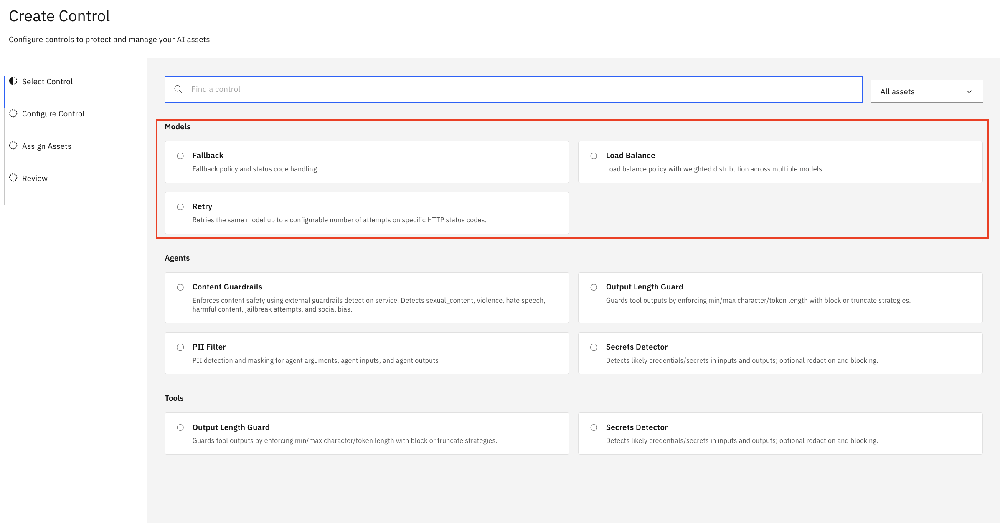

Sinta-se à vontade para clicar em qualquer um destes e explorar mais (você sempre pode cancelar e voltar).

Models
Fallback, retry, load balance

- Mostrar como criar e usar um controle de fallback de modelo:

Agents

- Content guardrails
- PII filter

Outros controles disponíveis para agentes: output length guard e secrets detector

Controles também estão disponíveis para ferramentas - output length guard e secrets detector.

### Enterprise Controls

Há vários enterprise controls disponíveis. Não os cobriremos em detalhe neste laboratório, mas você pode dar uma rápida olhada para ver o que está disponível!

Primeiro, clique em **Enterprise Controls** e revise os diferentes tipos de enterprise controls disponíveis:

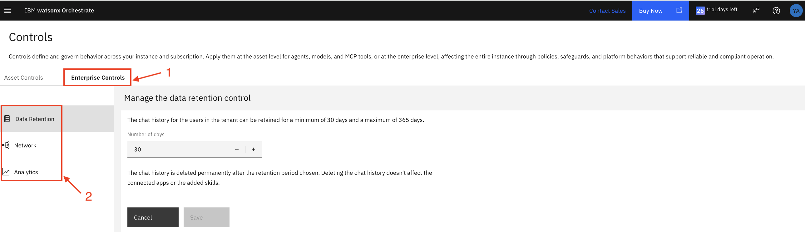

**Data retention** O controle de retenção de dados permite gerenciar a retenção de dados especificando por quanto tempo o histórico de chat para usuários neste tenant wxO deve ser retido (padrão é 30 dias), após o qual será automaticamente deletado. Note que todo histórico de chat será deletado após 365 dias.

**Network** Você pode definir acesso de rede especificando quais endereços IP podem alcançar seu sistema (restrições de rede de entrada) e quais destinos externos seu sistema pode conectar (restrições de rede de saída).

**Analytics** Este enterprise control ajuda você a gerenciar como analytics é coletado e mostrado para seu tenant em dashboards, logs ou relatórios. Essas configurações ajudam você a controlar quais informações são capturadas para que sua equipe possa obter insights úteis enquanto permanece alinhada com suas necessidades de privacidade e tratamento de dados. Você pode _Enable PII Masking_ para proteger dados potencialmente sensíveis mascarando informações pessoalmente identificáveis (PII) comuns em metadados de trace. Quando o mascaramento está habilitado, entradas de usuários e saídas de agentes permanecem visíveis, enquanto atributos sensíveis detectados, como emails e números de telefone, são mascarados antes de aparecer em dashboards, logs ou relatórios.

## Resumo

Controlar agentes de IA empresariais requer mais do que um único dashboard. Requer visibilidade, governança, observabilidade, debugging, analytics e investigação assistida por IA em todo o ambiente de agentes.

Com o Control Plane, as equipes podem passar de sinais dispersos para controle centralizado — ajudando empresas a gerenciar agentes com maior confiança, clareza e segurança em escala.

Parabéns por completar o laboratório do Agentic Control Plane!