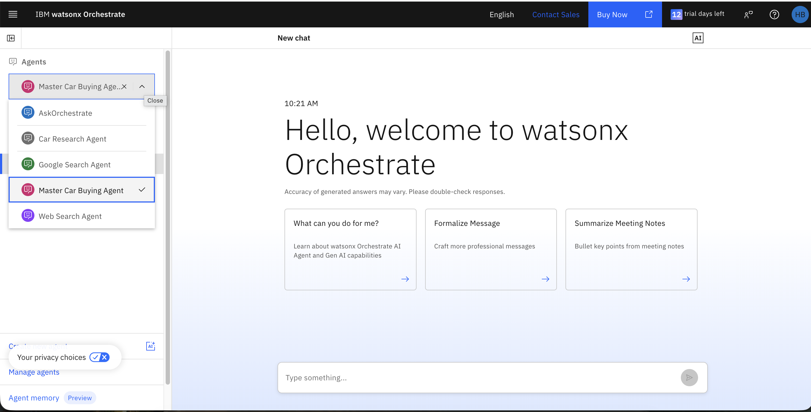
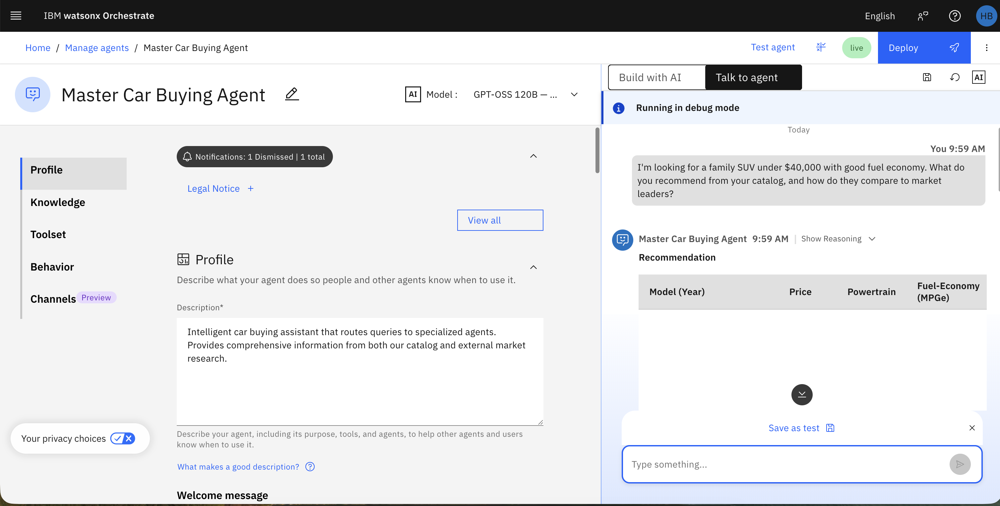
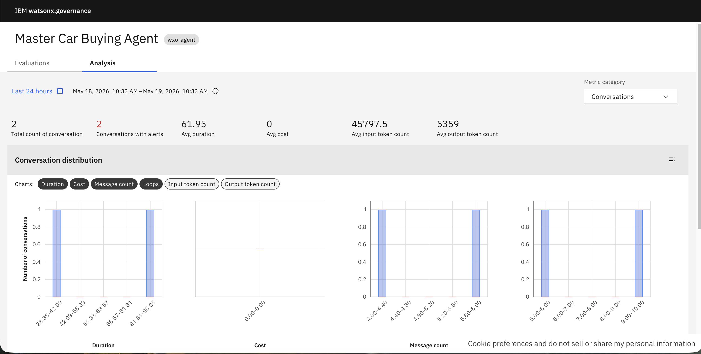
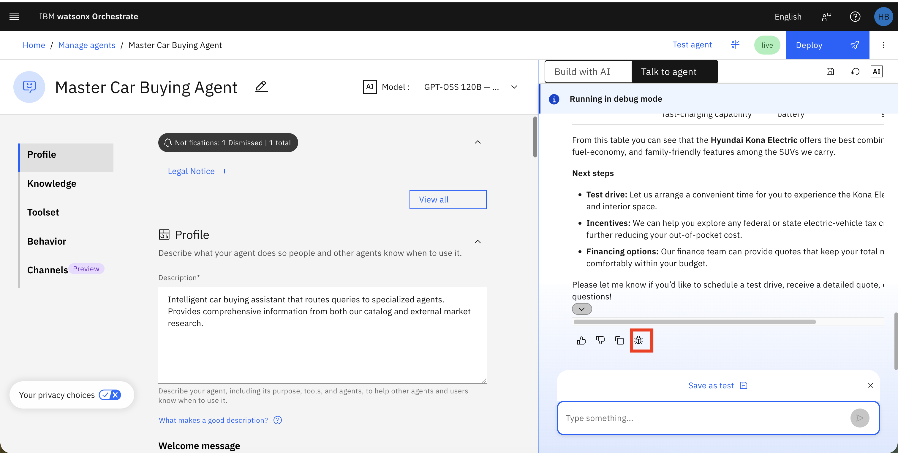
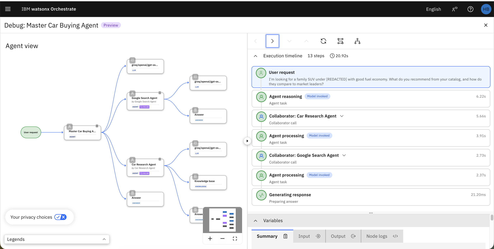
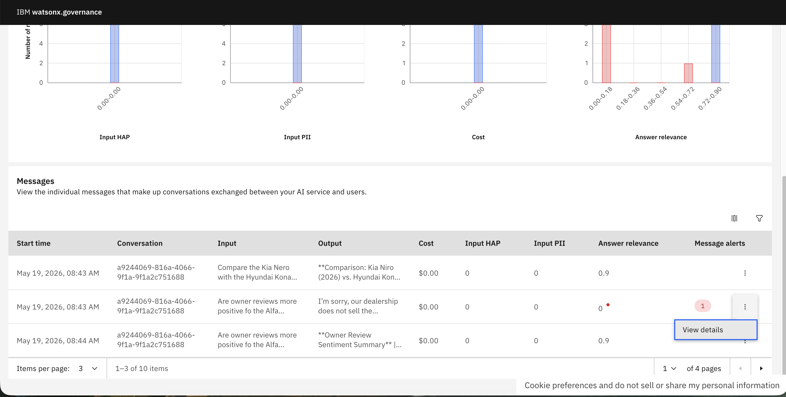

# 🐛 Laboratório Prático: Debugging de Agentes no watsonx Orchestrate

## Índice
- [Visão Geral](#visão-geral)
- [Pré-requisitos](#pré-requisitos)
- [Descrição do Caso de Uso](#descrição-do-caso-de-uso)
- [Instruções do Laboratório](#instruções-do-laboratório)
  - [Parte 1: Forçar um Erro no Agente](#parte-1-forçar-um-erro-no-agente)
  - [Parte 2: Identificar o Erro no Dashboard de Debugging](#parte-2-identificar-o-erro-no-dashboard-de-debugging)
  - [Parte 3: Investigar a Causa Raiz com a Visualização de Debug](#parte-3-investigar-a-causa-raiz-com-a-visualização-de-debug)
  - [Parte 4: Corrigir o Problema](#parte-4-corrigir-o-problema)
  - [Parte 5: Verificar a Correção](#parte-5-verificar-a-correção)
- [Parabéns!](#parabéns)

---

## Visão Geral

Este laboratório prático ensina como **depurar (debugar) agentes de IA** usando as ferramentas integradas do watsonx Orchestrate. Você aprenderá a identificar falhas de ferramentas e agentes, rastrear a causa raiz de erros e corrigi-los rapidamente usando a visualização de Debug do Control Plane.

**Objetivos de Aprendizado**:
- Entender como usar o dashboard de debugging do watsonx Orchestrate
- Identificar falhas em chamadas de ferramentas e agentes
- Rastrear o caminho de execução de uma conversa com erro
- Corrigir a configuração do agente e verificar que o problema foi resolvido

---

## Pré-requisitos

> [!IMPORTANT]
> Este laboratório requer que você já tenha completado os laboratórios anteriores e tenha os seguintes agentes criados e implantados:
> - **Dealership Support Agent** (criado no laboratório de Data Poisoning) — agente RAG com o catálogo de carros
> - **Google Search Agent** / **Web Search Agent** (criado no laboratório de Importando Agentes Externos)
> - **Master Car Buying Agent** (criado no laboratório de Importando Agentes Externos) — agente mestre que roteia para os dois acima

---

## Descrição do Caso de Uso

Imani está monitorando o **Master Car Buying Agent** em produção e recebe um alerta de que alguns usuários estão reportando respostas incorretas. O agente às vezes responde com informações sobre carros fora do catálogo ou falha ao chamar a ferramenta de busca web quando deveria. Imani precisa usar as ferramentas de debugging do watsonx Orchestrate para identificar o problema, entender a causa raiz e corrigi-lo.

---

## Instruções do Laboratório

### Parte 1: Forçar um Erro no Agente

Vamos reproduzir o problema enviando uma consulta que deve chamar o **Web Search Agent**, mas que pode falhar dependendo das instruções do agente.

1. Navegue até a interface de chat do watsonx Orchestrate clicando em **IBM watsonx Orchestrate** no canto superior esquerdo.

2. Selecione o **Master Car Buying Agent** no menu dropdown de agentes.

   

3. Envie a seguinte consulta que requer busca na web:

   ```
   O que os proprietários dizem sobre o Alfa Romeo Spider? Encontre avaliações recentes.
   ```

   

4. Observe a resposta do agente. Se o agente não chamou o **Web Search Agent** (ou retornou uma resposta genérica sem fontes externas), isso indica um problema de roteamento ou chamada de ferramenta.

   > [!TIP]
   > Uma resposta correta deve incluir avaliações reais de proprietários com URLs de fontes externas. Se o agente respondeu apenas com informações genéricas do catálogo interno, há um erro de roteamento.

---

### Parte 2: Identificar o Erro no Dashboard de Debugging

Agora vamos usar o Control Plane para identificar o erro nas conversas do agente.

1. Clique em **IBM watsonx Orchestrate** no canto superior esquerdo para voltar ao dashboard do Control Plane.

   

2. Na seção **Agent Analytics** do dashboard, localize o **Master Car Buying Agent** na tabela de agentes. Observe se há mensagens falhadas registradas.

3. Clique no ícone de **analytics** (📊) ao lado do **Master Car Buying Agent** para abrir a página de analytics detalhada do agente.

4. Na página de analytics do agente, mude para a aba **Conversations** para ver a lista de conversas recentes.

   

5. Localize a conversa da consulta que você enviou na Parte 1. Clique nela para ver os detalhes.

6. Você pode ver o ID da conversa, o ID do usuário, quando a conversa ocorreu e o conteúdo das mensagens.

7. Localize a resposta do agente e clique no **ícone de debug** (🐛) ao lado dela para abrir a visualização de Debug.

   

---

### Parte 3: Investigar a Causa Raiz com a Visualização de Debug

A visualização de Debug mostra a topologia do agente e a linha do tempo de execução lado a lado, permitindo rastrear exatamente o que aconteceu durante a conversa.

1. Na **visualização de Debug**, você verá dois painéis:
   - **Esquerda**: Topologia do agente (mostra os nós — agente mestre, sub-agentes e ferramentas)
   - **Direita**: Linha do tempo com os passos da execução

   

2. Clique no **passo de raciocínio** do agente na linha do tempo (lado direito). Observe que os nós correspondentes na topologia (lado esquerdo) ficam **destacados** — isso mostra quais componentes estavam ativos naquele momento.

3. Selecione diferentes passos na linha do tempo e observe como a topologia atualiza para mostrar o caminho de execução.

4. Para cada passo selecionado, use as abas de detalhes para investigar:

   **Aba Summary**:
   - Mostra os detalhes-chave do passo selecionado
   - Inclui a requisição de entrada, resposta de saída e resultados de teste
   - Use para entender o que aconteceu e validar se o agente se comportou como esperado

   **Aba Input**:
   - Mostra os dados passados para o passo selecionado
   - Inclui a requisição, profundidade do agente e flags de execução
   - Use para entender o contexto que o agente usou para tomar sua decisão

   **Aba Output**:
   - Mostra a saída produzida pelo passo selecionado
   - Use para confirmar se a ferramenta ou sub-agente produziu a resposta esperada
   - Ajuda a identificar onde exatamente um problema ocorreu

   **Aba Node Logs**:
   - Mostra os detalhes de execução em nível de trace
   - Inclui metadados detalhados do passo
   - Use para solucionar problemas avançados e validar caminhos de orquestração

   

5. **Identificando o problema**: Verifique se, na linha do tempo, o **Web Search Agent** (ou **Google Search Agent**) foi chamado. Se o passo de chamada ao agente de busca web **não aparecer** na linha do tempo, o problema está nas **instruções de roteamento** do agente mestre.

   > [!TIP]
   > Consulte a aba **Input** do passo de raciocínio do agente mestre para ver qual foi o raciocínio que levou o agente a não chamar o Web Search Agent. Isso revelará se o problema está nas instruções de roteamento (Behavior) ou em outra configuração.

---

### Parte 4: Corrigir o Problema

Com base na investigação da Parte 3, vamos corrigir o problema no agente.

1. Feche a visualização de Debug clicando no **X** ou navegando de volta.

2. Vá para a página de **Build** do **Master Car Buying Agent**:
   - Clique no menu hambúrguer (☰) → **Build**
   - Localize o **Master Car Buying Agent** e clique para editar

3. Na seção **Behavior**, revise as instruções de roteamento. Certifique-se de que as regras de roteamento para consultas de avaliações e pesquisa web estão claras. Se necessário, atualize as instruções para garantir que consultas sobre opiniões de proprietários sejam roteadas para o **Google Search Agent** / **Web Search Agent**:

   ```
   ROUTING RULES:

   2. EXTERNAL RESEARCH → Google Search Agent
      - "What do owners say about [catalog car]?"
      - "Find reviews for [catalog car]"
      - "Are there any recent recalls for [catalog car]?"
      - "What are reviewers saying about [catalog car]?"
      - Any query requiring market research or user reviews for a car in our catalog
   ```

   > [!NOTE]
   > Se o problema foi identificado como falta do agente de busca na seção **Agents** do agente mestre, você precisará adicioná-lo novamente conforme descrito no laboratório de Importando Agentes Externos.

4. Após atualizar as instruções, clique em **Save** (ou **Deploy** para atualizar o agente em produção).

---

### Parte 5: Verificar a Correção

Agora vamos verificar que a correção funcionou enviando a mesma consulta e conferindo a resposta.

1. Volte para a interface de chat clicando em **IBM watsonx Orchestrate** no canto superior esquerdo.

2. Selecione o **Master Car Buying Agent** e inicie uma nova conversa.

3. Envie novamente a consulta da Parte 1:

   ```
   O que os proprietários dizem sobre o Alfa Romeo Spider? Encontre avaliações recentes.
   ```

4. Desta vez, o agente deve:
   - Reconhecer que a consulta é sobre avaliações de proprietários
   - Chamar o **Web Search Agent** para buscar informações externas
   - Retornar uma resposta com fontes externas e URLs citadas

5. Para confirmar, você pode voltar ao dashboard do Control Plane e verificar a nova conversa na aba **Conversations** do **Master Car Buying Agent** — desta vez, a linha do tempo de debug deve mostrar a chamada ao **Web Search Agent**.

---

## Próximos Passos

Parabéns! 🎉

Você completou com sucesso o laboratório de Debugging! Agora você sabe como:

- ✅ **Identificar** falhas de agentes e ferramentas usando o dashboard do Control Plane
- ✅ **Rastrear** a causa raiz de um problema usando a visualização de Debug com topologia + linha do tempo
- ✅ **Investigar** detalhes de cada passo de execução (input, output, logs)
- ✅ **Corrigir** a configuração do agente para resolver o problema
- ✅ **Verificar** que a correção foi eficaz

**Próximos Passos**:

- Use o debugging regularmente durante o desenvolvimento para identificar problemas antes da produção
- Configure alertas no Control Plane para ser notificado automaticamente quando agentes falharem
- Combine debugging com avaliação automática (Lab 6) para um ciclo completo de qualidade

<b>➜</b> 
