# Adicionando Agentes Externos

## Visão Geral

Este guia de laboratório orienta você no processo de integração de agentes externos ao seu ambiente watsonx Orchestrate. Você aprenderá como conectar um agente LangGraph de terceiros que realiza buscas no Google, criar um agente orquestrador mestre para rotear consultas de forma inteligente e testar o sistema multi-agente completo. Ao final deste laboratório, você terá um assistente de compra de carros totalmente funcional que combina informações do catálogo com pesquisa web em tempo real.

> [!NOTE]
> **Pré-requisito:** Este laboratório assume que você já completou o laboratório **Data Poisoning** e criou o **Dealership Support Agent** com a base de conhecimento do catálogo de veículos. O agente criado naquele laboratório será usado aqui como o agente de pesquisa do catálogo (Car Research Agent).

## Índice

- [Adicionando Agentes Externos](#adicionando-agentes-externos)
  - [Visão Geral](#visão-geral)
  - [Índice](#índice)
- [Adicionando Agentes Externos](#adicionando-agentes-externos-1)
    - [Parte 1: Conectar Agente de Busca Google de Terceiros](#parte-1-conectar-agente-de-busca-google-de-terceiros)
    - [Parte 2: Criar Agente Mestre de Compra de Carros](#parte-2-criar-agente-mestre-de-compra-de-carros)
    - [Parte 3: Testar Seus Agentes](#parte-3-testar-seus-agentes)

---

# Adicionando Agentes Externos

### Parte 1: Conectar Agente de Busca Google de Terceiros

Agora vamos conectar o agente LangGraph externo que realiza buscas no Google por informações sobre carros, avaliações e dados de mercado.

> [!TIP]
> Este agente usa o protocolo Agent-to-Agent (A2A) para se comunicar com o watsonx Orchestrate. O instrutor já implantou este agente para você.

1. Na página inicial do watsonx Orchestrate, clique no card **Create your agent**.

   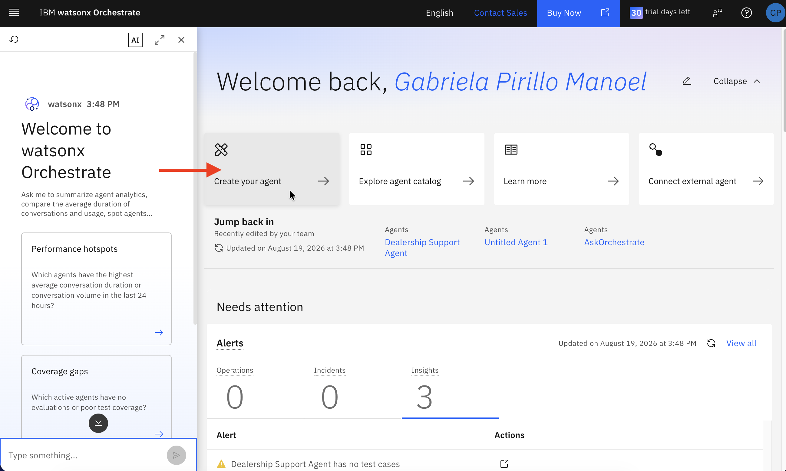

2. Selecione **Create from scratch** e preencha o Nome e a Descrição do agente.

   **Name**:
   ```
   Google Search Agent
   ```
   
   **Description**:
   ```
   This agent searches Google for real-time information such as user reviews, ratings, and market comparisons, but only for cars that are in our catalog. It should not provide information for vehicles not sold by our dealership.
   ```
   > *Este agente pesquisa no Google informações em tempo real, como avaliações de usuários, classificações e comparações de mercado, mas apenas para carros que estão em nosso catálogo. Não deve fornecer informações sobre veículos não vendidos pela nossa concessionária.*

   > [!NOTE]
   > O **Name** e a **Description** do agente são mantidos em inglês. Eles são usados pelo agente mestre para tomar decisões de roteamento — manter em inglês garante consistência e precisão na orquestração multi-agente.

   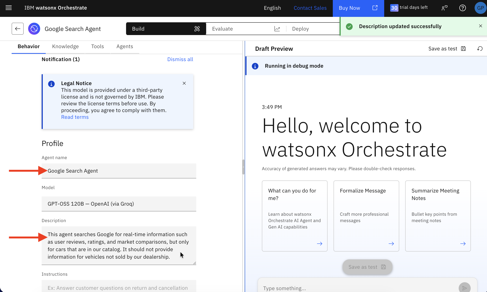

3. Na aba **Agents**, clique no botão **Add Agents**.

   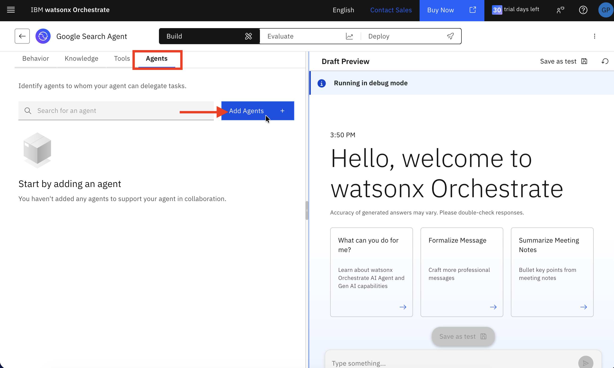

4. Na janela **Add Agents**, selecione **Import**.

   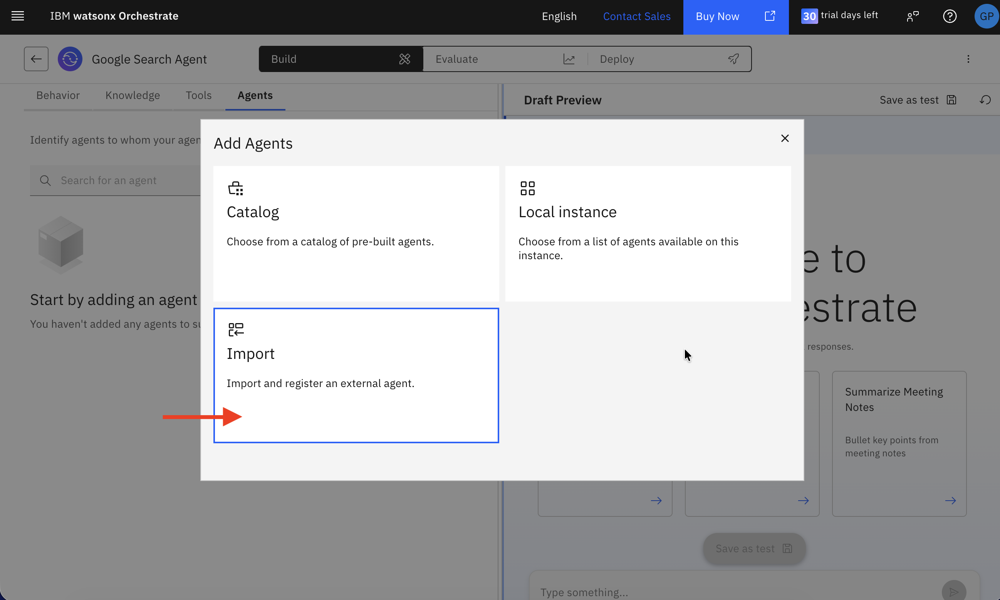

5. Selecione **External agent** como o tipo de agente e clique em **Next**.

   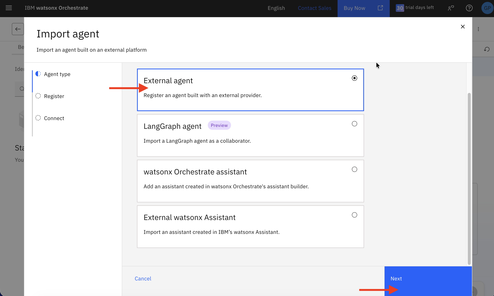

6. Em **Register**, preencha os detalhes de conexão fornecidos pelo seu instrutor:

   **External protocol**: Selecione **External agent via A2A standard**

   **A2A protocol version**: `0.3.0`

   **External agent's URL**: (Obtenha do instrutor)

   Role para baixo até a seção **Define new agent** e preencha os detalhes:

   **Display name**:
   ```
   Web Search Agent
   ```

   **Description of agent capabilities**:
   ```
   This agent connects to the Tavily service to perform a web search and return the top results.
   ```
   > *Este agente se conecta ao serviço Tavily para realizar uma busca na web e retornar os principais resultados.*

   > [!NOTE]
   > O **Display name** e a **Description** do agente importado são mantidos em inglês, pois identificam o agente dentro do sistema multi-agente.

   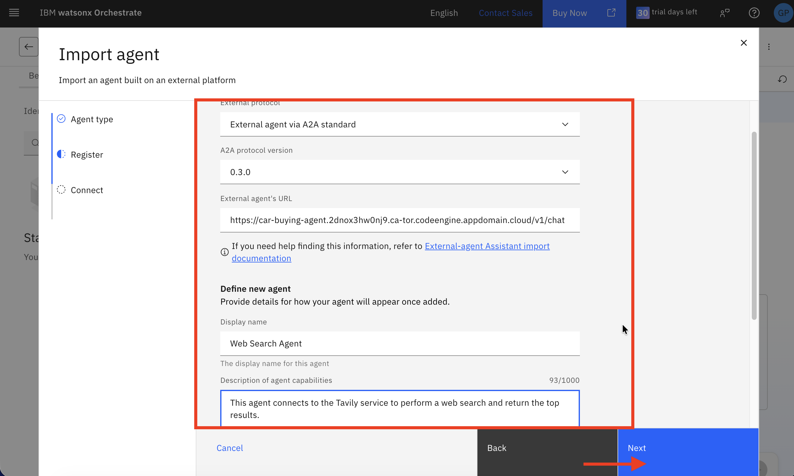

   Clique em **Next**.

7. Em **Connect**, você verá que ainda não há nenhuma conexão A2A configurada. Clique em **Add connection**.

   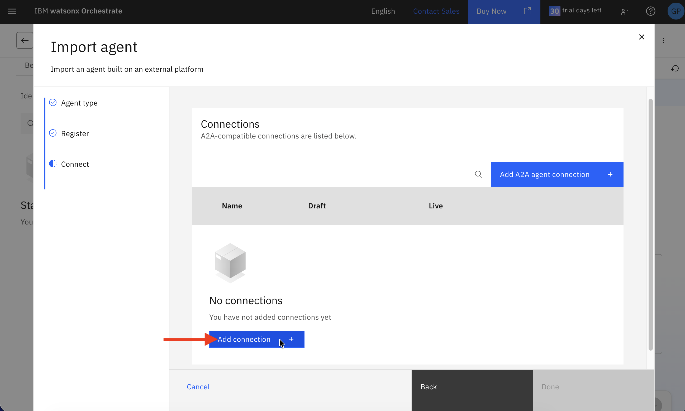

8. Preencha o **Connection ID** para identificar esta conexão:

   ```
   web-search-agent
   ```

   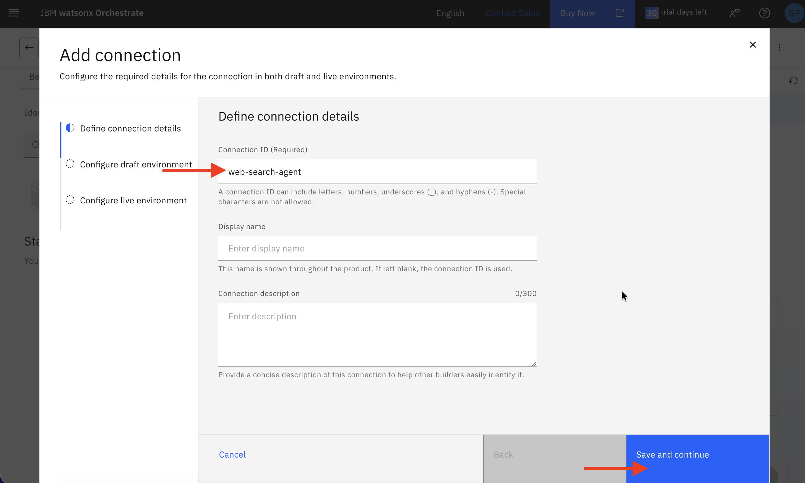

   Clique em **Save and continue**.

9. Uma janela de confirmação irá avisar que, uma vez adicionada, a conexão não pode ser renomeada ou excluída. Clique em **Continue**.

   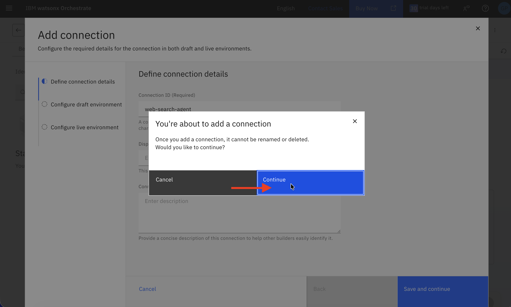

10. Em **Configure draft environment**, selecione **Authentication type**: **API Key**.

    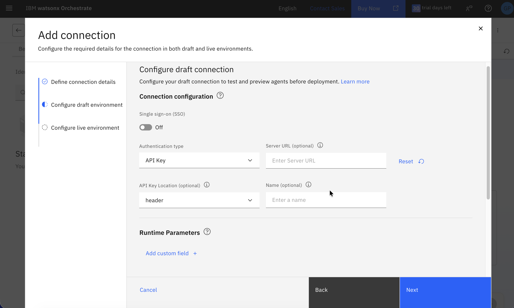

11. Role para baixo até **Credential type**, selecione **Team credentials** e cole a **API Key** fornecida pelo seu instrutor. Clique em **Next**.

    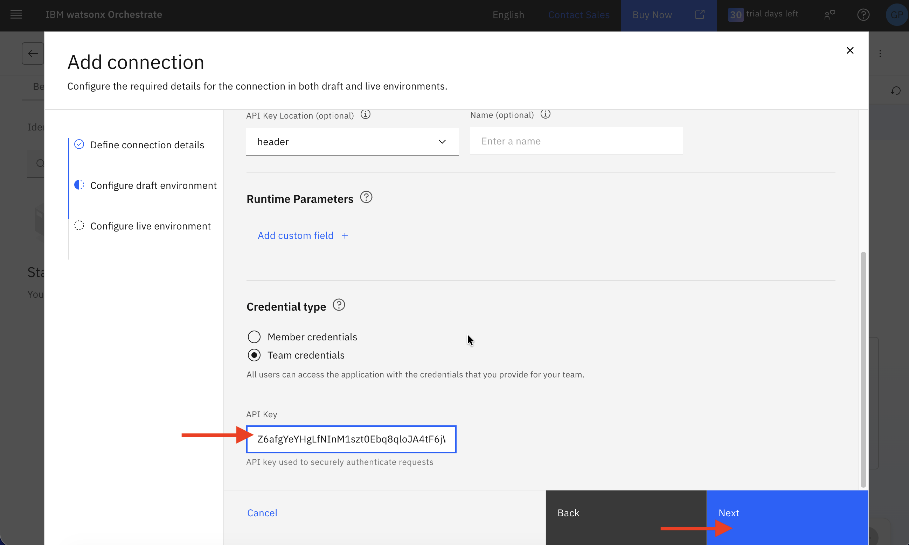

12. Em **Configure live environment**, clique em **Paste draft configuration** para reutilizar a mesma configuração no ambiente live. Clique em **Finish**.

    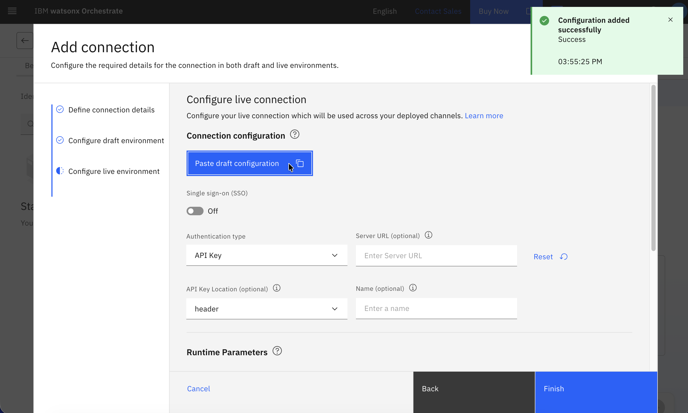

13. A conexão **web-search-agent** aparecerá na lista com autenticação **API Key** configurada tanto para **Draft** quanto para **Live**. Clique em **Done**.

    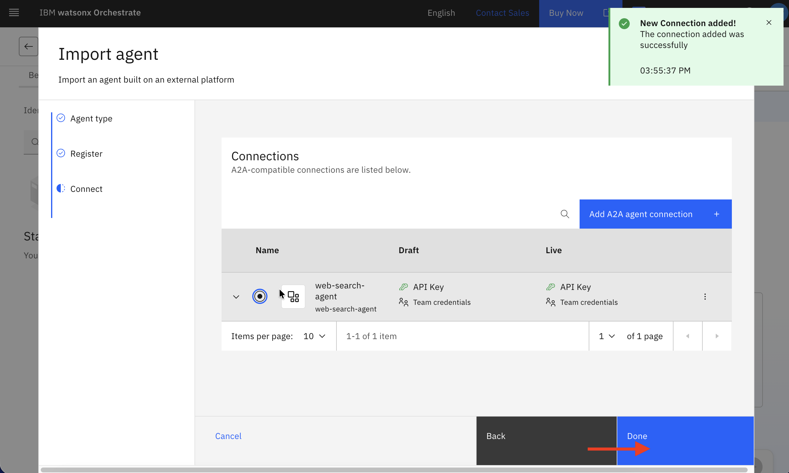

14. De volta à aba **Agents** do **Google Search Agent**, o **Web Search Agent** agora aparece como colaborador.

    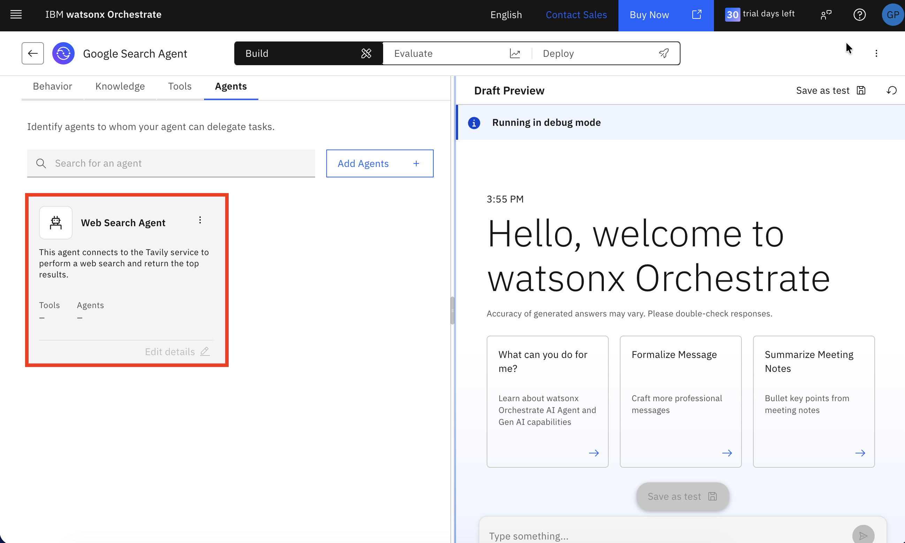

15. Na aba **Behavior**, adicione as seguintes instruções:

    ```
    You are a car research specialist with access to real-time Google Search. You may use Google Search only for cars that are in our catalog.

    1. User reviews and ratings for cars in our catalog: Search for owner experiences, common complaints, and satisfaction ratings.

    2. Market comparisons for cars in our catalog: Find competitive information and industry reviews when the question is about one of our catalog vehicles.

    3. Latest information for cars in our catalog: Search for recent news, recalls, or updates about specific catalog models.

    4. The vehicles in the catalog are: Nissan Versa, Hyundai Kona Electric, Alfa Romeo Spider, Porsche 911 Carrera GTS, and Kia Nero. If the user asks about a vehicle that is not in our catalog, do not search the web. Respond with:
    "I'm sorry, our dealership does not sell that car, so I can't provide information on that vehicle."

    Always provide the source URLs for the information you find. Format search results clearly with:
    - Title of the source
    - Key information or summary
    - Source URL

    If search returns no results for a catalog vehicle, inform the user and suggest alternative search terms.
    ```

    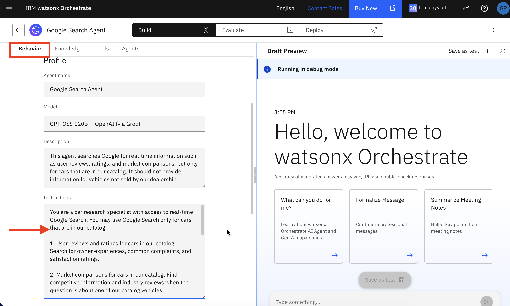

16. Teste o agente com estas consultas:

    ```
    O que os proprietários dizem sobre o Porsche 911?
    ```

    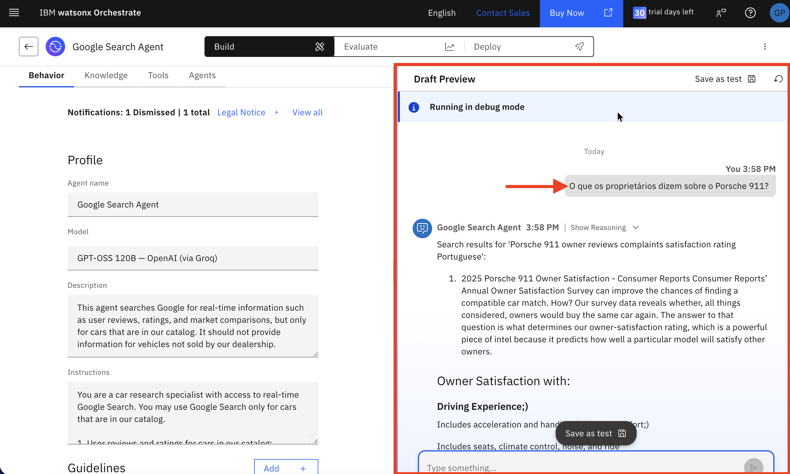

    ```
    Encontre avaliações de usuários para o Toyota Camry
    ```

    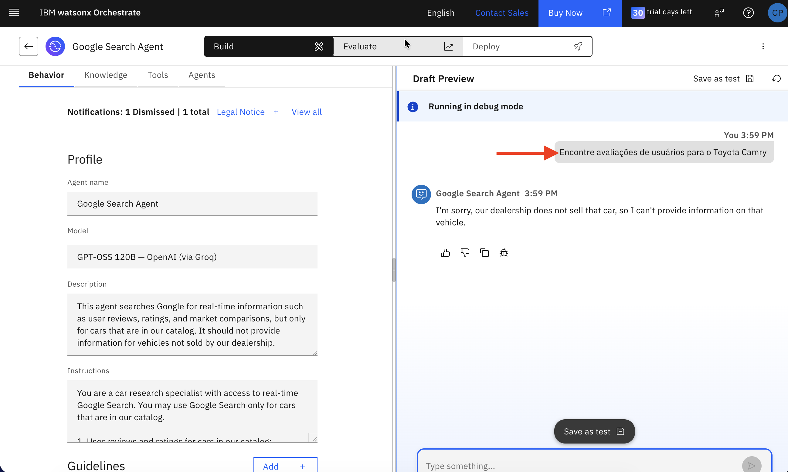

    > [!NOTE]
    > O Toyota Camry não faz parte do catálogo da concessionária, então o agente corretamente recusa a pesquisa e informa que não vende esse veículo.

### Parte 2: Criar Agente Mestre de Compra de Carros

Agora vamos criar um agente orquestrador que roteia consultas de forma inteligente para o agente especializado apropriado.

1. Na página inicial do watsonx Orchestrate, clique no card **Create your agent**.

   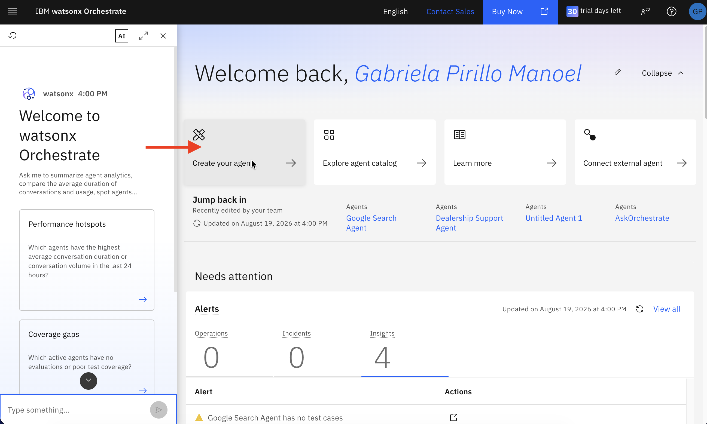

   Clique no botão **Create from scratch**.

   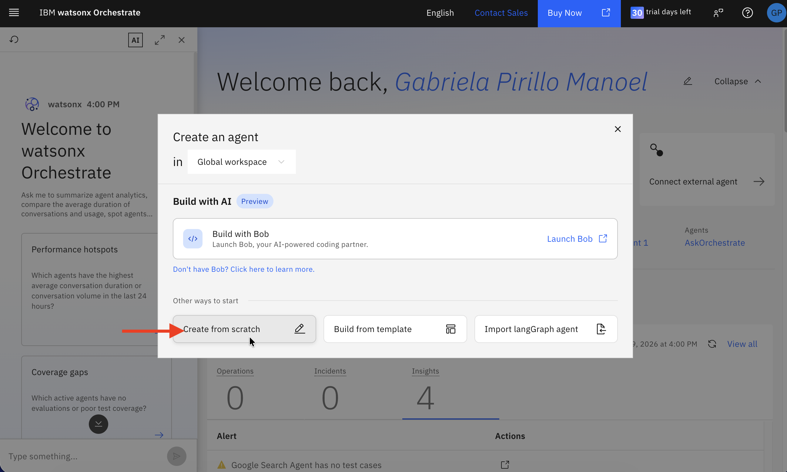

2. Digite os seguintes detalhes

   **Name**:
   ```
   Master Car Buying Agent
   ```
   
   **Description**:
   ```
   Intelligent car buying assistant that routes queries to specialized agents. Provides comprehensive information from both our catalog and external market research.
   ```
   > *Assistente inteligente de compra de carros que roteia consultas para agentes especializados. Fornece informações abrangentes tanto do nosso catálogo quanto de pesquisas externas de mercado.*

   > [!NOTE]
   > O **Name** e a **Description** do agente mestre são mantidos em inglês. As instruções de **Behavior** também permanecem em inglês para garantir que a lógica de roteamento funcione de forma confiável.

   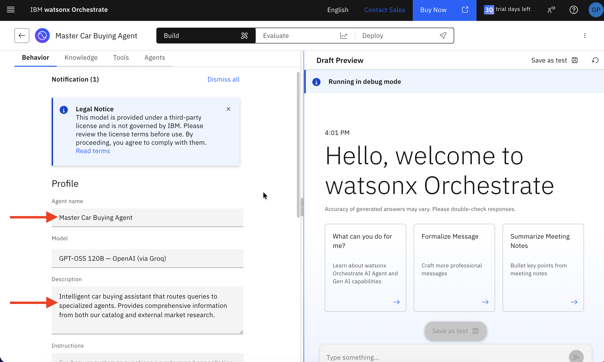

3. Na aba **Agents**, clique no botão **Add Agents** e selecione **Local instance**.

   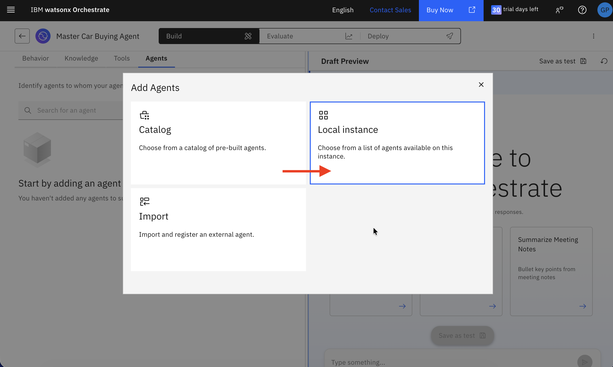

4. Selecione tanto o **Dealership Support Agent** (criado no laboratório de Data Poisoning — este é o agente de pesquisa do catálogo de carros) quanto o **Google Search Agent** (criado na Parte 1 acima), depois clique em **Add to agent**.

   > [!NOTE]
   > O **Dealership Support Agent** foi criado no laboratório anterior (Data Poisoning) e possui a base de conhecimento com o catálogo de veículos da ABC Dealership. Ele atuará como o agente especializado em pesquisa do catálogo neste sistema multi-agente.

   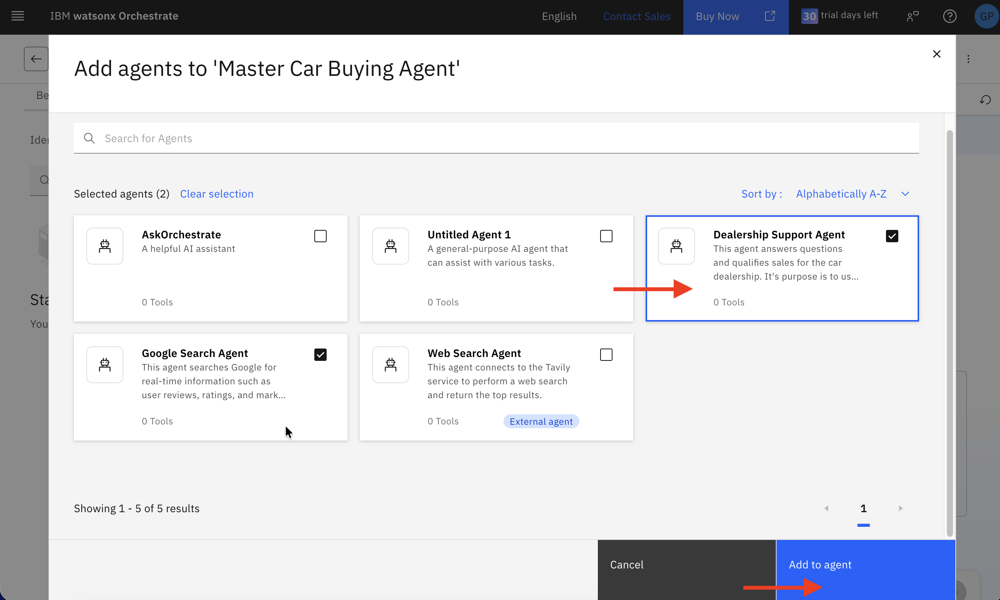

5. Na seção **Behavior**, adicione a seguinte lógica de roteamento:

    ```
    You are the Master Car Buying Assistant. Your role is to route user queries to the appropriate specialized agent and synthesize responses.

    ROUTING RULES:

    1. CATALOG QUERIES → Dealership Support Agent
       - "Show me your sedans/SUVs/trucks"
       - "What's the price of [car in catalog]?"
       - "Compare [catalog car] and [catalog car]"
       - "Give me specifications for [catalog car]"
       - Any query about cars in our inventory

    2. EXTERNAL RESEARCH → Google Search Agent
       - "What do owners say about [catalog car]?"
       - "Find reviews for [catalog car]"
       - "Are there any recent recalls for [catalog car]?"
       - "What are reviewers saying about [catalog car]?"
       - Any query requiring market research or user reviews for a car in our catalog

    3. HYBRID QUERIES → Both Agents
       - "How does [our catalog car] compare to market leaders?"
       - "What do reviewers say about [our catalog car], and what are its specs?"
       - First get catalog info, then get market research for that same catalog car, then synthesize

    4. NON-CATALOG CARS → Do not use Google Search Agent
       - If the user asks about a car that is not in our catalog, do not answer with generated details and do not search the web.
       - Respond with: "I'm sorry, our dealership does not sell that car, so I can't provide information on that vehicle."

    RESPONSE GUIDELINES:
    - The vehicles in the catalog are: Nissan Versa, Hyundai Kona Electric, Alfa Romeo Spider, Porsche 911 Carrera GTS, and Kia Nero.
    - Always determine whether the vehicle is in our catalog before routing
    - Only use Dealership Support Agent and Google Search Agent for cars in our catalog
    - Always identify which agent(s) you're using
    - For comparisons, create clear tables with all relevant features
    - Cite sources for external information
    - If a query is ambiguous, ask for clarification
    - Do not speculate about vehicles outside our catalog
    - Provide comprehensive, helpful responses for supported vehicles
    

    
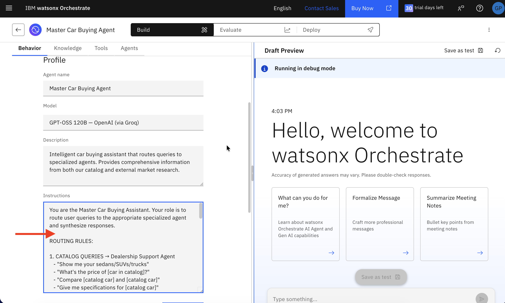

6. Teste o agente mestre com várias consultas:

    ```
    Compare o Kia Nero com o Hyundai Kona Electric
    ```

    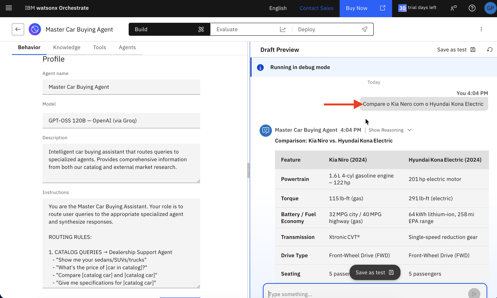

    ```
    As avaliações dos proprietários são mais positivas para o Alfa Romeo Spider ou para o Porsche 911?
    ```

    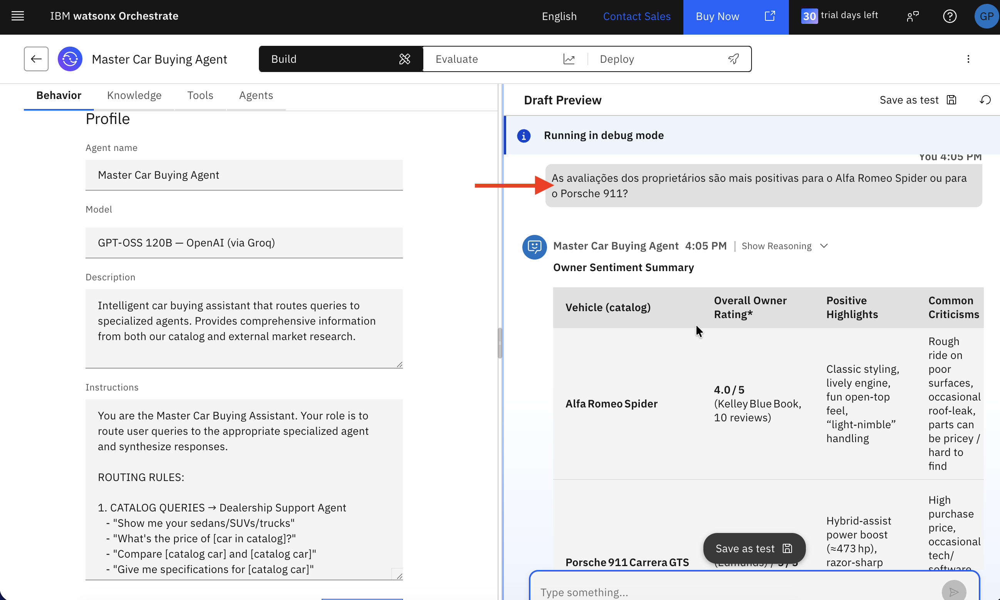

    ```
    Mostre-me avaliações de usuários para o Tesla Model Y
    ```

    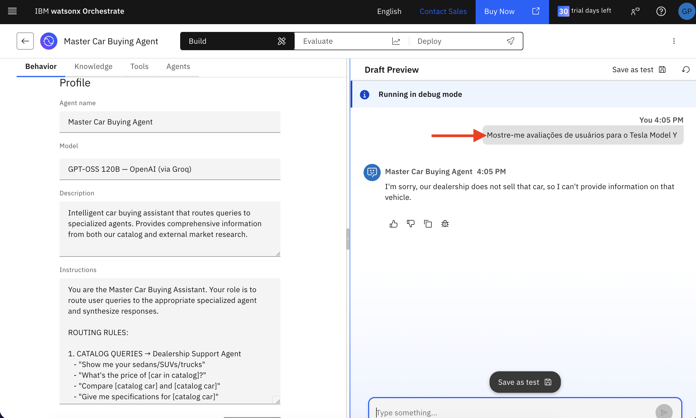

7. Clique em **Deploy** e depois em **Deploy to Live** para tornar o agente ativo.

    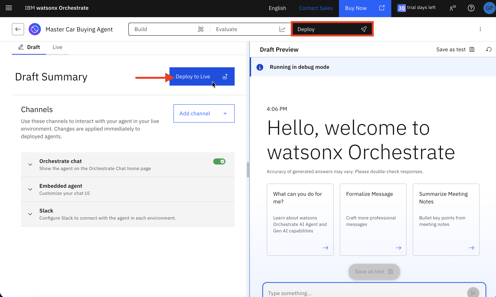

    Revise o resumo de pré-implantação, incluindo as conexões que serão levadas para o ambiente live, e clique em **Deploy**.

    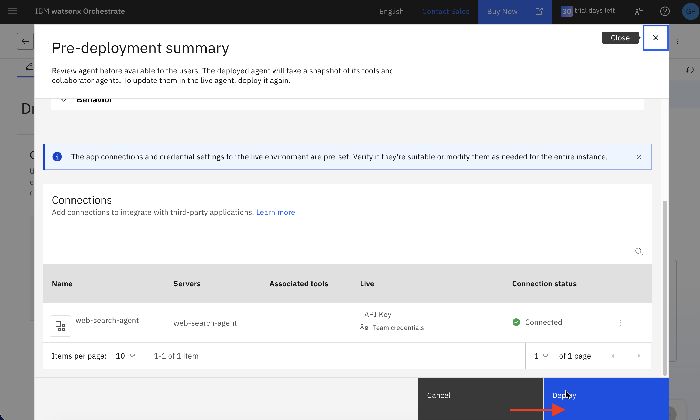

    Seu agente agora está **Live**!

### Parte 3: Testar Seus Agentes

Agora vamos testar o sistema completo através da interface de chat.

1. No menu lateral esquerdo, clique em **Chat**.

   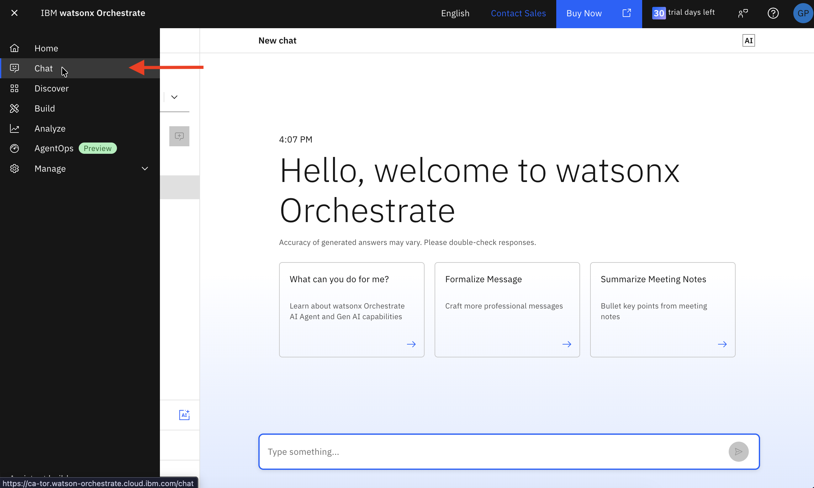

2. Selecione o **Master Car Buying Agent** no menu de agentes.

   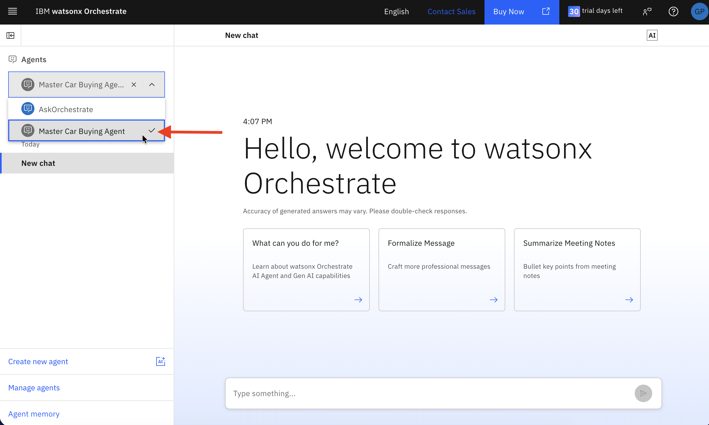

3. Experimente estes cenários de teste abrangentes:

   **Cenário 1: Pesquisa de Catálogo**
   ```
   Mostre-me todos os veículos elétricos do catálogo
   ```
   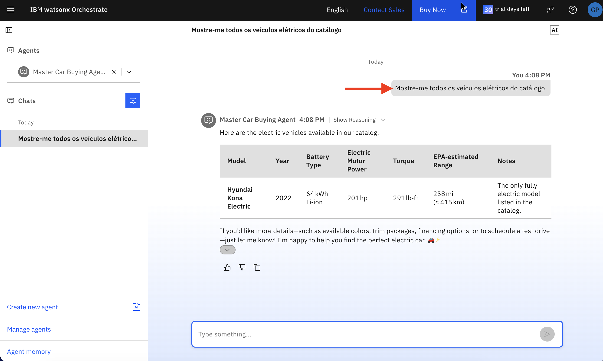

   **Cenário 2: Pesquisa Externa**
   ```
   O que os proprietários dizem sobre o Nissan Versa?
   ```
   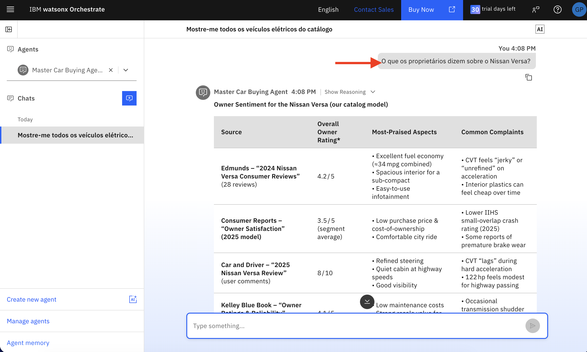
   
   ```
   O que os proprietários dizem sobre o BMW X5 2024?
   ```

   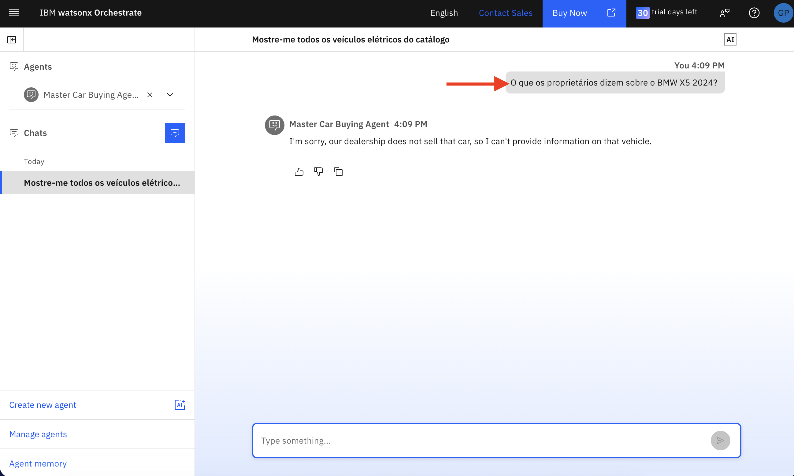


   **Cenário 3: Consulta Híbrida Catálogo + Avaliação**
   ```
   O que os avaliadores dizem sobre o Porsche 911 e quais são suas especificações principais?
   ```
   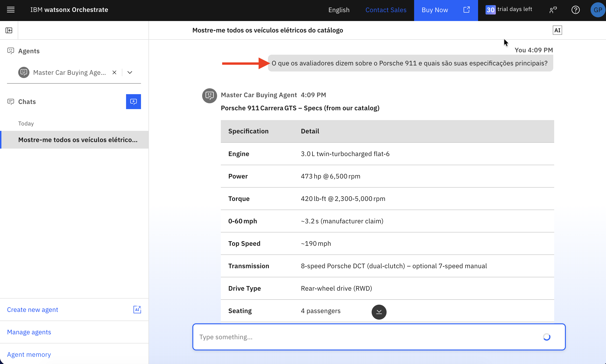

   **Cenário 4: Consulta Complexa**
   ```
   Estou procurando um SUV familiar abaixo de $40.000 com bom consumo de combustível. O que você recomenda do catálogo e como eles se comparam aos líderes de mercado?
   ```
   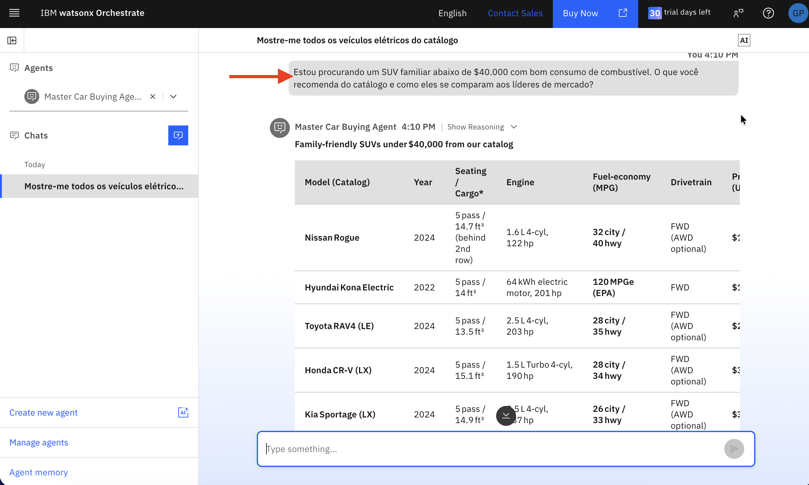

-----

<b>➜</b> Clique aqui para acessar o próximo laboratório - Proteja Contra Vazamento de PII com Controles no watsonx Orchestrate](https://github.com/bootcampwxo/bootcamp/blob/main/usecases/acp/controls/README.md)
