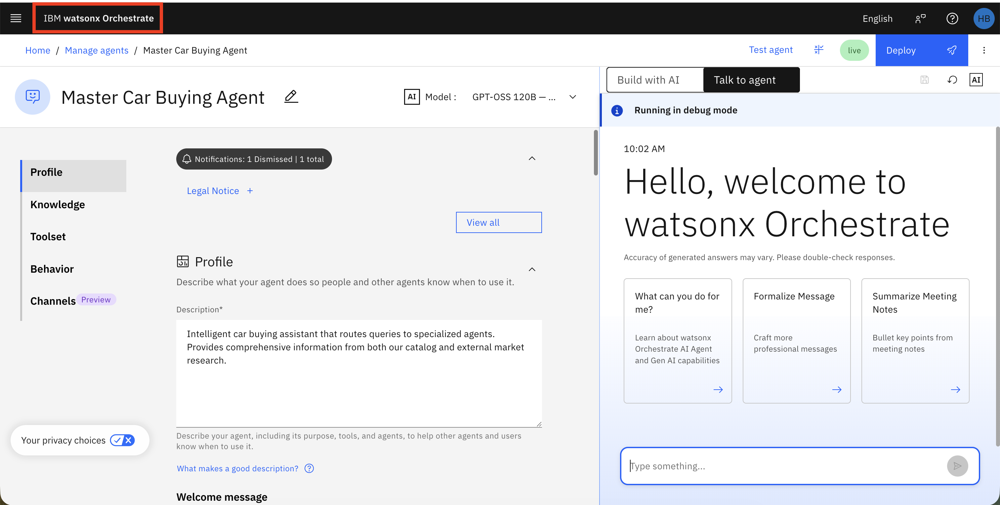
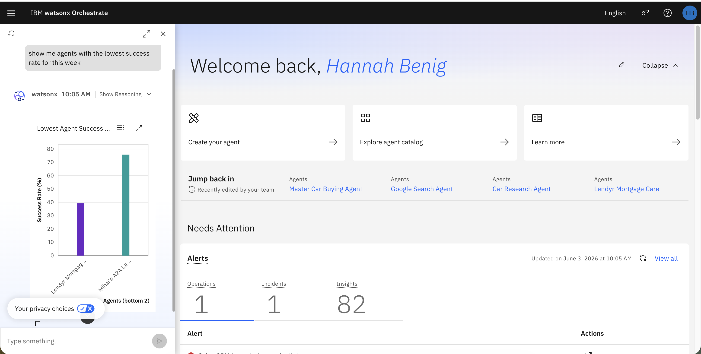
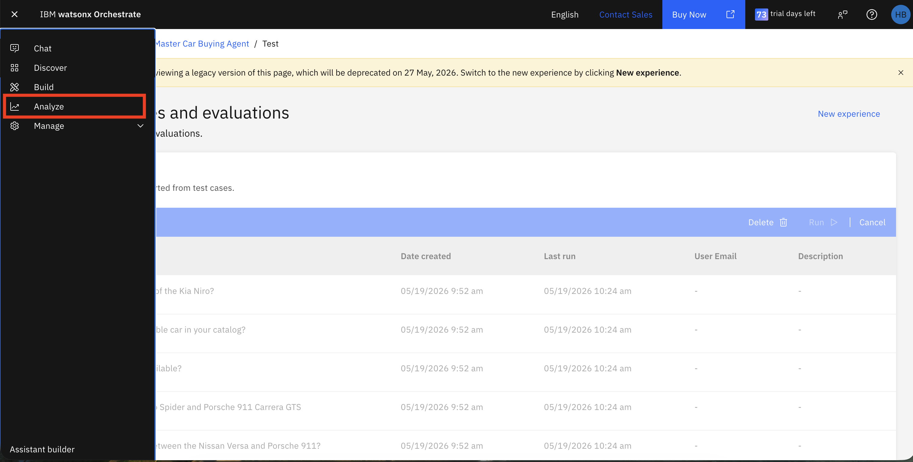
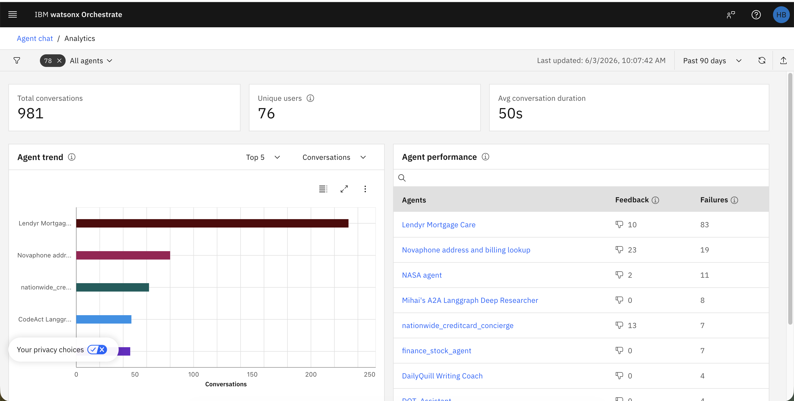
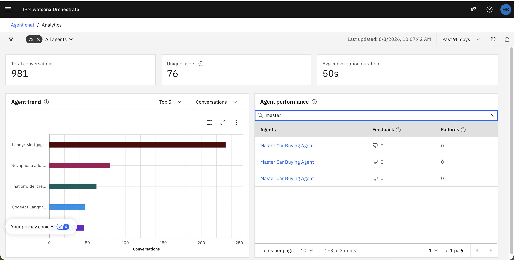
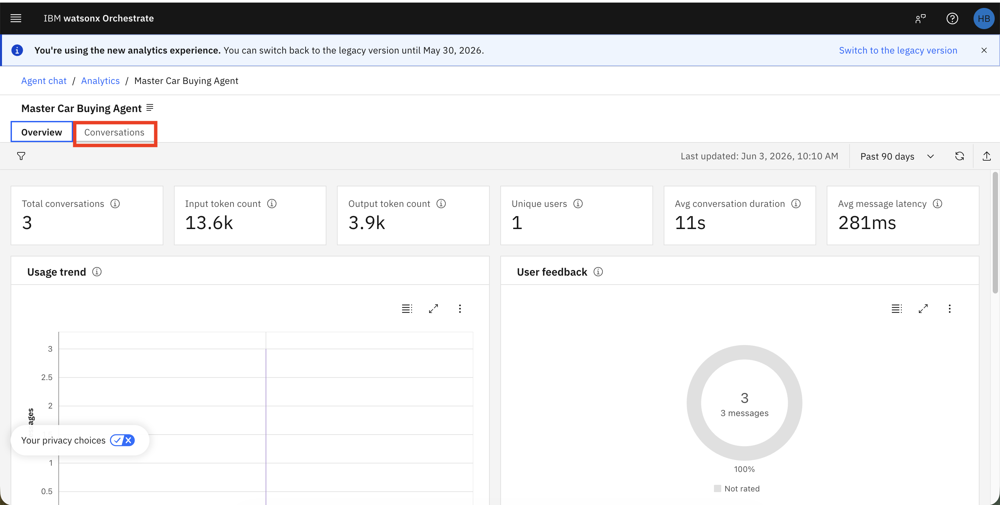
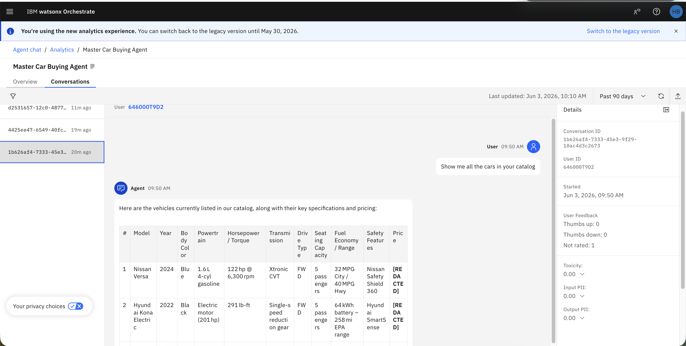

# 📊 Monitorar Agentes em Tempo Real

## Visão Geral

Este guia de laboratório apresenta as capacidades de monitoramento em tempo real no watsonx Orchestrate. Você aprenderá como rastrear o desempenho de agentes, analisar padrões de conversação e monitorar métricas-chave como taxas de sucesso, feedback de usuários e indicadores de segurança de conteúdo. O monitoramento em tempo real é crucial para manter a qualidade dos agentes em produção e identificar problemas antes que impactem os usuários.

---

## Índice

- [📊 Monitorar Agentes em Tempo Real](#-monitorar-agentes-em-tempo-real)
  - [Visão Geral](#visão-geral)
  - [Índice](#índice)
      - [Visualizar Resultados de Monitoramento](#visualizar-resultados-de-monitoramento)

---


#### Visualizar Resultados de Monitoramento

1. Já implantamos o agente e habilitamos o monitoramento. Vamos verificar o dashboard de monitoramento. Clique em **IBM watsonx Orchestrate** no canto superior esquerdo para retornar à tela de boas-vindas do control plane.

    

2. Vamos explorar as analytics de agentes usando o chat à esquerda. Faça a seguinte pergunta:

```
Mostre os agentes com a menor taxa de sucesso desta semana
```

   

3. Em seguida, vamos explorar Platform e Agent Analytics. Selecione **Analyze** no menu hambúrguer.

   


4. Você verá o dashboard de avaliação com métricas-chave incluindo principais conversas, usuários únicos e duração média de conversação. Você também verá gráficos refletindo o número de conversas com cada agente e o desempenho de seus agentes.

   

5. Procure pelo Master Car Buying Agent no gráfico de Agent Performance.

   

6. Mude a visualização de Overview para a aba Conversations. Isso mostra detalhes de todas as mensagens na conversação.

   


7. Revise os detalhes da conversação. Você pode ver a mensagem do usuário, a resposta do agente e as métricas para cada mensagem.

   

   **Entendendo as Métricas**:

   **Métricas de Feedback do Usuário**:

   - **Thumbs up**: Número de respostas de feedback positivo dos usuários indicando satisfação com a resposta do agente.

   - **Thumbs down**: Número de respostas de feedback negativo dos usuários indicando insatisfação com a resposta do agente.

   - **Not rated**: Número de interações onde os usuários não forneceram feedback.

   - **Toxicity**: Pontuação indicando o nível de conteúdo tóxico, ofensivo ou inapropriado na resposta (0.00 = nenhuma toxicidade detectada).

   - **Input PII**: Pontuação indicando se informações pessoalmente identificáveis foram detectadas na entrada do usuário (0.00 = nenhuma PII detectada).

   - **Output PII**: Pontuação indicando se informações pessoalmente identificáveis foram detectadas na resposta do agente (0.00 = nenhuma PII detectada).
  
----

