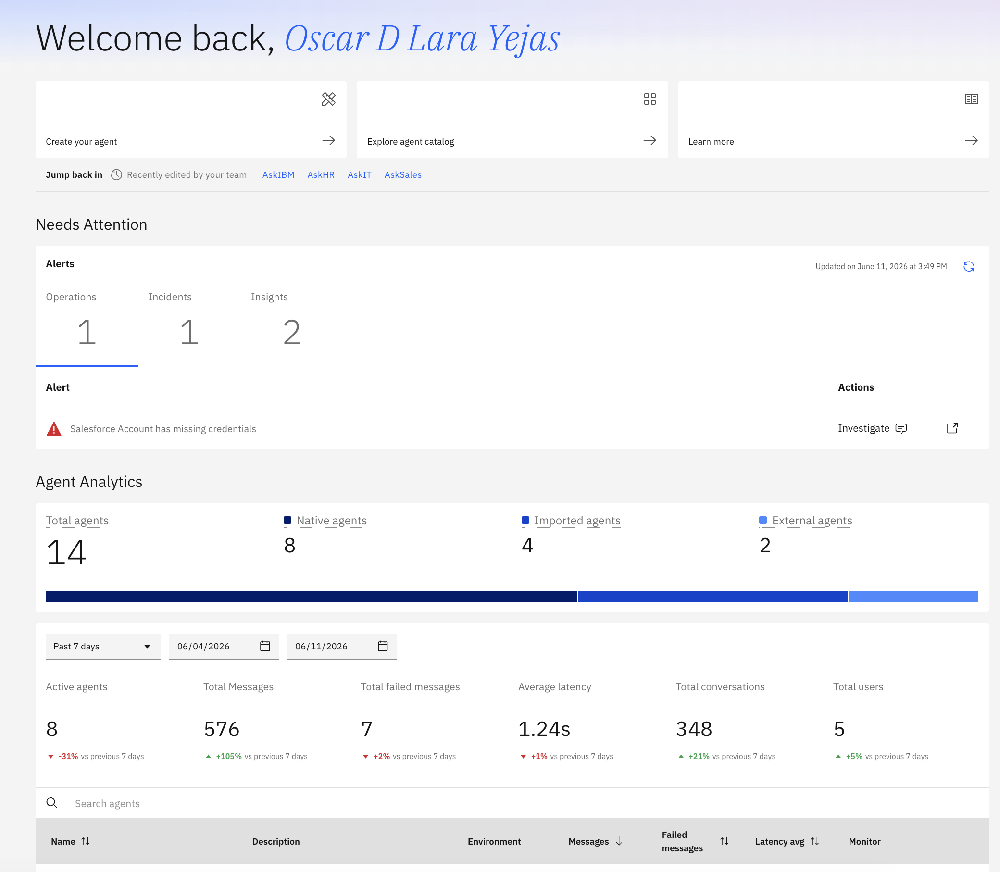

# 🚨 Controle e Governança de Agentes de IA com watsonx Orchestrate

Neste laboratório, você aprenderá como governar e controlar Agentes de IA, incluindo a implementação de guardrails, monitoramento, debugging e avaliação de agentes de IA para mitigar diversos riscos, incluindo alucinações, envenenamento de dados, erros de invocação de ferramentas, vazamento de PII, entre outros.

## 🎬 O Cenário

Imani é uma Engenheira de IA trabalhando para a **Concessionária de Carros ABC**. Ela está construindo uma aplicação de IA Agêntica para ajudar clientes a responder perguntas sobre o catálogo de veículos. No entanto, ela está preocupada com muitos riscos potenciais relacionados à IA Generativa, como _geração de conteúdo prejudicial, alucinações, proliferação de agentes, injeção de prompt_, entre outros riscos. Ela sabe que usuários maliciosos conseguiram atacar sistemas de IA para enganá-los e obter promoções ou ofertas de vendas contra a política da empresa.

O catálogo de veículos da **Concessionária de Carros ABC** pode ser encontrado abaixo:

## 🎯 Objetivo

Neste laboratório, você ajudará Imani a implementar capacidades de **Controles e Governança de IA Agêntica** para abordar:

💉 **Injeção de prompt**: um usuário malicioso interagindo com o sistema pode instruir o LLM a gerar conteúdo prejudicial, alterar seu comportamento ou executar ações perigosas.

😵‍💫 **Alucinações**: em alguns casos, um LLM pode gerar declarações falsas chamadas alucinações.

🤢 **Saída tóxica (HAP)**: em alguns casos, o sistema pode gerar saída odiosa, abusiva ou profana (HAP). O filtro HAP da IBM usa IA para prevenir a geração de conteúdo prejudicial.

💧 **Vazamento de PII**: informações pessoalmente identificáveis podem estar presentes em bases de conhecimento ou podem ser geradas por ferramentas de agentes.

🕸️ **Proliferação de Agentes**: como gerenciar e governar um grande número de agentes em uma organização

✅ **Avaliação de qualidade**: é sempre uma boa prática medir a qualidade da saída de um sistema de IA antes de ir para produção.

📊 **Monitoramento**: fornecer métricas em tempo real para garantir que os agentes tenham alto desempenho e baixo risco.

🚨 **Alertas**: notificar quando houver violações nas métricas de qualidade, modelo ou desempenho do sistema.

🚨 **Debugging**: notificar quando houver violações nas métricas de qualidade, modelo ou desempenho do sistema.

## 📈 Valor de Negócio

🕸️ **Prevenir proliferação de agentes**: a proliferação descontrolada de agentes aumenta a complexidade, o custo computacional e os riscos, daí a necessidade de gerenciar e governar um grande número de agentes em uma organização.

🛡️ **Proteção de reputação**: Imani está muito preocupada que a reputação de sua organização possa ser afetada se os sistemas de IA que ela e sua equipe construíram forem sujeitos a ataques, autorizando ofertas contra a política da empresa, ou gerando saídas prejudiciais, tóxicas ou não confiáveis.

🚫 **Infrações regulatórias e questões legais**: muitos riscos de IA são abordados por leis e regulamentos em muitas jurisdições. Embora o Lab 2 os aborde com maior detalhe, as ferramentas de gerenciamento de risco abordadas neste laboratório também ajudam a reduzir potenciais questões de conformidade legal e regulatória.

📈 **Produtividade**: a equipe de Imani economizará tempo fazendo avaliações manuais e verificações de qualidade, bem como monitorando manualmente os modelos e sistemas de IA de sua equipe.

## 🎛️ Confira a Demo

Este é o resultado final do que você construirá neste laboratório. Clique [aqui](https://wxdemo.ibm.com/) para explorar o Agentic Control Plane.

## 🏛 Arquitetura

## Pré-requisitos

**Participantes**:
- Acesso à instância do watsonx Orchestrate
- URL do endpoint do Agente de terceiros (fornecido pelo instrutor)
- Chave de API do Agente de terceiros (fornecida pelo instrutor)
- Catálogo de veículos: arquivo ``abcCatalog with prices.pdf`` (encontrado na pasta sample-data)

Vamos começar!

## 🧪 Laboratório Prático Passo a Passo
<!--
> [!TIP]
> Se você está interessado apenas em avaliação e/ou monitoramento de agentes, complete o Lab 1 **Criação de agente** e então você pode pular diretamente para a seção 4 e/ou 5. Caso contrário, comece com o Lab 2 **Guardrails**.
-->
Você pode encontrar instruções passo a passo aqui:

<!-- ### 🏛️ Track 1: Full Governance & Controls Track -->
<!--1. Agent creation - clean](lab_guides/0_agent_creation_clean.md): Build a simple RAG car sales assistant that answers questions using a car catalog knowledge base.-->
### 1. 🤢 [**Data Poisoning**](data-poisoning/README.md)
Proteja agentes de IA contra ataques de envenenamento de dados implementando diretrizes que validam saídas e previnem que informações maliciosas cheguem aos usuários.

### 2. 🚧 [**Guardrails Customizados (Opcional)**](guardrails/README.md)
Incorpore um script Python para ser executado antes e depois de invocações agênticas para guardrails totalmente customizáveis. Esta parte requer habilidades de desenvolvimento/técnicas.

### 3. 🤖 [**Importando agentes externos**](lab_guides/4_adding_external_agents.md)
Habilite a integração de agentes externos que vivem no IBM Cloud, Google Cloud ou AWS.
 
### 4. 👁️‍🗨️ [**Vazamento de PII**](controls/README.md) 
Proteja Informações Pessoalmente Identificáveis que podem estar presentes em bases de conhecimento ou geradas por ferramentas de agentes.

### 5. 🚨 [**Debugging**](debugging/README.md)
Diagnostique falhas de ferramentas/agentes, encontre a causa raiz e corrija problemas rapidamente.

### 6. 📊 [**Avaliação Automática**](lab_guides/5_automatic_evaluation.md)
Teste e depure agentes sistematicamente usando casos de teste automatizados, métricas de desempenho e ferramentas de debugging para garantir confiabilidade antes da implantação.

### 7. 👀 [**Monitoramento em Tempo Real**](lab_guides/6_real_time_monitoring.md)
Acompanhe o desempenho de agentes em produção através de dashboards analíticos que monitoram taxas de sucesso, feedback de usuários e indicadores de segurança de conteúdo.

### 8. 📊 [**Dashboard e Analytics de Agentes**](control-plane/README.md)
Tenha uma visão 360 graus de todo o seu sistema agêntico, incluindo analytics, alertas, incidentes e muito mais.

<!-- 
### 🎛️ Track 2: Control Plane Track

1. [**Agent creation**](lab_guides/0_agent_creation_clean.md): Build a simple RAG car sales assistant that answers questions using a car catalog knowledge base.
2. [**Importing external agents**](lab_guides/4_adding_external_agents.md): enable the integration of external agents living in IBM Cloud, Google Cloud, or AWS.
3. [**PII Leakage**](controls/README.md)
4. [**Debugging**](debugging/README.md)
5. [**Real-time Monitoring**](lab_guides/6_real_time_monitoring.md): Track agent performance in production through analytics dashboards that monitor success rates, user feedback, and content safety indicators.
6. [**Control plane**](control-plane/README.md)

## Key Takeaways

You've successfully built, deployed, and monitored an intelligent car buying assistant using watsonx Orchestrate. By completing this lab, you've learned:

✅ **Agent Creation**: How to build specialized agents in watsonx Orchestrate  
✅ **Knowledge Integration**: How to use RAG with uploaded documents  
✅ **A2A Protocol**: How to connect third-party agents using Agent-to-Agent protocol  
✅ **Agent Orchestration**: How to create a master agent that routes to specialized agents  
✅ **Evaluation**: How to test agents systematically before deployment  
✅ **Monitoring**: How to track agent performance and identify issues in production  
-->