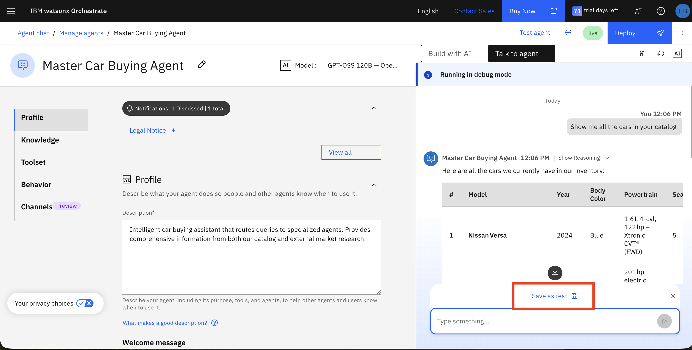
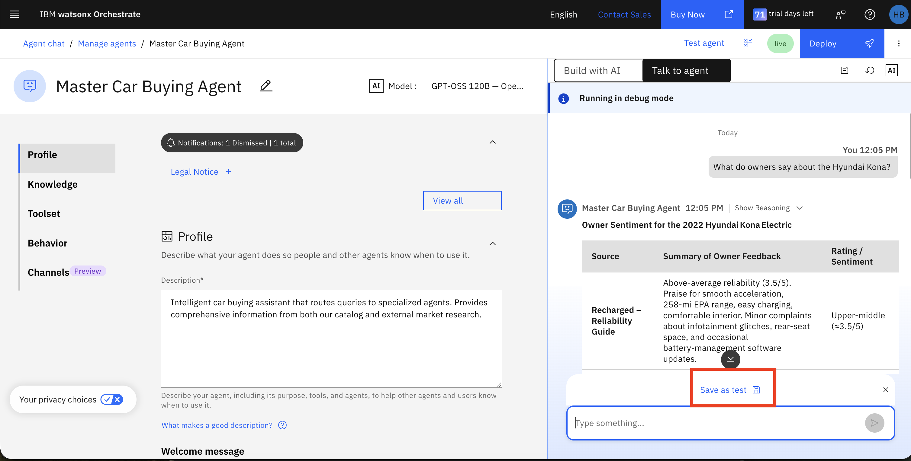
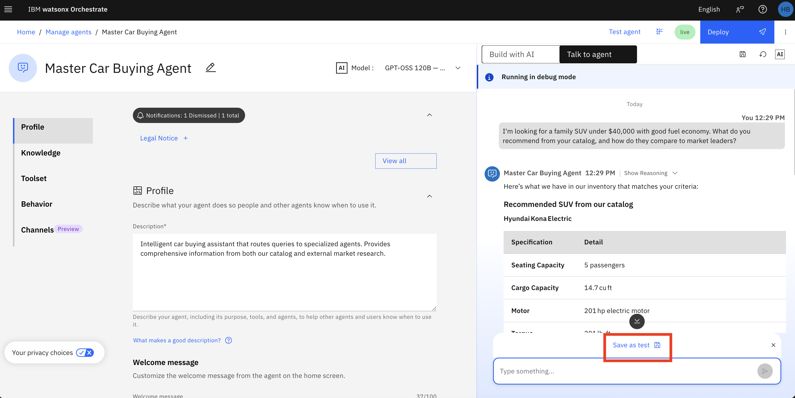
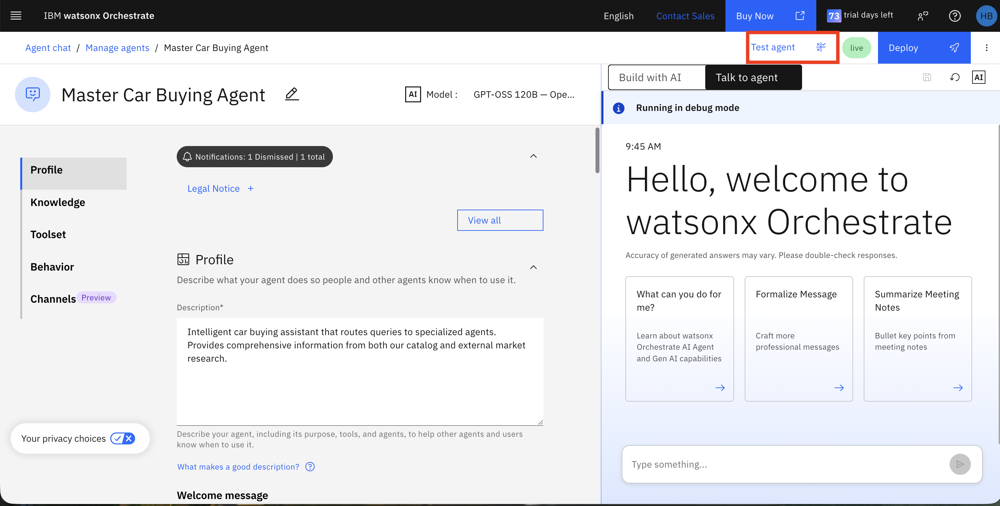
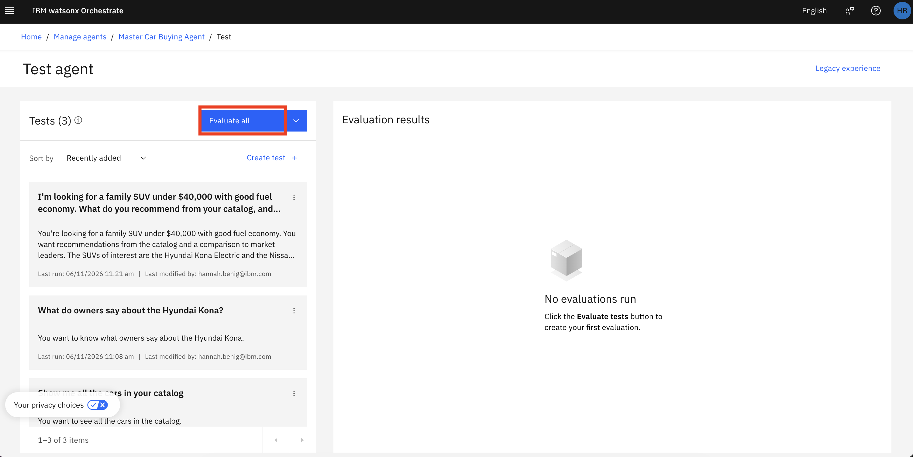
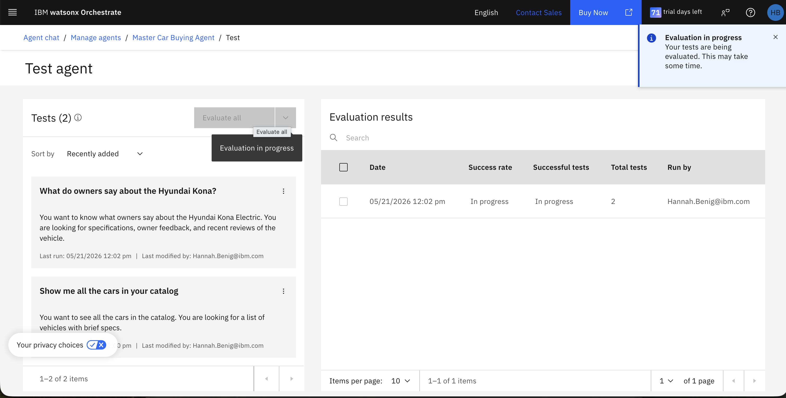
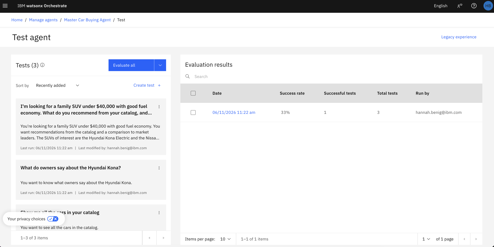
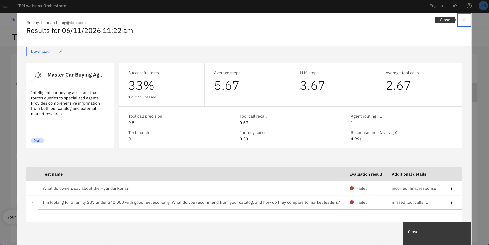
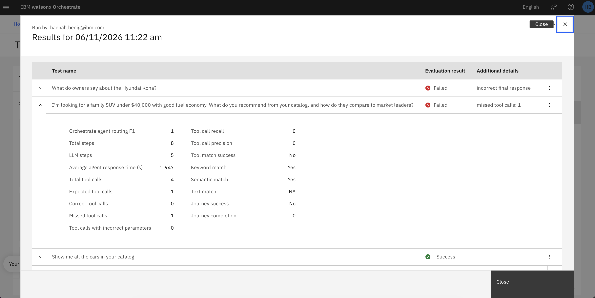

# 🔎 Avaliar Agentes

## Visão Geral

Este guia de laboratório ensina como avaliar e depurar sistematicamente seus agentes de IA usando as capacidades integradas de teste e debugging do watsonx Orchestrate. Você aprenderá a criar casos de teste, executar avaliações automatizadas, interpretar métricas de desempenho e usar ferramentas de debugging para entender o comportamento do agente e identificar problemas. Essas habilidades são essenciais para garantir que seus agentes tenham desempenho confiável antes da implantação.

---

## Índice

- [Passo 1: Avaliar o Agente](#passo-1-avaliar-o-agente)


---

# Avaliar e Depurar Seu Agente

Vamos avaliar o desempenho do agente usando casos de teste.

## Passo 1: Avaliar o Agente

1. Navegue de volta para a página de Build do Master Car Buying Agent.

2. Digite as seguintes perguntas no chat. Após cada uma, clique em **Save as Test**.

As duas primeiras perguntas são simples e devem ser fáceis para o agente responder. A terceira pergunta é mais complexa e requer mais chamadas de ferramentas onde o agente pode cometer um erro.

```
Mostre todos os carros do catálogo
```



```
O que os proprietários dizem sobre o Hyundai Kona?
```



```
Estou procurando um SUV familiar abaixo de $40.000 com bom consumo de combustível. O que você recomenda do catálogo e como eles se comparam aos líderes de mercado?
```


3. Selecione o botão **Test agent** no canto superior direito.

   

  

4. Clique em **Evaluate All**.

   

5. Enquanto a avaliação está em execução, você verá um status **In progress**.
Isso levará algum tempo, sinta-se à vontade para avançar para a parte 7 enquanto aguarda.

   

6. Uma vez concluído, você verá um status verde **Completed**. Clique na execução de teste concluída para visualizar os resultados.

   

7. Revise os resultados da avaliação:

   
   

Seus resultados podem variar das capturas de tela acima. Por exemplo, as capturas de tela mostram uma falha devido a uma chamada de ferramenta perdida e uma resposta incorreta. Os seus podem ser diferentes.

Abaixo está um detalhamento das métricas principais e o que elas significam:

**Roteamento e Precisão:**
- **Orchestrate agent routing F1**: Média harmônica de precisão e recall para decisões de roteamento (mede quão precisamente o agente mestre roteia consultas para agentes especializados)
- **Keyword match**: Se a resposta contém palavras-chave esperadas
- **Semantic match**: Se a resposta é semanticamente similar à saída esperada
- **Text match**: Se a resposta corresponde exatamente à saída de texto esperada

**Métricas de Execução:**
- **Total steps**: Número total de ações ou operações realizadas em todos os testes
- **LLM steps**: Número de vezes que o modelo de linguagem foi invocado para gerar respostas
- **Average agent response time (s)**: Tempo médio levado para gerar cada resposta em segundos

**Métricas de Uso de Ferramentas:**
- **Total tool calls**: Número de vezes que agentes ou ferramentas externas foram invocados durante os testes
- **Expected tool calls**: Número de chamadas de ferramentas que eram esperadas
- **Correct tool calls**: Número de chamadas de ferramentas que foram feitas corretamente
- **Missed tool calls**: Número de chamadas de ferramentas esperadas que não foram feitas
- **Tool calls with incorrect parameters**: Número de chamadas de ferramentas feitas com parâmetros errados
- **Tool call recall**: Proporção de chamadas de ferramentas necessárias que foram realmente feitas (mede se todas as ferramentas necessárias estão sendo usadas)
- **Tool call precision**: Proporção de chamadas de ferramentas relevantes para o total de chamadas de ferramentas (mede se as ferramentas estão sendo chamadas apropriadamente)
- **Tool match success**: Se as ferramentas corretas foram chamadas

**Métricas de Sucesso:**
- **Journey success**: Se o cenário de teste completo alcançou seu resultado pretendido
- **Journey completion**: Se a interação de teste de múltiplas etapas completou todas as etapas sem erros


8. Você pode baixar os resultados para análise posterior.