# 🔬 Laboratório Prático: Deploy de Agente IA em Produção usando IBM Bob

Neste laboratório, o Bob, seu parceiro de desenvolvimento de software com IA, vai ajudá-lo a incorporar seus agentes IA em seu website.

## Pré-requisitos

- Certifique-se de ter o **IBM Bob IDE** configurado localmente
- Complete o [laboratório de Análise Competitiva](../../competitive-analysis/hands-on-lab-competitive-analysis.md)
- Tenha em mãos a chave de API IBM que você usou para aquele projeto
- Certifique-se de que o instrutor forneceu o arquivo `abc-robots-website-final_v2.zip` e que você o descompactou. Esta pasta contém o website onde você irá incorporar seu agente do Orchestrate
- Certifique-se de que seu instrutor forneceu todas as credenciais necessárias

## Nota Importante

IA Generativa é não-determinística, portanto, os resultados que você obtém podem variar das capturas de tela fornecidas nas instruções, isso é esperado e normal. Se você encontrar algum problema, pode contatar seu instrutor ou simplesmente pedir ajuda ao Bob.

## Instruções do Laboratório

Agora você vai deployar o agente de comparação separadamente no website interno da ABC Robots para que os funcionários da ABC Robots possam realizar análise competitiva dos aspiradores de pó robóticos em seu catálogo.

### 1. Abrir o Projeto no IBM Bob IDE

Extraia o arquivo ZIP do website ABC Robots fornecido pelo seu instrutor. Abra seu **IBM Bob IDE** e abra a pasta do website ABC Robots no Bob.

<p align="center">
  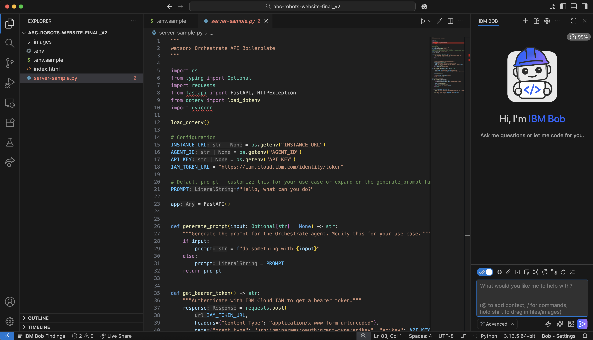
</p>

### 2. Criar Arquivo de Configuração

Crie um arquivo `.env` na pasta similar ao arquivo `.env.sample` fornecido na pasta.

<p align="center">
  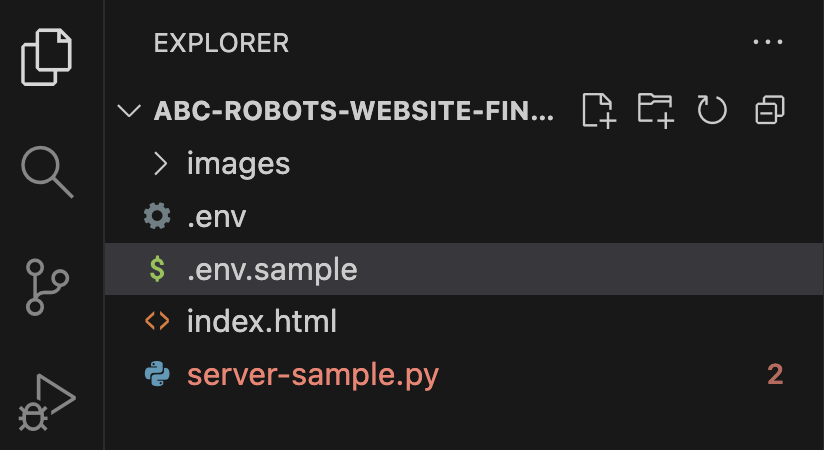
</p>

### 3. Obter ID do Agente

Na sua instância do watsonx Orchestrate, vá para **Manage Agents** e depois para seu Master Agent do laboratório de Análise Competitiva.

Role para baixo até **Channels** e clique em **Embedded Agent**.

<p align="center">
  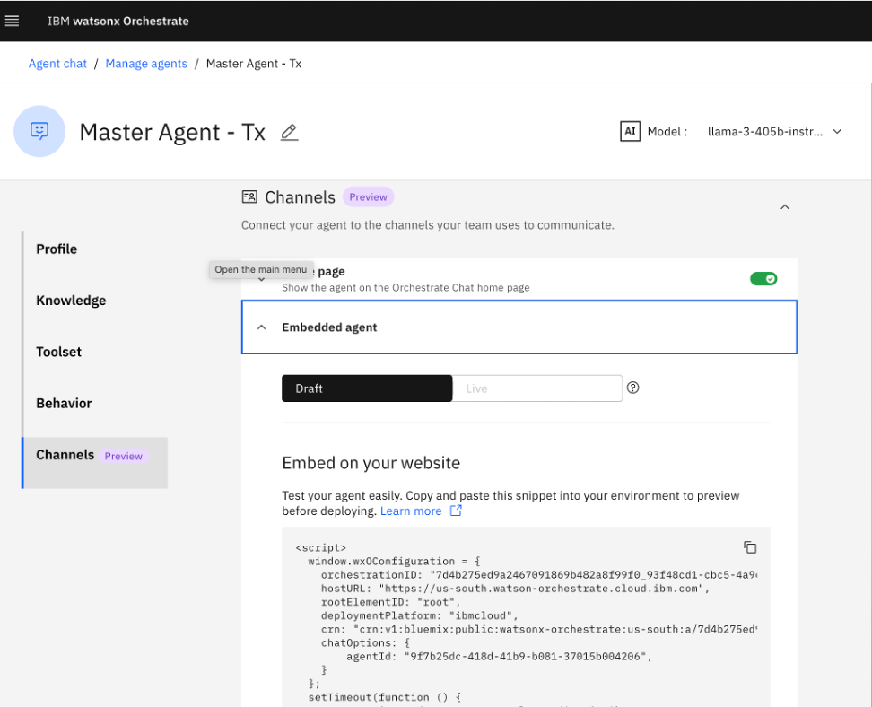
</p>

### 4. Configurar Credenciais

Copie o ID do agente do bloco de código aqui e cole-o para o Agent ID no `.env` que você criou. Seu instrutor fornecerá seu Instance ID e API Key. Adicione-os ao seu arquivo `.env`.

### 5. Enviar Prompt ao Bob

No chat do Bob, copie e cole o seguinte prompt:

```
I have a website @/index.html that showcases products several products.
I want to add a new page called "Competitive Analysis" that's linked from the home screen. It should follow the same look and feel as the rest of the website.
On this page, I need two drop-down to select products to compare, and a "Compare" button. When clicked, it should send the selections to an AI agent that will return a comparison between the two products. Display the results on the page, it should be able to read the markdown format.
Use this as a starting point and to understand how to connect an agent to the website: @server-sample.py. Create the requirements.txt file with the necessary dependencies without version numbers and execute the commands needed to build the virtual environment.
Finally, create a README.md file with instructions on how to run the application locally.
```

<p align="center">
  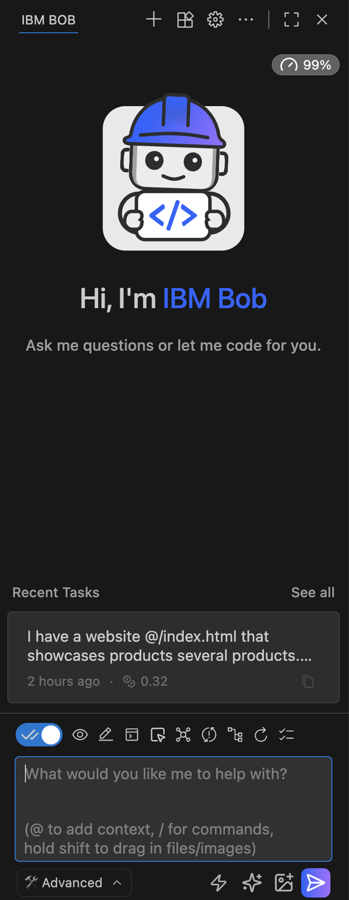
</p>

<p align="center">
  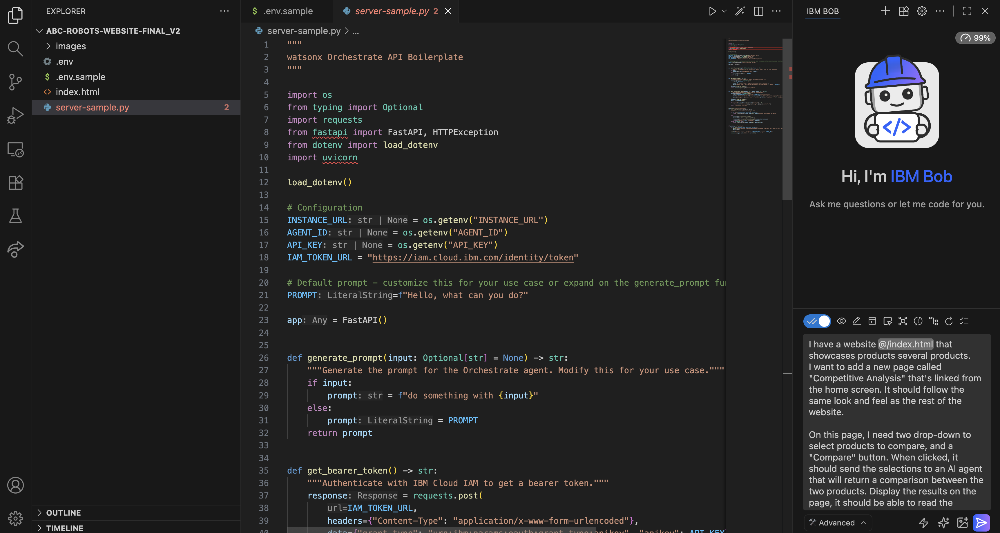
</p>

Certifique-se de que a referência a `index.html` está correta para a estrutura do seu projeto. Você pode tentar redigitar `@index.html` e a referência correta será sugerida.

### 6. Configurar Modo Avançado

No dropdown de configuração de Mode do chat do Bob, escolha modo Advanced e ative o toggle de auto approval.

<p align="center">
  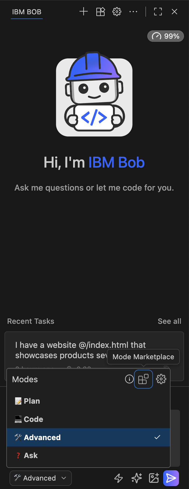
</p>

### 7. Executar o Prompt

Envie o prompt! O Bob vai propor um plano como uma **Todo List** e depois que você aprovar, ele começará a criar os arquivos necessários para criar uma nova aba para Análise Competitiva com um novo `requirements.txt` e editar o arquivo `server.py` existente ou gerar um novo para você com a configuração correta da API do Orchestrate para agente headless.

<p align="center">
  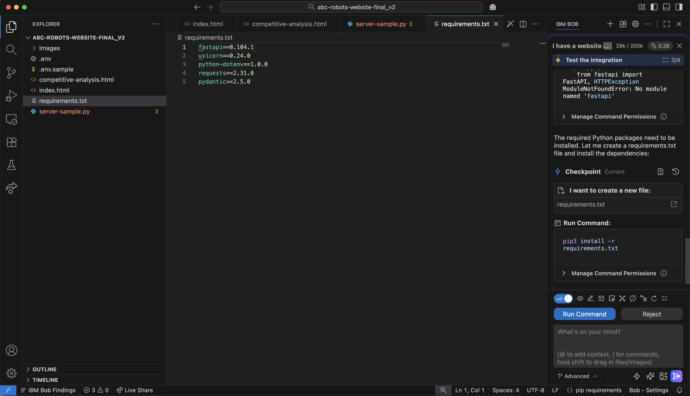
</p>

### 8. Instalar Dependências

Você será solicitado a executar alguns comandos para construir o ambiente virtual e instalar as dependências listadas no arquivo `requirements.txt`. Remova todas as versões do arquivo txt caso existam e clique em "Run" na interface de chat do Bob.

<p align="center">
  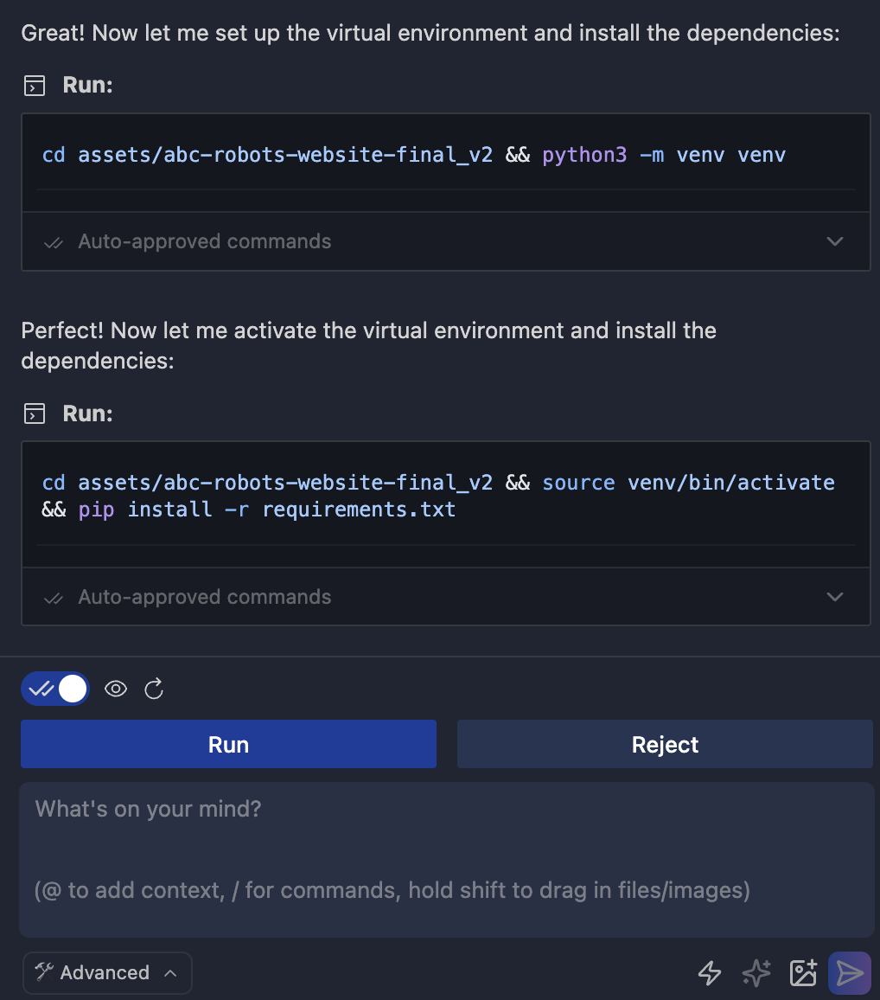
</p>

### 9. Finalizar Geração

O Bob vai gerar o arquivo README e finalizar sua etapa de geração de código.

### 10. Executar o Servidor Backend

Abra o terminal e execute o seguinte comando se o Bob gerou um novo arquivo `server.py`:

```bash
python3 server.py
```

Se o arquivo `server-sample.py` existente foi editado, execute o seguinte comando:

```bash
python3 server-sample.py
```

Se nenhum desses comandos funcionar, você pode pedir ao Bob para fornecer a instrução específica para executar o servidor backend, ajustada à estrutura do seu projeto. Copie e cole o seguinte prompt na interface de chat:

```
Give me the specific command to run the backend server
```

Existem muitas maneiras do Bob responder esta pergunta, uma delas é propor executar o comando ele mesmo. Não deixe o Bob executar este comando, simplesmente copie e cole-o no seu terminal. Não é recomendado deixar o Bob executar comandos de longa duração.

<p align="center">
  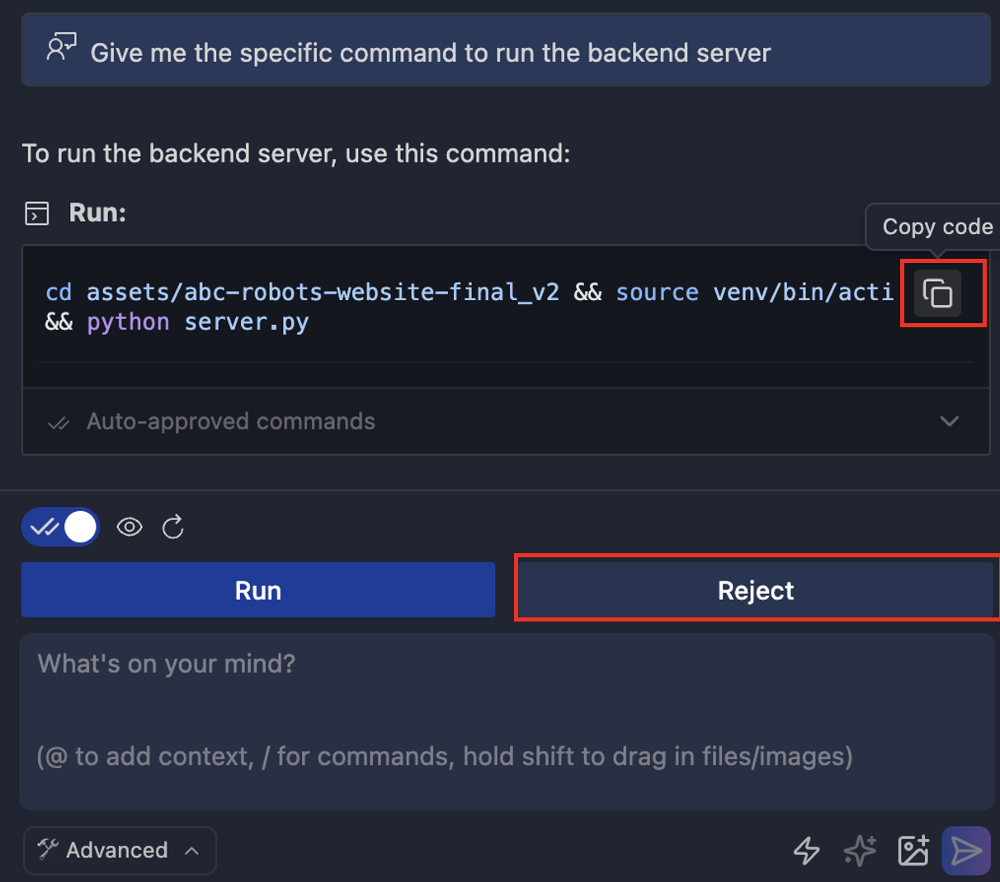
</p>

### 11. Abrir o Arquivo HTML

Agora abra o arquivo recém-gerado `competitive-analysis.html` no seu navegador.

<p align="center">
  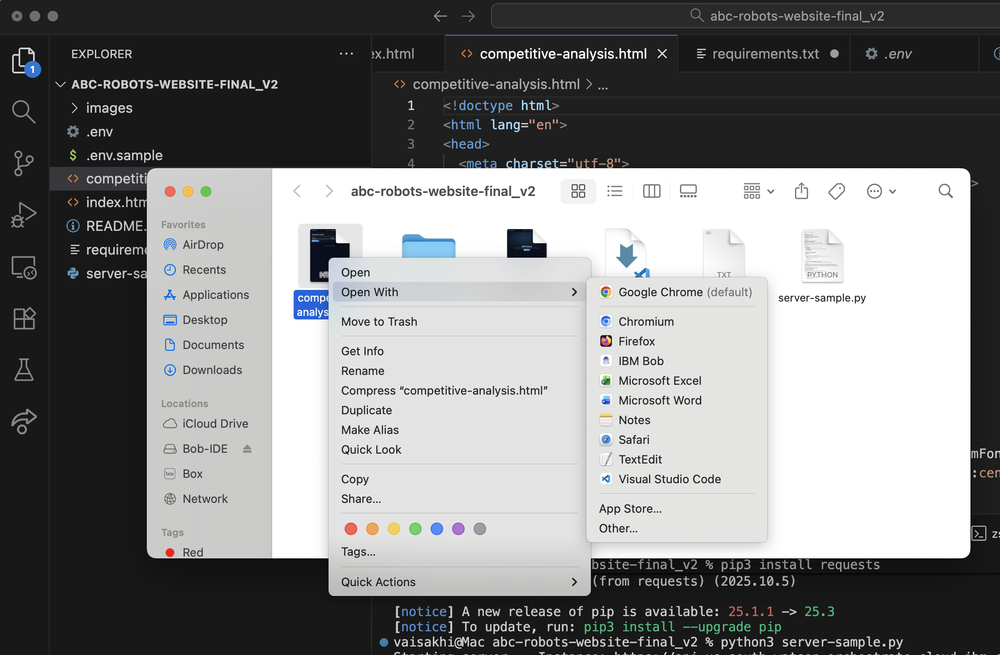
</p>

### 12. Navegar para a Nova Aba

Você deve ver uma nova aba para "Competitive Analysis". Navegue para essa aba.

<p align="center">
  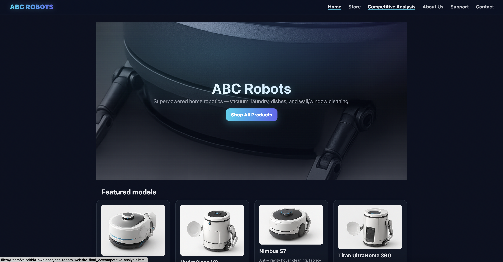
</p>

### 13. Testar o Agente

Selecione 2 aspiradores de pó robóticos diferentes dos dropdowns de produtos e clique em "Compare Products". Isso vai chamar o agente cujo ID você adicionou no seu `.env` e exibir os resultados para você.

<p align="center">
  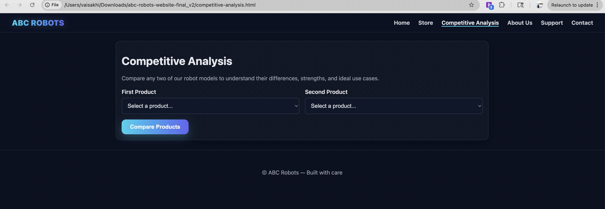
</p>

<p align="center">
  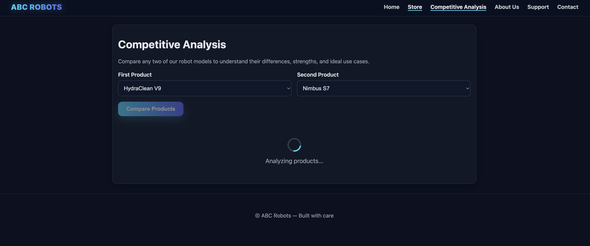
</p>

<p align="center">
  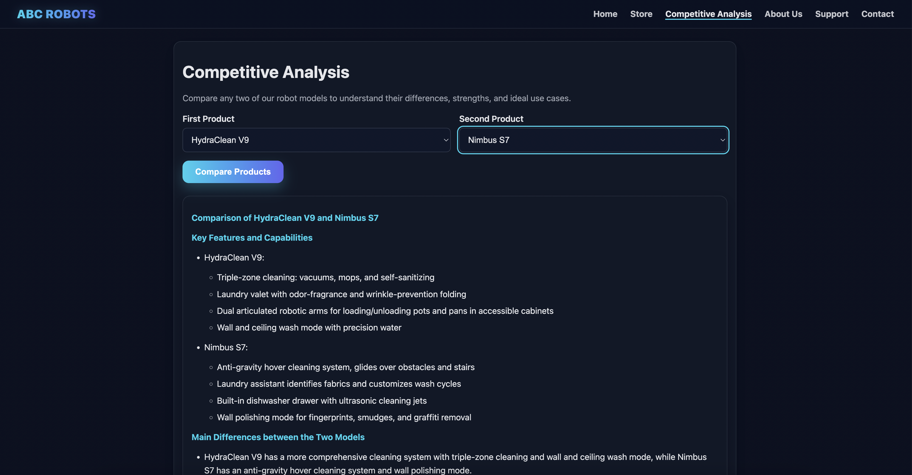
</p>

## 🎉 Parabéns!

Você deployou com sucesso um **agente IA do watsonx Orchestrate** com o IBM Bob!

> [!TIP]
> **Modifique isso para qualquer outro caso de uso**: Você pode usar o arquivo `server.py` de exemplo fornecido como referência para qualquer outro caso de uso para implementar integração de um agente headless de forma similar e também fornecer ao Bob um link para um website para criar a UI como ponto de partida.