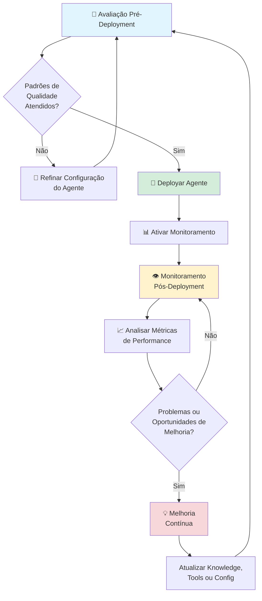

# 🛡️ Governança de Agentes no watsonx Orchestrate

Garanta que seus agentes IA entreguem respostas consistentes, seguras e de alta qualidade através de capacidades abrangentes de avaliação e monitoramento no watsonx Orchestrate.

## 🤔 O Problema

Conheça Sarah, uma Product Manager de IA em uma grande empresa de serviços financeiros. Sua equipe construiu vários agentes IA para ajudar representantes de atendimento ao cliente a responder perguntas sobre apólices e processar sinistros. No entanto, Sarah enfrenta um desafio crítico: **Como ela pode garantir que esses agentes estão prontos para produção e continuam a performar bem após o deployment?**

As preocupações de Sarah são compartilhadas entre indústrias:

- **Incerteza de qualidade**: Sem testes, como ela pode saber se os agentes fornecerão respostas precisas e consistentes para perguntas reais de clientes?
- **Riscos de segurança**: E se um agente expor informações sensíveis de clientes (PII) ou gerar conteúdo inapropriado?
- **Falta de visibilidade**: Uma vez deployados, como ela pode rastrear a performance do agente e identificar problemas antes que impactem clientes?
- **Preocupações com custos**: Uso de tokens e chamadas de API podem aumentar rapidamente—como ela pode monitorar e otimizar custos?
- **Requisitos de compliance**: Sua empresa precisa de trilhas de auditoria e evidências de práticas responsáveis de IA para revisões regulatórias

Sem governança adequada, a equipe de Sarah hesita em deployar agentes em escala, temendo erros custosos e danos à reputação.

## 🎯 Objetivo

Este laboratório addon ajuda product managers, engenheiros de IA e líderes de negócio como Sarah a implementar um framework abrangente de governança usando as capacidades integradas de avaliação e monitoramento do watsonx Orchestrate.

**O que você vai realizar:**

- **Testar agentes antes do deployment** usando casos de teste estruturados para validar qualidade e segurança
- **Monitorar performance de agentes em produção** com analytics em tempo real e rastreamento de conversas
- **Medir indicadores-chave de qualidade** incluindo relevância de resposta, relevância de contexto e métricas de segurança
- **Rastrear custos operacionais** através de uso de tokens e métricas de chamadas de ferramentas
- **Manter compliance** com trilhas de auditoria completas de interações de agentes

Ao completar este laboratório, você ganhará confiança para deployar agentes IA sabendo que eles atendem padrões de qualidade e entregam valor de negócio mensurável.

## 📈 Valor de Negócio

Avaliação e monitoramento no watsonx Orchestrate fornecem insights mensuráveis sobre performance e segurança de agentes:

- **Qualidade de Resposta**: Rastreie relevância de resposta e relevância de contexto para garantir que agentes forneçam respostas precisas e úteis
- **Segurança & Compliance**: Monitore HAP (Hate, Abuse, Profanity) e PII (Personally Identifiable Information) para manter interações seguras e em conformidade
- **Gestão de Custos**: Rastreie uso de tokens (input/output) e métricas de chamadas de ferramentas para otimizar custos operacionais
- **Mitigação de Riscos**: Avalie riscos de segurança de prompts antes do deployment para prevenir respostas prejudiciais ou inapropriadas
- **Otimização de Performance**: Use testes pré-deployment e analytics pós-deployment para melhorar continuamente a efetividade do agente

Essas métricas habilitam decisões baseadas em dados sobre qualidade, segurança e custo-efetividade do agente.

## 🏛️ Fluxo de Trabalho de Governança

O ciclo de vida de governança de agentes no watsonx Orchestrate segue um modelo de melhoria contínua:

### 1. Avaliação Pré-Deployment

Teste seu agente com casos de teste estruturados antes que ele entre em produção. Faça upload de arquivos CSV contendo prompts de usuários e respostas esperadas, depois execute avaliações para medir relevância de resposta, relevância de contexto e métricas de segurança. Revise resultados detalhados e itere na configuração do seu agente até que atenda padrões de qualidade.

### 2. Deployment

Uma vez que os resultados de avaliação atendam seus limites de qualidade, deploye seu agente com confiança. Ative o monitoramento para começar a rastrear performance no mundo real.

### 3. Monitoramento Pós-Deployment

Monitore conversas de agentes em produção através do dashboard do IBM watsonx.governance. Analise métricas de ferramenta, conversa e nível de mensagem, incluindo relevância de resposta, uso de tokens, detecção de HAP/PII e scores de segurança de prompt. Analise padrões de conversa para identificar oportunidades de melhoria.

### 4. Melhoria Contínua

Use insights do monitoramento para refinar seu agente. Atualize bases de conhecimento, ajuste ferramentas ou modifique configuração do agente baseado em dados de performance do mundo real. Crie novos casos de teste a partir de conversas problemáticas, reavalie e redesploy versões melhoradas.

**Este ciclo se repete continuamente**, garantindo que seus agentes evoluam e melhorem ao longo do tempo.

### Componentes-Chave

**Avaliação Pré-Deployment**
- Gestão de casos de teste com upload de CSV
- Execuções de avaliação configuráveis (direcionadas ou completas)
- Resultados detalhados com métricas de qualidade
- Relatórios baixáveis para análise

**Monitoramento Pós-Deployment**
- Integração com IBM watsonx.governance
- Rastreamento de conversas em tempo real
- Análise de métricas em nível de mensagem
- Dashboards de métricas customizáveis

**Métricas Medidas**
- Relevância de resposta e relevância de contexto
- Uso de tokens (input/output)
- Detecção de HAP (Hate, Abuse, Profanity)
- Detecção de PII (Personally Identifiable Information)
- Scores de risco de segurança de prompt
- Performance de chamadas de ferramentas

## 📄 Laboratórios Práticos

Este addon de governança inclui dois laboratórios abrangentes que podem ser completados após qualquer um dos laboratórios de casos de uso principais. Você precisará ter um agente de caso de uso disponível para executar estes laboratórios:

### 1. Avaliação Pré-Deployment

Aprenda como testar seu agente antes que ele entre em produção usando casos de teste estruturados e métricas de avaliação.

**O que você vai aprender:**
- Criar e fazer upload de arquivos CSV de casos de teste
- Executar avaliações direcionadas e completas
- Interpretar resultados de avaliação e métricas
- Iterar na configuração do agente baseado em resultados de teste

**[Iniciar Lab de Avaliação →](./evaluation.md)**

### 2. Monitoramento Pós-Deployment

Descubra como monitorar a performance dos seus agentes em produção e obter insights de interações do mundo real.

**O que você vai aprender:**
- Ativar monitoramento de agentes
- Acessar o dashboard do watsonx.governance
- Analisar métricas de conversa e nível de mensagem
- Customizar visualizações de métricas para suas necessidades
- Usar dados de monitoramento para melhorar performance do agente

**[Iniciar Lab de Monitoramento →](./monitoring.md)**

## 🎯 Pré-requisitos

Antes de iniciar estes laboratórios, você deve ter:
- Completado pelo menos um dos laboratórios de casos de uso principais (ex: AskHR, Retail, Análise Competitiva)
- Um agente deployado ou em draft no watsonx Orchestrate
- Acesso ao watsonx Orchestrate com capacidades de avaliação e monitoramento habilitadas

## 💡 Melhores Práticas

**Para Avaliação:**
- Crie casos de teste diversos cobrindo cenários comuns e de borda
- Inclua tanto exemplos positivos (respostas boas esperadas) quanto exemplos negativos (detratores)
- Execute avaliações após quaisquer mudanças significativas em ferramentas, conhecimento ou configuração do agente
- Use avaliações direcionadas para validação rápida durante desenvolvimento iterativo

**Para Monitoramento:**
- Habilite monitoramento imediatamente após deployment
- Revise analytics regularmente para identificar tendências e problemas
- Use análise de conversas para entender necessidades reais de usuários e melhorar capacidades do agente
- Rastreie uso de tokens para otimizar custos enquanto mantém qualidade

## 📚 Referências

Para mais informações sobre governança de agentes no watsonx Orchestrate, consulte a documentação oficial:

- [Evaluating Draft Agents](https://www.ibm.com/docs/en/watsonx/watson-orchestrate/base?topic=agents-evaluating-draft-agent)
- [Monitoring Agents](https://www.ibm.com/docs/en/watsonx/watson-orchestrate/base?topic=agents-monitoring)
- [IBM watsonx.governance](https://www.ibm.com/products/watsonx-governance)

---

> [!TIP]
> **Comece com avaliação primeiro!** Testar seu agente antes do deployment ajuda você a capturar problemas cedo e deployar com confiança. Uma vez deployado, o monitoramento fornece insights contínuos para melhorar continuamente a performance do agente.