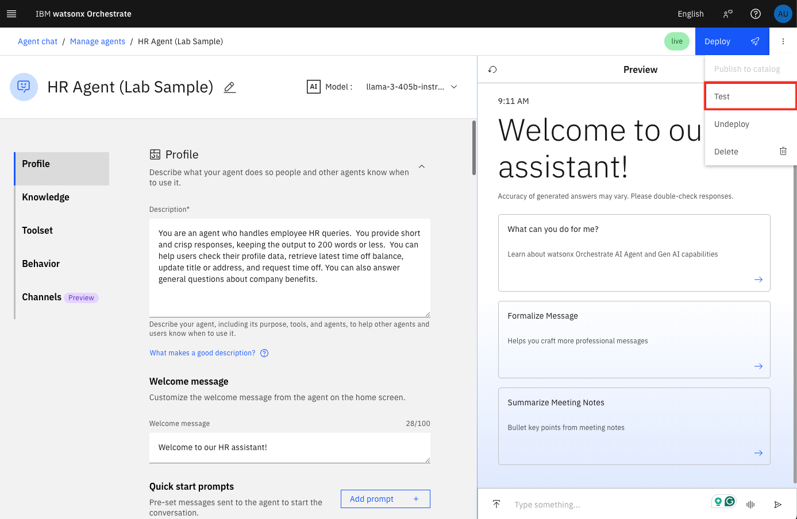
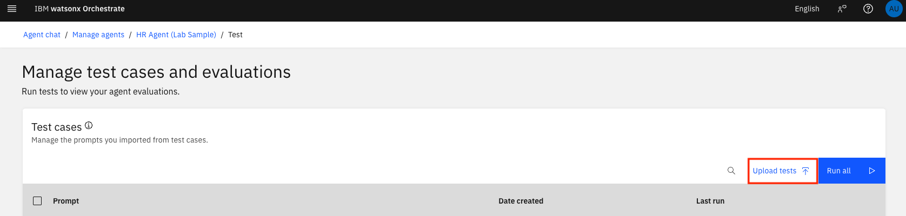
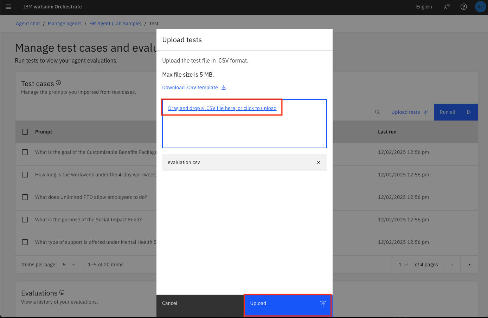
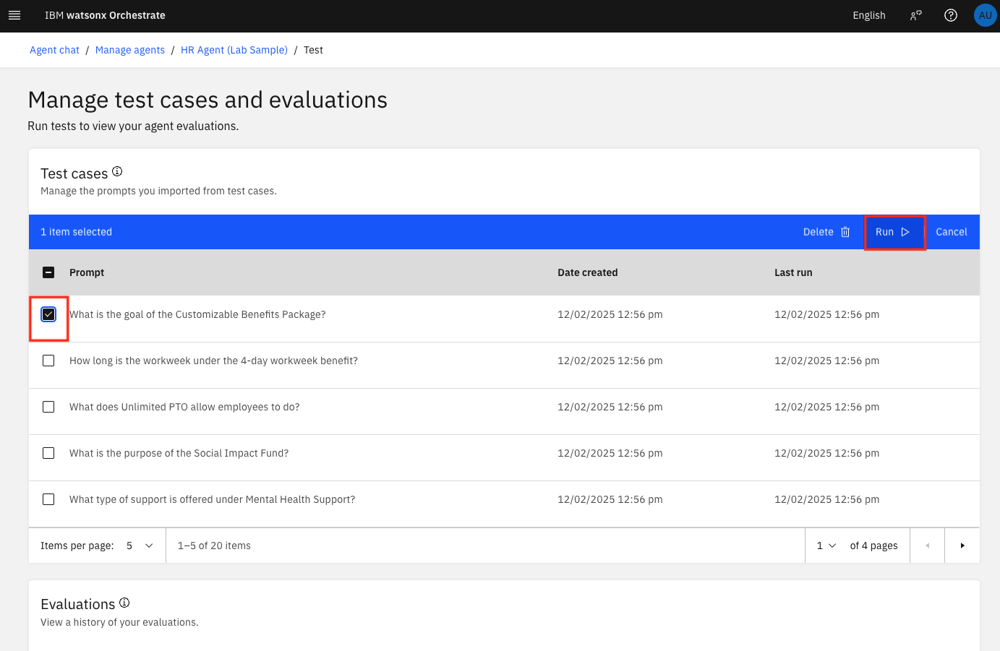
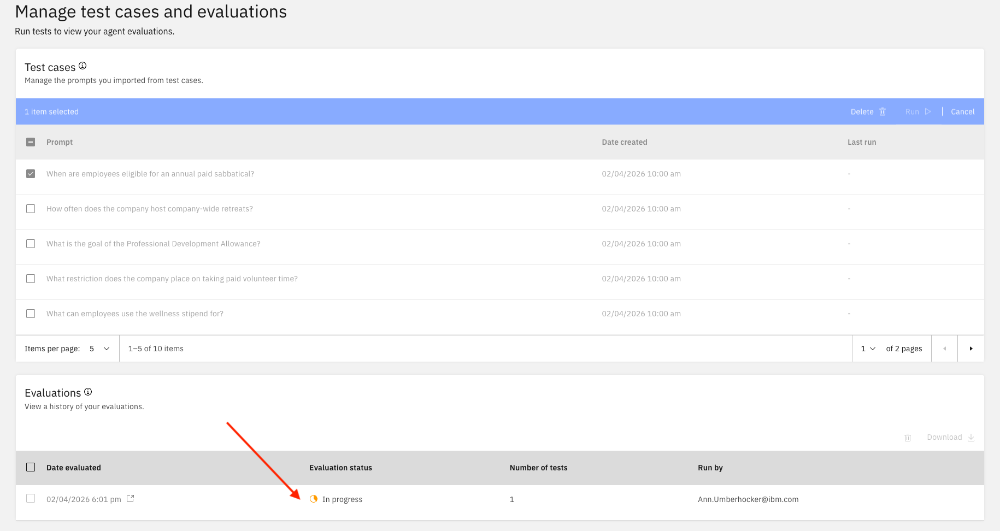
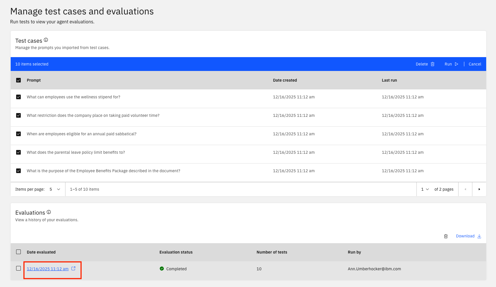
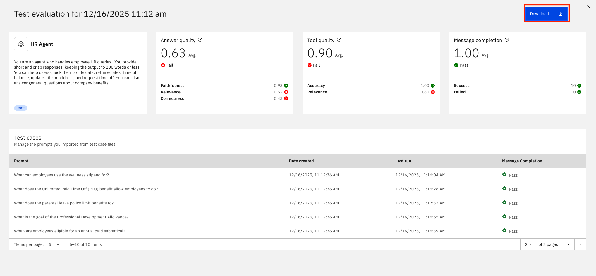

# 📊 Avalie Agentes antes do Deployment

Antes de ir para produção, você quer ter certeza de que os agentes produzem **respostas de alta qualidade**. Isso pode ser feito manualmente, mas geralmente é muito demorado, propenso a erros e não objetivo.

Neste laboratório, você aprenderá como **avaliar um agente IA** de forma mais disciplinada. Testes ajudam a confirmar que mudanças recentes em ferramentas, colaboradores ou conhecimento produzem as respostas esperadas. Você pode iterar mais rápido executando apenas casos relevantes para pequenas atualizações e avaliações completas ao validar comportamento end-to-end.

Avaliar o agente antes do deployment ajuda você a ajustar seu comportamento, garantindo que ele se alinhe com objetivos de negócio e entregue resultados consistentes e mensuráveis.

## 1. Preparar Casos de Teste

Antes de executar avaliações, baixe o arquivo .csv abaixo que corresponde ao seu bootcamp (tamanho máximo: 5 MB) contendo casos de teste para seu agente.

### 1.1 Arquivos de Teste de Casos de Uso

Aqui estão alguns arquivos de teste de avaliação preparados para alguns dos casos de uso. NOTA: as últimas 3 queries e respostas são respostas detratoras projetadas para mostrar baixa qualidade de resposta:

- [AskHR](../../ask-hr/assets/askhr-eval.csv)
- [Análise Competitiva](../../competitive-analysis/assets/comp-analysis-eval.csv)
- [HR Talent](../../hr-talent/data/hr-talent-eval.csv)
- [Product Scout](../../product-scout/knowledge/product-scout-eval.csv)

### 1.2 Criando Arquivos de Teste (Opcional)

Se você gostaria de baixar um template em branco para desenvolver seus próprios casos de teste, você pode clicar em **Upload tests** > **Download CSV template** para baixar um arquivo de exemplo.

Cada linha no arquivo CSV deve incluir um **Prompt** (a pergunta do usuário) e uma **Answer** (a resposta esperada do agente).
Esta estrutura ajuda a garantir que seus casos de teste estejam formatados corretamente e reflitam cenários de interação realistas.
Use o seguinte formato no seu arquivo CSV:

```
Prompt,Answer
"What is the capital of France?","Paris"
"List three healthcare providers.","Provider A, Provider B, Provider C"
```

Você pode usar o [watsonx.ai](https://www.ibm.com/products/watsonx-ai) prompt lab ou [IBM Bob](https://www.ibm.com/products/bob) para gerar seus dados de exemplo.

## 2. Fazer Upload e Executar Testes

### 2.1 Acessar Opção de Teste

Selecione a opção **Test** do menu hambúrguer no canto superior direito.



### 2.2 Fazer Upload de Testes

Selecione o botão **Upload tests**.



### 2.3 Escolher Arquivo

Agora, escolha o link para fazer upload do seu arquivo csv de teste recém-criado, depois clique em **Upload**.



### 2.4 Selecionar e Executar

Selecione quais Prompts de teste você quer avaliar e clique em **Run**.



### 2.5 Acompanhar Progresso

Enquanto está executando a avaliação, você verá um status **In progress**.



### 2.6 Visualizar Resultados

Uma vez completado, você verá um status verde **Completed**. Você pode ver os resultados do teste clicando na execução de teste completada.





### 2.7 Baixar Resultados

Você também pode baixar seus resultados.

Enquanto sua avaliação está executando, sinta-se livre para continuar para a [Seção de Monitoramento](monitoring.md).

## 3. Referências

Para mais informações sobre execução de avaliações, consulte a [documentação do **watsonx Orchestrate**.](https://www.ibm.com/docs/en/watsonx/watson-orchestrate/base?topic=agents-evaluating-draft-agent)