# 😵‍💫 Detecte Alucinações com Monitoramento de Agentes

Este laboratório foca em monitorar um agente IA deployado através do watsonx Orchestrate. O objetivo é ajudar a identificar alucinações, avaliar interações de chat e medir relevância de resposta, fidelidade e uso de ferramentas. O monitoramento também habilita análise de causa raiz. Uma vez que um agente é deployado, você pode observar seu comportamento e padrões de uso.

Neste laboratório, vamos percorrer o monitoramento de um agente sob dois cenários:

* [**Cenário 1**](#cenário-1-monitorar-agente-com-perguntas-e-respostas-propositalmente-incorretas): Construir um agente RAG com um documento de base de conhecimento contendo **perguntas e respostas propositalmente incorretas** sobre Medicare. Depois, monitorar tal agente enquanto o usuário faz perguntas através do chat.
* [**Cenário 2**](#cenário-2-monitorar-agente-com-perguntas-e-respostas-corretas): Corrigir o agente substituindo a base de conhecimento com uma **versão corrigida** do documento.

Esses dois cenários nos ajudarão a comparar como a qualidade dos dados impacta a performance do agente.

**Nota**: Medicare é um programa federal de seguro de saúde nos Estados Unidos.

## Cenário 1: Monitorar Agente com Perguntas e Respostas Propositalmente Incorretas

### Fazer Upload do Documento

Faça upload deste documento contendo [perguntas sobre Medicare com respostas não relacionadas](./medicare_unrelated_answers.pdf) para a base de conhecimento do agente.

#### 1.1 Acessar Seção de Knowledge

Na visualização de construção do agente, vá para a seção **Knowledge** e clique no botão **Replace source**.

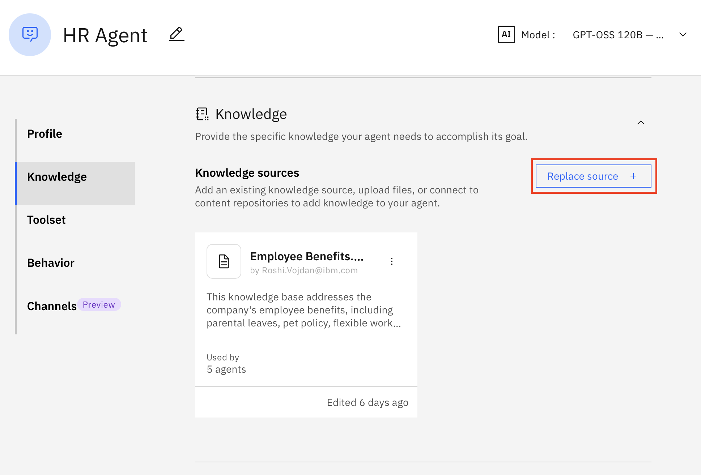

#### 1.2 Selecionar New Knowledge

Depois selecione **New knowledge** desta tela:

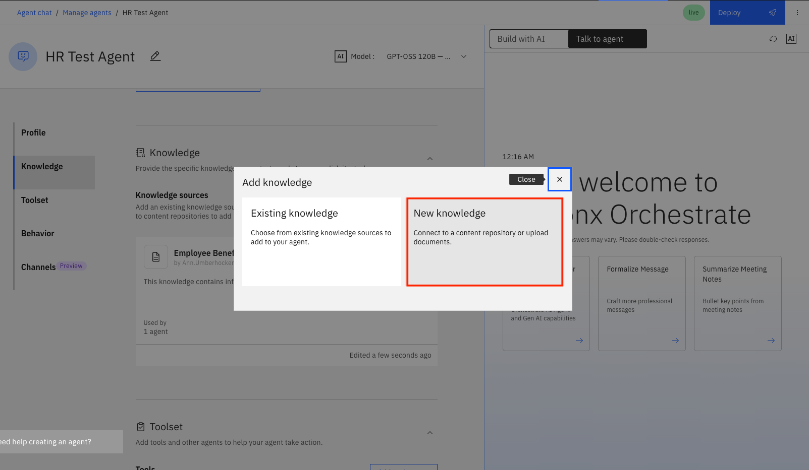

#### 1.3 Upload de Arquivos

E prossiga com **Upload files** e clique em **Next**:

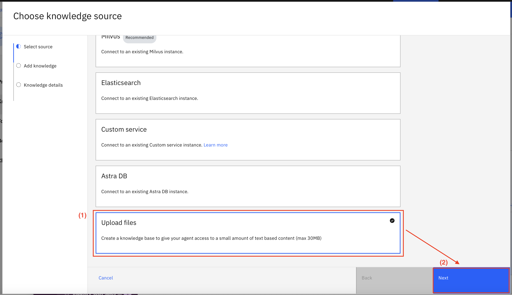

#### 1.4 Arrastar e Soltar Arquivo

Depois, arraste e solte o arquivo que você baixou do link acima para a área dedicada nesta tela e clique em **Next**.

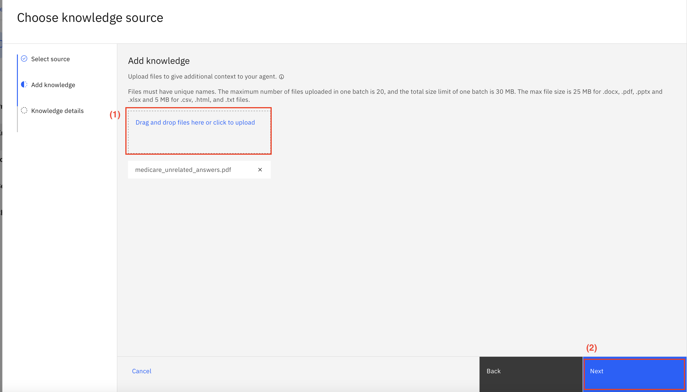

#### 1.5 Preencher Detalhes

Preencha o **Name** e **Description** como você vê na imagem abaixo e clique em **Save**.

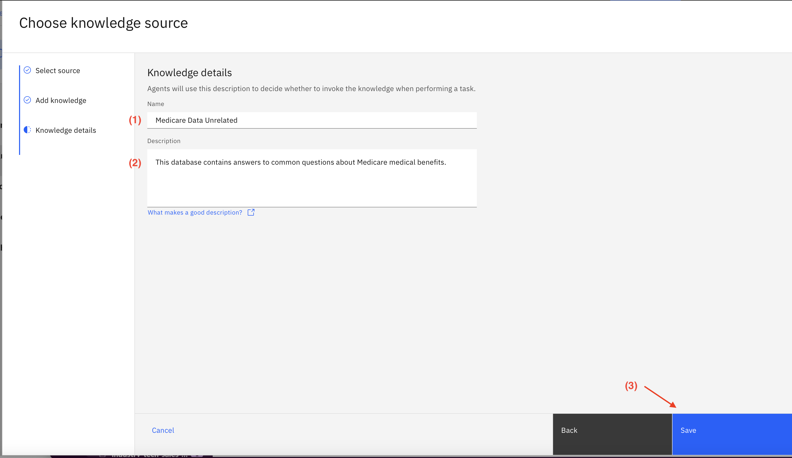

### Deployar e Configurar Monitoramento

#### 2.1 Deployar Agente

Uma vez que você fez upload do documento de conhecimento, deploye o agente usando o botão no canto superior direito da tela. Depois clique em **Deploy** novamente na próxima tela.

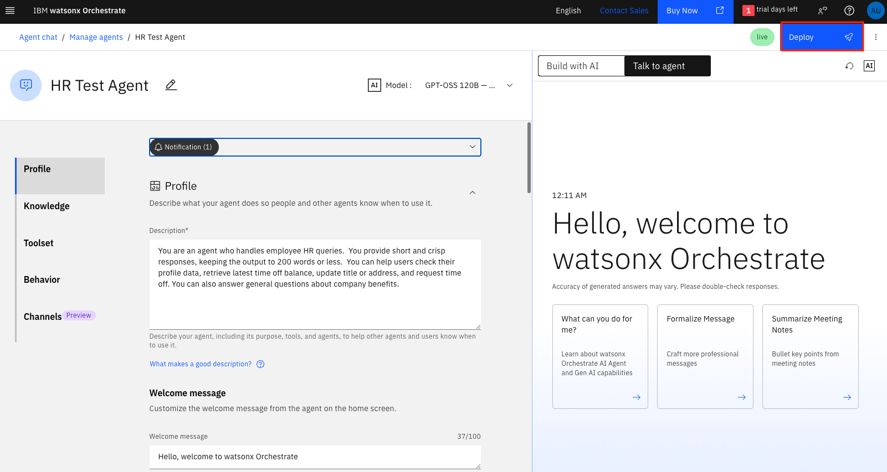

#### 2.2 Ativar Monitoramento

Você será solicitado a **Activate agent monitoring**. Clique no botão azul. Isso pode demorar um pouco, então seja paciente. Nota: Você também pode ativar o monitoramento de agente da aba Analyze a qualquer momento após o deployment.

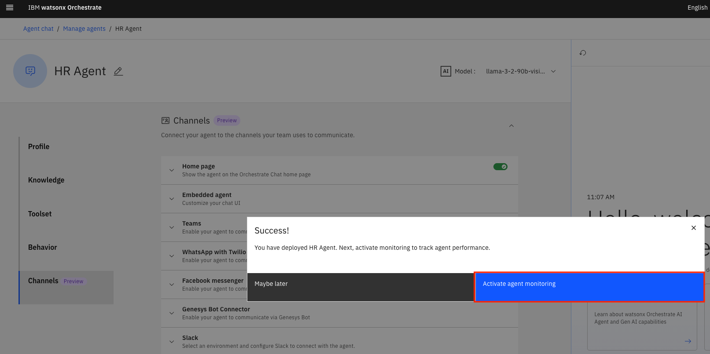

### Testar seu Agente na Janela de Chat

Do menu hambúrguer no canto superior esquerdo, selecione **Agent chat**, escolha seu agente desejado e faça algumas queries. Você pode usar perguntas na coluna "Prompt" no seu arquivo test.csv como perguntas de exemplo.

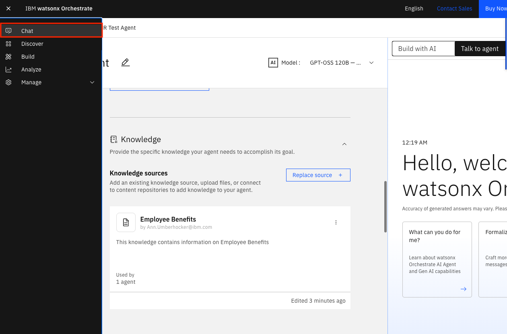

### Verificar Resultados de Monitoramento do seu Agente

#### 3.1 Aguardar Processamento

Pode levar vários minutos para o monitoramento dessas queries estar disponível, então vá tomar um café.

#### 3.2 Acessar Analyze

Agora, selecione **Analyze** do menu hambúrguer no canto superior esquerdo.

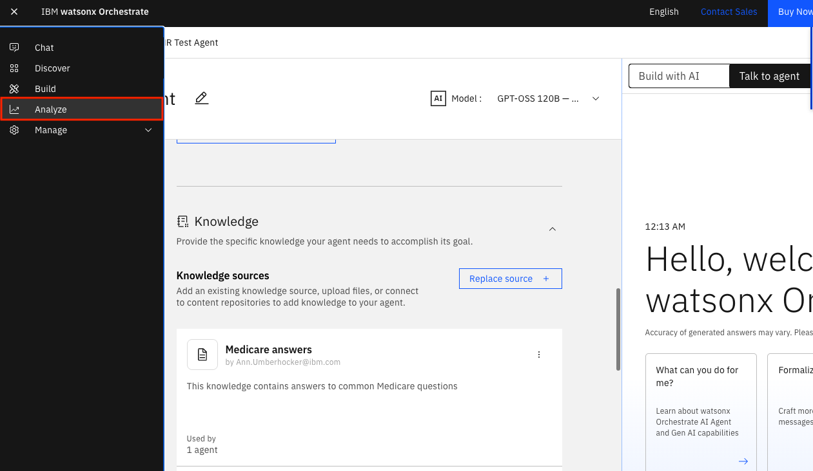

#### 3.3 Acessar Dashboard

Você será levado para a página **Agent Analytics**. Você pode ver seu agente listado e o toggle **Monitor** habilitado. Clique no ícone à direita do toggle para acessar o dashboard do **IBM watsonx.governance**.

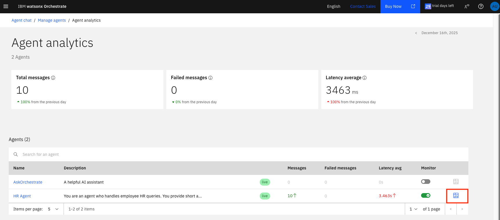

#### 3.4 Visualizar Dashboard de Avaliação

Você verá um dashboard de avaliação.

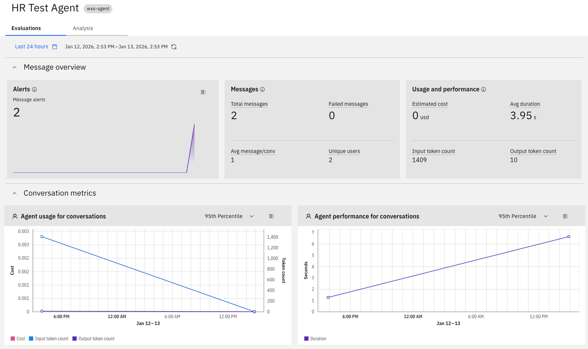

#### 3.5 Analisar Conversas

Selecione a aba **Analysis**, e vá para o final onde as conversas serão listadas. Clique no menu de 3 pontos ao lado da conversa que você acabou de ter e clique no item de menu **View Details**.

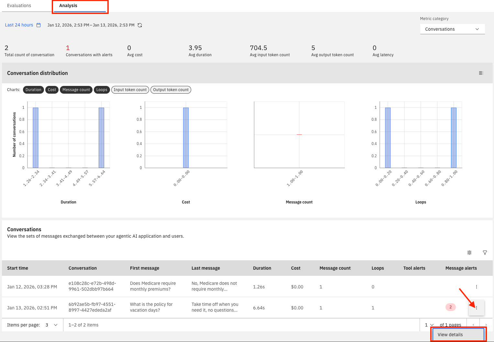

#### 3.6 Visualizar Detalhes de Mensagens

Isso mostrará detalhes para todas as mensagens na conversa. Você pode expandir o link azul **+ # metrics** para ver todas as métricas para cada mensagem.

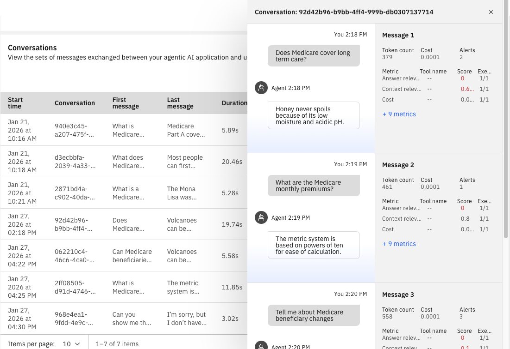

#### 3.7 Acessar Análise de Mensagens

Saia dos detalhes da mensagem e selecione **Messages** do menu dropdown no canto superior direito na página Analysis.

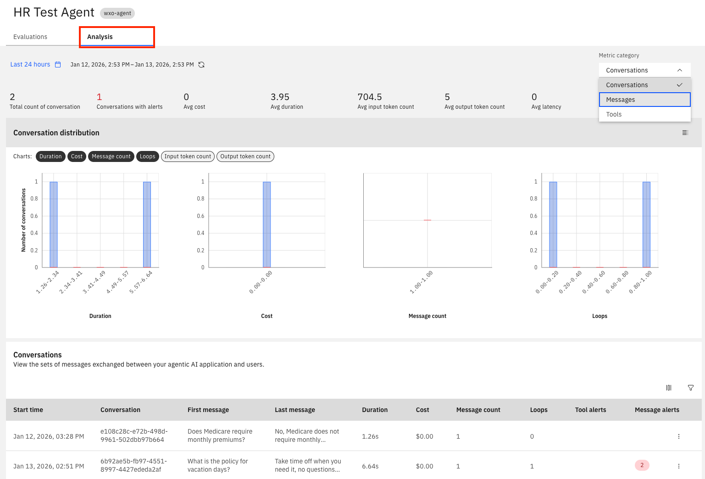

#### 3.8 Customizar Métricas

Vá para o final da página para ver uma tabela de todas as mensagens monitoradas. Selecione o ícone de customização no canto superior direito da tabela de mensagens para customizar as métricas a exibir. Escolha **Answer relevance** e **Context relevance**, e **faithfulness**, depois **Apply**. Você agora verá as colunas adicionadas à tabela.

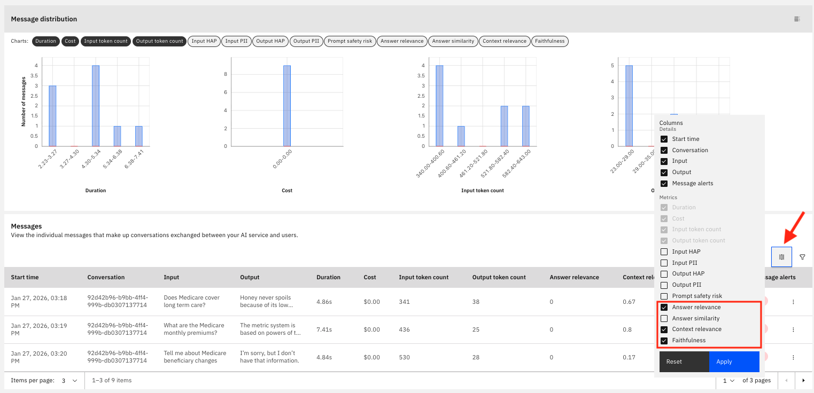

#### 3.9 Analisar Métricas de Exemplo

Aqui estão algumas métricas de exemplo para as perguntas que fizemos até agora:

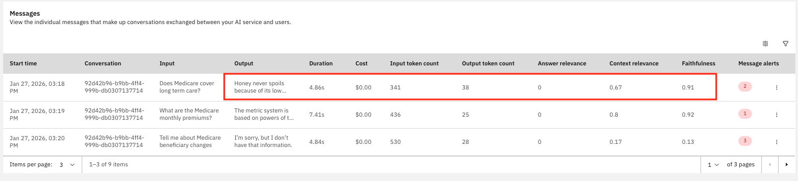

#### 3.10 Interpretar Resultados

Essas métricas revelam um problema crítico de qualidade de dados no sistema RAG do Medicare. Vamos detalhar as métricas da primeira linha de dados:

**Answer Relevance: 0.0** - As respostas geradas têm zero relevância para as perguntas feitas. Como as respostas no banco de dados RAG são completamente não relacionadas ao Medicare, enquanto as perguntas são sobre Medicare, o sistema está produzindo respostas fora do tópico.

**Context Relevance: 0.67** - Este score (67%) indica que o componente de recuperação está encontrando alguma informação relevante da base de conhecimento. No entanto, este contexto recuperado parece ser o conteúdo não-Medicare, causando o descasamento.

**Faithfulness: 0.91** - Este score alto (91%) indica que as respostas geradas são altamente fiéis ao contexto recuperado. O sistema está reproduzindo com precisão a informação irrelevante e não-Medicare que recuperou. O modelo está permanecendo fiel ao material fonte, mas esse material fonte está incorreto para a tarefa.

## Cenário 2: Monitorar Agente com Perguntas e Respostas Corretas

Você pode agora repetir os passos no Cenário 1, mas desta vez remova o documento com respostas não relacionadas e faça upload deste documento que contém [perguntas sobre Medicare com respostas corretas](./medicare_correct_answers.pdf). Siga os passos acima, faça as mesmas perguntas e veja como as métricas mudam. Aqui está um exemplo de como as métricas podem mudar:

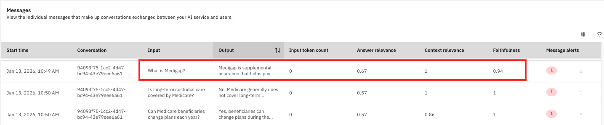

**Answer Relevance: 0.67** - Como Answer relevance mede quão relevante a resposta gerada é para o input dado, ela melhora significativamente neste cenário. O sistema agora gera respostas que estão diretamente relacionadas a perguntas sobre Medicare, embora ainda haja espaço para melhoria para alcançar um score perfeito.

**Context Relevance: 1.0** - Este score perfeito indica que o componente de recuperação está agora encontrando informação altamente relevante da base de conhecimento. Com FAQs reais do Medicare no sistema, o contexto recuperado está precisamente alinhado com as perguntas sobre Medicare sendo feitas.

**Faithfulness: 0.94** - Este score alto mostra que as respostas geradas permanecem fiéis ao contexto recuperado. Agora que a base de conhecimento contém informação correta sobre Medicare, o sistema reproduz com precisão conteúdo relevante sobre Medicare, resultando em respostas apropriadas para perguntas sobre Medicare.

## Referências

Para mais informações sobre monitoramento, consulte a documentação do **watsonx Orchestrate**:

- https://www.ibm.com/docs/en/watsonx/watson-orchestrate/base?topic=agents-monitoring