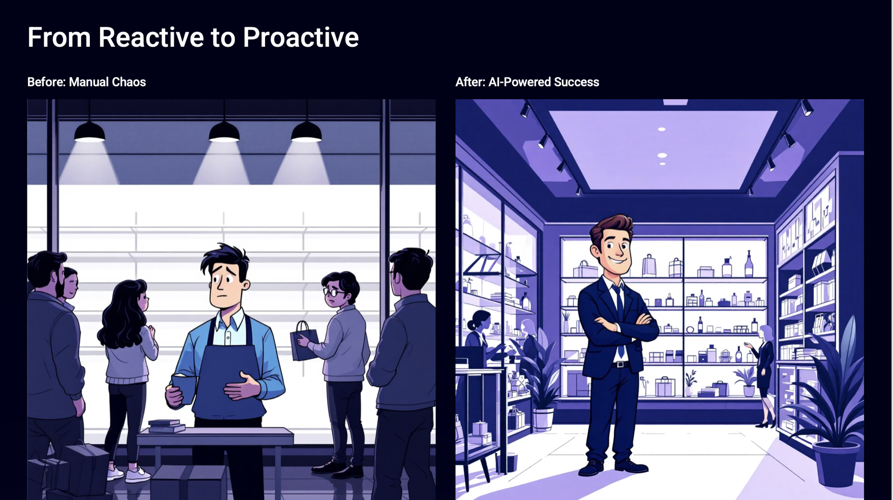

# Sumário
- [Sumário](#sumário)
- [🛒 IA Agêntica para Gestão de Inventário no Varejo](#-ia-agêntica-para-gestão-de-inventário-no-varejo)
- [🤔 O Problema](#-o-problema)
- [🎯 Objetivo](#-objetivo)
- [📈 Valor de Negócio](#-valor-de-negócio)
  - [Para Clientes](#para-clientes)
  - [Para Gerentes de Loja e Operações de Varejo](#para-gerentes-de-loja-e-operações-de-varejo)
- [🏛️ Arquitetura](#-arquitetura)
  - [Camada Orchestrate](#camada-orchestrate)
  - [Camada Code Engine](#camada-code-engine)
  - [Como Funciona](#como-funciona)
- [🎥 Demonstração](#-demonstração)
- [📝 Laboratório prático passo a passo](#-laboratório-prático-passo-a-passo)

# 🛒 IA Agêntica para Gestão de Inventário no Varejo

Neste laboratório, você vai construir e implementar um sistema de **Agentes de IA para Gestão de Inventário**, projetado para automatizar e otimizar todo o fluxo de trabalho de inventário no varejo. Usaremos a **XYZ Retail Store**, uma loja de varejo fictícia, como a empresa que desenvolve esta solução agêntica.

## 🤔 O Problema

A **XYZ Retail Store** é líder no varejo de bens de consumo. Embora tenha construído uma forte reputação pela variedade e qualidade de produtos, seus processos legados de gestão de inventário e previsão manual criaram uma experiência complicada tanto para clientes quanto para gerentes de loja.

**Desafios enfrentados:**

- **Clientes** frequentemente encontram prateleiras vazias, perdem oportunidades de compra e enfrentam disponibilidade inconsistente de produtos
- **Gerentes de loja** são sobrecarregados com previsão manual, pedidos reativos e dados de inventário fragmentados
- Dificuldade em antecipar demanda, reduzir vendas perdidas e manter a fidelidade do cliente

## 🎯 Objetivo

Criar **Agentes de IA para Gestão de Inventário** que automatizam e otimizam todo o fluxo de trabalho de inventário, oferecendo uma alternativa mais inteligente, proativa e orientada por IA.

**Transformações proporcionadas pelo sistema:**

✅ **Integração perfeita com sistemas existentes**
- Conectividade plug-and-play com sistemas POS, ERP e gestão de inventário existentes
- Fluxo de dados unificado sincronizado em tempo real entre plataformas

✅ **Automação inteligente em processos de inventário**
- Três agentes de IA especializados colaborando: previsão de demanda, reabastecimento de estoque e detecção de anomalias
- Gestão preditiva de estoque que antecipa tendências de demanda e previne rupturas

✅ **Supervisão e controle humano**
- Fluxos de aprovação para pedidos gerados por IA
- Capacidade de ajustar recomendações da IA quando necessário

✅ **Experiência aprimorada do cliente e eficiência operacional**
- Redução de rupturas de estoque
- Otimização de operações e economia de tempo

## 📈 Valor de Negócio

### Para Clientes

- **98% de Disponibilidade de Estoque**: Produtos disponíveis quando os clientes precisam, reduzindo frustração com prateleiras vazias
- **Experiência de Compra Sem Atritos**: Clientes encontram produtos facilmente com níveis de estoque consistentes
- **Atendimento Mais Rápido**: Reabastecimento rápido garante que pedidos e solicitações na loja sejam atendidos prontamente
- **Fidelidade Aprimorada**: Disponibilidade confiável de produtos fortalece confiança e compras repetidas

### Para Gerentes de Loja e Operações de Varejo

- **95% de Precisão na Previsão**: Previsão de demanda confiável reduz excesso e falta de estoque
- **40% de Redução de Custos**: Níveis otimizados de inventário reduzem custos de armazenamento e aquisição
- **70% de Economia de Tempo**: Automação reduz esforços de previsão manual, pedidos e monitoramento de estoque
- **Suporte à Decisão Orientado por IA**: Insights preditivos e alertas ajudam gerentes a gerenciar inventário proativamente
- **Fluxos de Trabalho Simplificados**: Sistemas integrados e agentes de IA colaborativos simplificam operações, garantindo eficiência e precisão

## 🏛️ Arquitetura

A solução utiliza uma arquitetura multiagente com **watsonx Orchestrate**, onde agentes especializados colaboram para otimizar a gestão de inventário:

Esta arquitetura ilustra como o **watsonx Orchestrate** gerencia um **fluxo de trabalho de inventário de varejo orientado por IA** através de um agente supervisor, **AskRetail**.

### Camada Orchestrate

**AskRetail (Agente Supervisor)**
- Atua como coordenador central, gerenciando o fluxo de execução dos agentes especializados

**Agentes Funcionais:**
- **Propensity Agent (Agente de Propensão)**: Analisa comportamento do cliente e probabilidade de compra
- **Forecast Agent (Agente de Previsão)**: Prevê demanda futura usando dados históricos e em tempo real
- **Reorder Agent (Agente de Reabastecimento)**: Aciona reabastecimento de estoque através de otimização inteligente de pedidos
- **Reporting Agent (Agente de Relatórios)**: Gera insights, dashboards e resumos para gerentes

### Camada Code Engine

Fornece os serviços de computação backend e ML para suportar os agentes do Orchestrate:

- **DB**: Armazenamento central para dados de varejo e inventário
- **Predict / Train / Forecast**: Pipelines de ML para treinamento de modelos, previsão de demanda e predição
- **Reorder Agent**: Aplica lógica de otimização para gerar ordens de compra
- **Reporting Agent**: Compila relatórios e KPIs

### Como Funciona

O agente supervisor do Orchestrate (**AskRetail**) interage com os agentes especializados em sequência ou em paralelo, invocando os **serviços do Code Engine** conforme necessário.

Este design equilibra automação com análise, permitindo que varejistas:
- Prevejam demanda
- Otimizem reabastecimento
- Prevejam propensão do cliente
- Detectem anomalias
- Relatem resultados eficientemente

✅ **Resultado:** Eficiência operacional aprimorada, redução de rupturas/excesso de estoque e melhor experiência do cliente.

## 🎥 Demonstração

Veja o vídeo completo que demonstra todo o cenário:

[▶️ Assistir demonstração do Agentic Inventory](https://github.ibm.com/user-attachments/assets/8d73cd4d-fd92-4925-82c9-65063c3b040f)

## 📝 Laboratório prático passo a passo

👉👉👉 [Clique aqui](./labs/handson_lab.md) para acessar as instruções detalhadas e implementar este caso de uso.

Neste laboratório você vai:

1. **Criar o Propensity Agent** - Para analisar comportamento e probabilidade de compra dos clientes
2. **Criar o Forecast Agent** - Para prever demanda futura e riscos de ruptura de estoque
3. **Criar o AskRetail Agent** - Agente supervisor que coordena todos os agentes especializados
4. **Testar o sistema completo** - Validar fluxos de trabalho de previsão, reabastecimento e relatórios

**Tempo estimado**: 90-120 minutos

**Pré-requisitos**:
- Acesso ao watsonx Orchestrate
- OpenAPI Specs fornecidos pelo instrutor
- Familiaridade com conceitos de agentes de IA

---

> [!IMPORTANT]
> Este laboratório requer serviços backend implantados no Code Engine. Os instrutores devem seguir o [repositório de instrutores](https://github.ibm.com/skol/agentic-ai-client-bootcamp-instructors/tree/main/usecase-setup/agentic-inventory) para configurar todos os ambientes e serviços backend.

**Features demonstradas**: `Multi-agent orchestration` `Backend connection` `External agents` `Predictive analytics` `No code`