# Automatizar Gestão de Inventário no Varejo com IA Agêntica

## Sumário

- [Automatizar Gestão de Inventário no Varejo com IA Agêntica](#automatizar-gestão-de-inventário-no-varejo-com-ia-agêntica)
  - [Sumário](#sumário)
  - [Descrição do Caso de Uso](#descrição-do-caso-de-uso)
  - [Arquitetura](#arquitetura)
  - [Camada Orchestrate](#camada-orchestrate)
  - [Camada Code Engine](#camada-code-engine)
  - [Como Funciona](#como-funciona)
  - [Objetivo de Aprendizado](#objetivo-de-aprendizado)
  - [Implementação](#implementação)
    - [Pré-requisitos](#pré-requisitos)
    - [Abrir o Agent Builder](#abrir-o-agent-builder)
    - [Propensity Agent](#propensity-agent)
      - [Criar o Propensity Agent](#criar-o-propensity-agent)
      - [Testar o Propensity Agent](#testar-o-propensity-agent)
    - [Forecast Agent](#forecast-agent)
      - [Criar o Forecast Agent](#criar-o-forecast-agent)
      - [Testar o Forecast Agent](#testar-o-forecast-agent)
    - [AskRetail Agent](#askretail-agent)
      - [Criar o AskRetail Agent](#criar-o-askretail-agent)
      - [Testar o AskRetail Agent](#testar-o-askretail-agent)
    - [Testes Adicionais via AI Chat](#testes-adicionais-via-ai-chat)

## Descrição do Caso de Uso

Agentes de IA para Gestão de Inventário automatizam e otimizam todo o fluxo de trabalho de inventário, integrando-se perfeitamente com sistemas existentes e garantindo um fluxo de dados unificado em tempo real. Agentes de IA especializados colaboram para prever demanda, gerenciar reabastecimento de estoque e detectar anomalias, gerando proativamente recomendações para prevenir rupturas e excesso de estoque. Gerentes mantêm controle através de fluxos de aprovação e capacidades de ajuste, equilibrando automação com julgamento humano. O resultado é eficiência operacional aprimorada, redução de rupturas de estoque e melhor experiência do cliente.

## Arquitetura

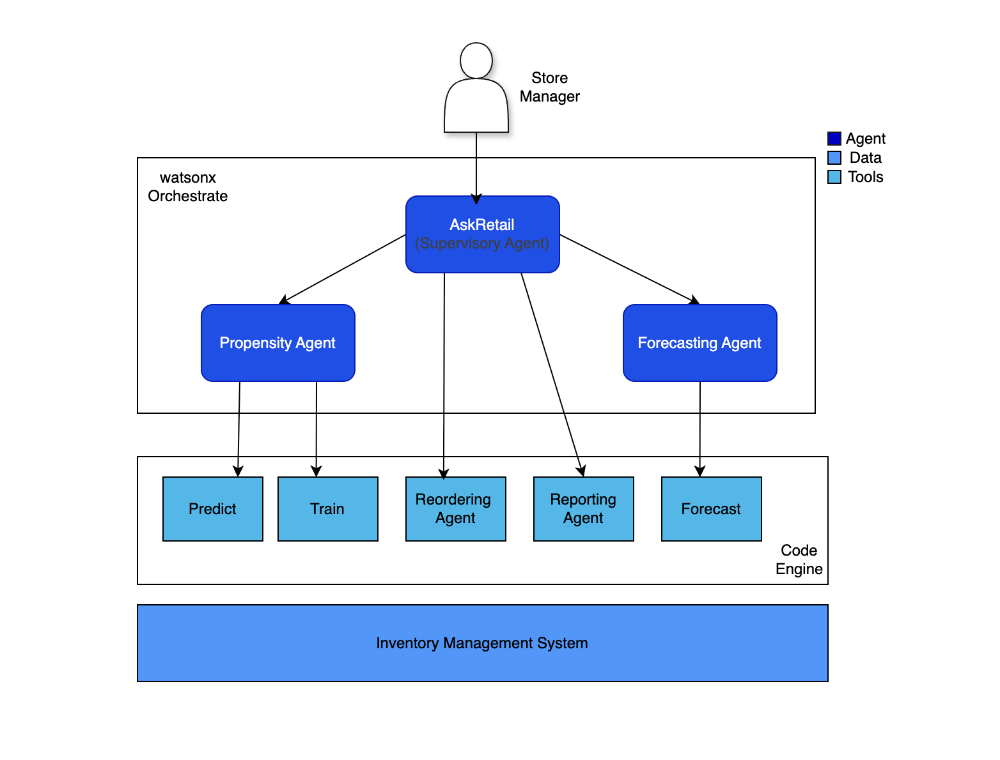

Esta arquitetura ilustra como o **watsonx Orchestrate** gerencia um **fluxo de trabalho de inventário de varejo orientado por IA** através de um agente supervisor, **AskRetail**.

## Camada Orchestrate

- **AskRetail (Agente Supervisor)**  
  Atua como coordenador central, gerenciando o fluxo de execução dos agentes especializados.

- **Agentes Funcionais**  
  - **Propensity Agent** → Analisa comportamento do cliente e probabilidade de compra.  
  - **Forecast Agent** → Prevê demanda futura usando dados históricos e em tempo real.  
  - **Reorder Agent** → Aciona reabastecimento de estoque através de otimização inteligente de pedidos.  
  - **Reporting Agent** → Gera insights, dashboards e resumos para gerentes.  

## Camada Code Engine

Fornece os serviços de computação backend e ML para suportar os agentes do Orchestrate.

- **DB** → Armazenamento central para dados de varejo e inventário.  
- **Predict / Train / Forecast** → Pipelines de ML para treinamento de modelos, previsão de demanda e predição.  
- **Reorder Agent** → Aplica lógica de otimização para gerar ordens de compra.  
- **Reporting Agent** → Compila relatórios e KPIs.  

## Como Funciona

O agente supervisor do Orchestrate (**AskRetail**) interage com os agentes especializados em sequência ou em paralelo, invocando os **serviços do Code Engine** conforme necessário.  

Este design equilibra automação com análise, permitindo que varejistas:  
- Prevejam demanda  
- Otimizem reabastecimento  
- Prevejam propensão do cliente  
- Detectem anomalias  
- Relatem resultados eficientemente  

✅ **Resultado:** Eficiência operacional aprimorada, redução de rupturas/excesso de estoque e melhor experiência do cliente.

## Objetivo de Aprendizado

Ao final deste laboratório, você será capaz de projetar e implementar um fluxo de trabalho de Gestão de Inventário orientado por IA usando watsonx Orchestrate. Você aprenderá passo a passo como configurar agentes de IA especializados que colaboram para:
- Prever demanda usando dados históricos e em tempo real.
- Acionar reabastecimento de estoque através de otimização inteligente de pedidos para reabastecimento oportuno e econômico.
- Agrupar SKUs para identificar itens de alta rotatividade, itens sazonais e itens de baixa rotatividade para estratégias de estoque mais inteligentes.
- Agrupar clientes para descobrir segmentos comportamentais que influenciam prioridades de inventário.
- Prever riscos de ruptura de estoque (OOS) e ajustar proativamente planos de inventário.
- Incorporar scores de propensão do cliente para alinhar decisões de estoque com probabilidade de compra.

## Implementação

### Pré-requisitos

**Instrutores**: 
- Verifique o [repositório de instrutores](https://github.ibm.com/skol/agentic-ai-client-bootcamp-instructors/tree/main/usecase-setup/agentic-inventory) correspondente para configurar todos os ambientes e serviços backend.
  > NOTA: a branch `main` contém o código da versão mais recente. Se você quiser usar uma versão anterior, baixe a mesma [release](https://github.ibm.com/skol/agentic-ai-client-bootcamp-instructors/releases) que será usada para o laboratório dos participantes.
- Certifique-se de ter fornecido OpenAPI Specs atualizados localizados no repositório do instrutor em `usecase-setup/agentic-inventory/orchestrate_specfiles` com a URL correta para seu serviço backend implantado para os participantes do laboratório.

**Participantes**:
- Valide que você tem acesso ao ambiente TechZone correto para este laboratório.
- Complete o guia de [configuração de ambiente](../../environment-setup) para passos sobre criação de chave API.
- Familiaridade com conceitos de agentes de IA (por exemplo, instruções, ferramentas, colaboradores...)
- Certifique-se de que seu instrutor forneceu o seguinte:
  - **OpenAPI Specs** atualizados

### Abrir o Agent Builder

- Faça login no IBM Cloud (cloud.ibm.com). Navegue até o menu hambúrguer no canto superior esquerdo, depois até Resource List. 
  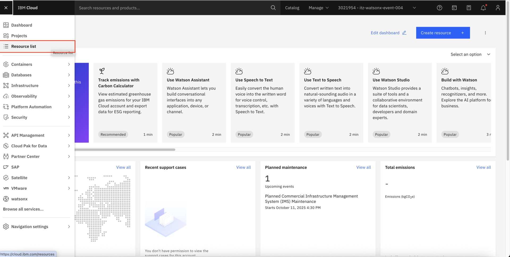

- Abra a seção AI/Machine Learning. Você deve ver um serviço **watsonx Orchestrate**, clique para abrir.

  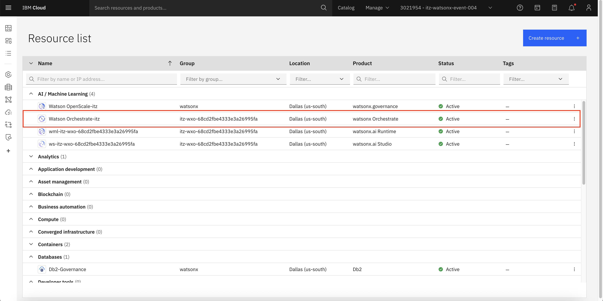

- Clique no botão "Launch watsonx Orchestrate".

  

- Bem-vindo ao watsonx Orchestrate. Abra o menu hambúrguer, clique em **Build** -> **Agent Builder**.

  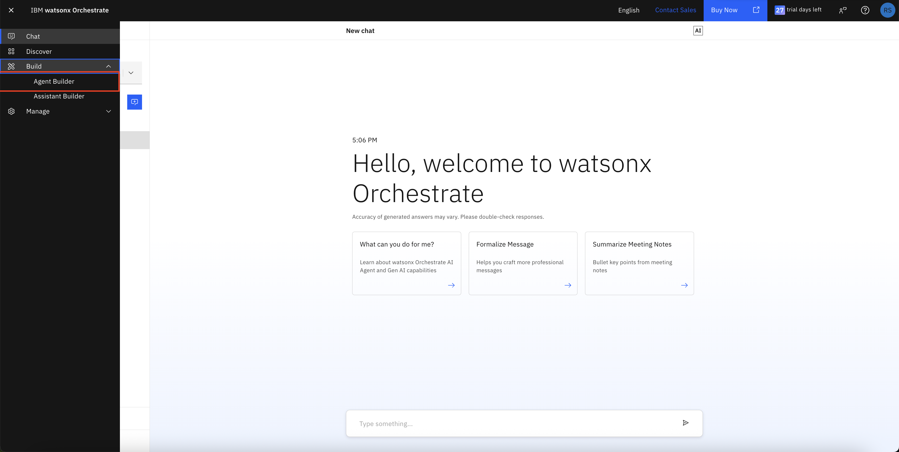

### Propensity Agent
#### Criar o Propensity Agent

- Clique em **Create Agent**

  

- Siga os passos de acordo com a captura de tela abaixo.
  - Selecione **Create from scratch**
  - Nomeie o agente como `Propensity Agent`
  - Use a seguinte descrição:
    ```
    The Propensity Agent will return propensity values for a customer and SKU. You can also train the model or predict for new values.
    ```
- Clique em **Create** 
  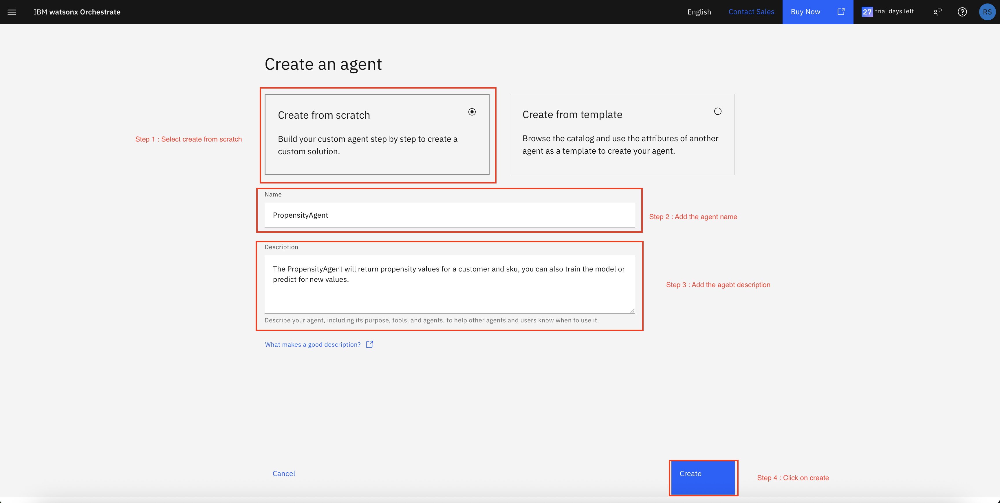

- Escolha o dropdown **Model** à direita do **Propensity Agent** e escolha `llama-3-405b-instruct`. 

  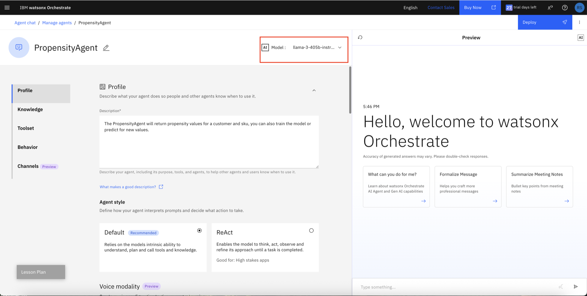

- Em **Profile** -> seção **Agent Style** mantenha como `Default`.

  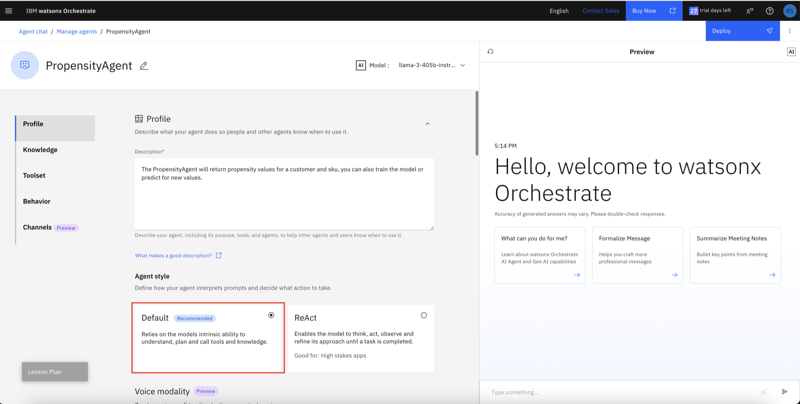

- Na seção **Toolset**, clique no botão **Add tool**.
  

- Selecione **OpenAPI**.

  

- Faça upload do OpenAPI Spec `open_api_spec_train.json`, que será fornecido pelo instrutor.

  
  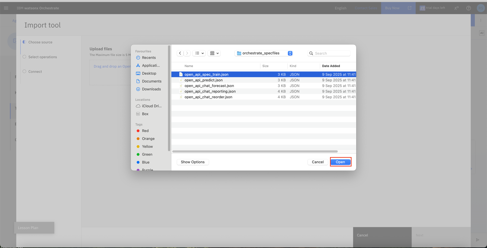

- Uma vez que o arquivo seja carregado, selecione **Next**.

  

- Selecione todas as **Operations** e clique em **Done**

  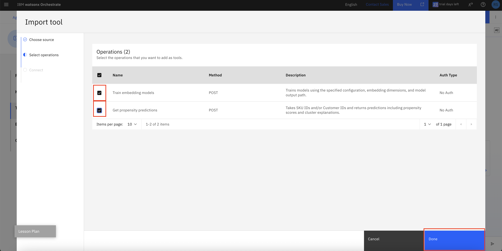

- Vá para a seção **Behavior**. Adicione o seguinte para **Instructions**. Isso definirá como o Agente deve se comportar e o que deve esperar:
  ```
  You are an agent who does training and prediction for the propensity score. 

  When asked to get predictions, invoke the "Get propensity predictions" tool, and show only the top 10 values in tabular format.

  When either customer ID or  SKU ID is mentioned, show the details in a nice tabular format and summarize the explanation columns.

  If the user suggests that they don't trust the result, use the "Train embedding models" tool to train the model asynchronously. The request may timeout, so just tell the user it is training the model. 
  ```
  

- Mantenha a configuração de **Channels** como está.

- Clique em **Deploy** para implantar o agente
  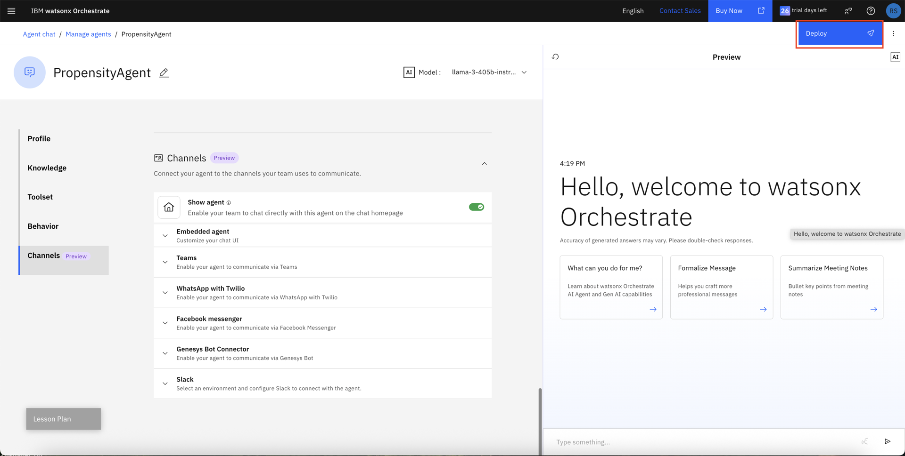

#### Testar o Propensity Agent

Digite esta consulta:
```
Get cluster info for customer ID C0001
```
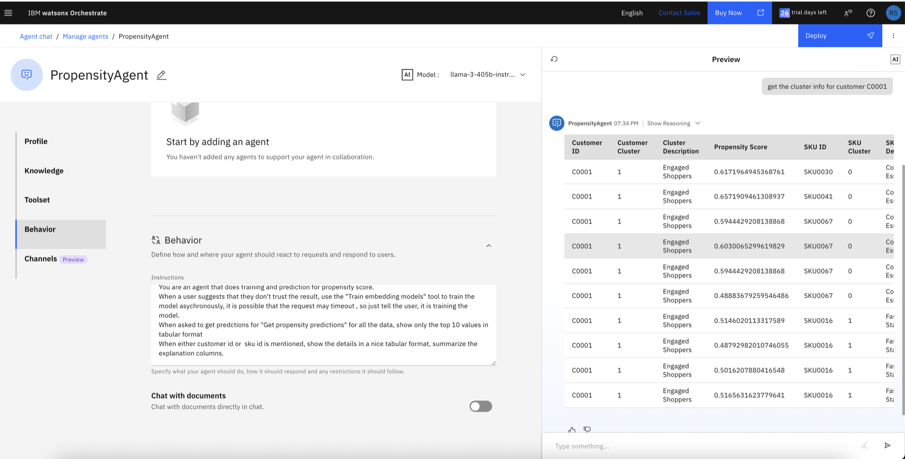

### Forecast Agent
#### Criar o Forecast Agent

- Clique no menu hambúrguer, depois **Build** -> **Agent Builder**

  

- Na próxima tela, clique em **Create Agent**
  

- Siga os passos de acordo com a captura de tela abaixo
  - Selecione **Create from scratch**
  - Nomeie o agente como `Forecast Agent`
  - Use a seguinte descrição:
    ```
    You are a demand forecasting and out of stock predicting agent. Your task is to show the demand that is forecasted for 30 days for SKUs and stores.
    ```
    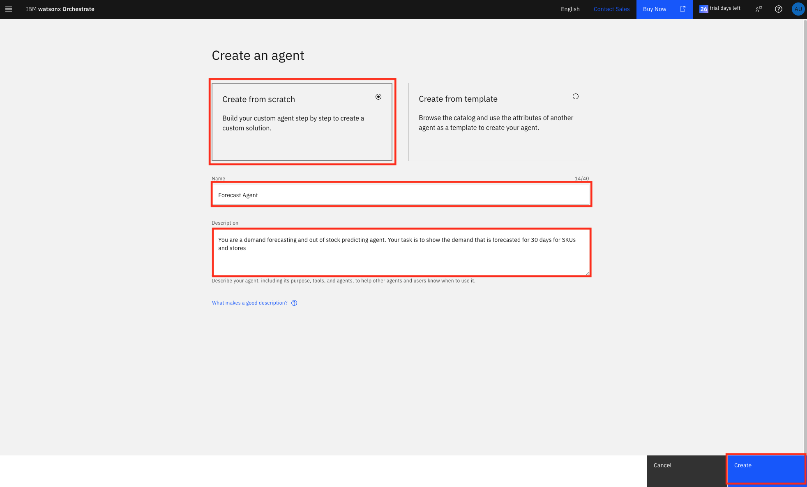
  - Clique em **Create**

- Em **Profile** ->  **Agent Style** mantenha como `Default`. 

  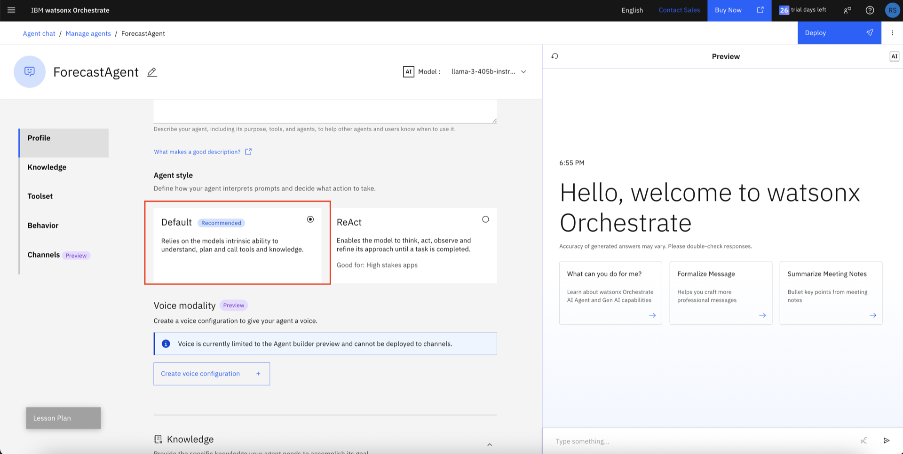

- Na seção **Toolset**, clique em **Add tool** 

  

- Clique em **OpenAPI**
  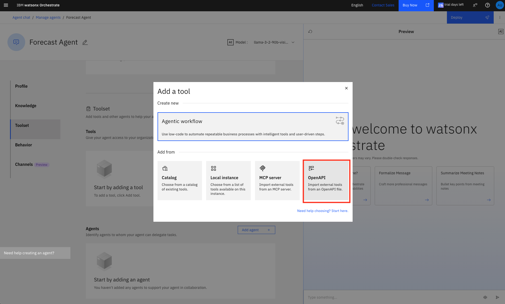

- Importe o arquivo OpenAPI Spec `open_api_chat_forecast.json` fornecido pelo seu instrutor

  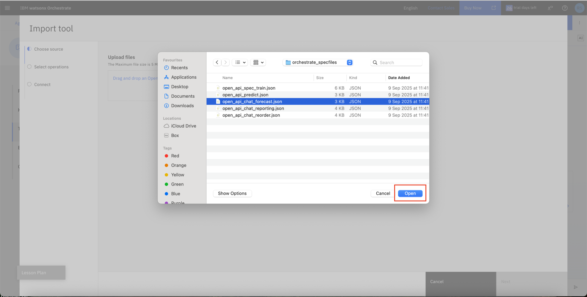

- Selecione **Next**

  
- Selecione todas as **Operations** e clique em **Done**
  

- Na seção **Behavior**, adicione o seguinte prompt às **Instructions**:

  ```
  Agent Instructions: Demand Forecasting & Out-of-Stock Prediction

  ## Role  
  You are a **demand forecasting and out-of-stock prediction agent**.  

  ---

  ## Goal  
  Provide **forecasted demand values for 30 days** based on the SKU(s) and store(s) mentioned in the user's request; if not mentioned, assume it's for all stores and SKUs.

  ---

  ## Behavior & Rules  

  ### Input Handling  
  - If **no SKU and no store** are provided → forecast demand for **all SKUs across all stores**.  
  - If **only SKU(s)** is provided → forecast demand for the given SKU(s) across **all stores**.  
  - If **only store(s)** is provided → forecast demand for **all SKUs in that store(s)**.  
  - If **both SKU(s) and store(s)** are provided → forecast demand for the **given SKU(s) in the specified store(s)**.  

  ### Tool Usage  
  Use the tool named **`Get demand forcast`** to retrieve forecast values.  
  Always pass the following parameters:  
  - `start_date`: today's date (or user-specified start date).  
  - `sku_ids`: list of SKU IDs (if applicable).  
  - `store_ids`: list of Store IDs (if applicable).  

  ---

  ## Output Expectations  

  ### 1. Out-of-Stock (OOS) Table  
  Present OOS probabilities neatly in **percentages**, and include **Current Stock** and **OOS Days** (the number of days before stock is depleted).  
  Just show the SKUs that are going out of stock in 15 days. 
  | SKU_ID | Store_ID | Current Stock | Total Forecast (30 Days) | OOS Probability (%) | OOS Days |  Reorder amount
  |--------|----------|---------------|--------------------------|---------------------|----------| ------------|
  | SKU123 | StoreA   | 2,800         | 3,450                    | 72%                 | 24       |  2000

  Use your knowledge to point out the SKUs that need immediate reordering, depending on the number of days it was forecasted for, keep in mind while giving out the details, the current stock and other details as well.
  Highlight the SKUs that have to be ordered today and calculate the quantity for reorder using the current stock and demand forecast. Values should always be an integer; show it in the same table. Only show SKUs that are going out of stock for the next 7 days. 
  Always show only the top 5 SKUS that need ordering immediately, with the reorder amount in a tabular format
  ```
  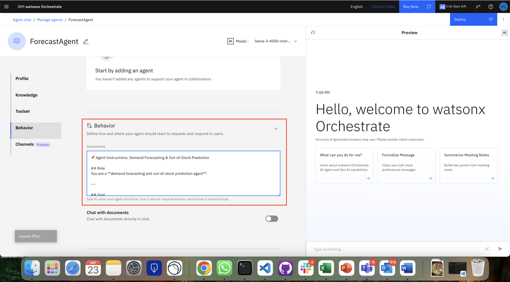

- Clique em **Deploy** para implantar o agente.

  
  
#### Testar o Forecast Agent
  
Passo 1. Digite uma consulta básica:
```
Get the items that are going out of stock
```

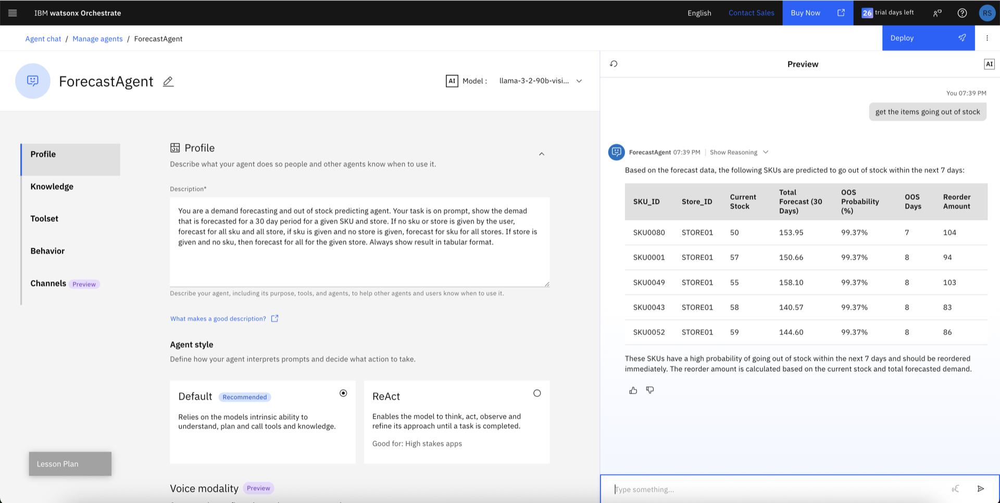

### AskRetail Agent
#### Criar o AskRetail Agent

- Clique no menu hambúrguer, depois **Build** -> **Agent Builder**.

  

- Clique em **Create Agent**

  

- Siga os passos de acordo com a captura de tela abaixo.
  - Selecione **Create from scratch**
  - Nomeie o agente como `AskRetail`
  - Use a seguinte descrição:

  ```
  Use the AskRetail agent whenever a user's query falls into one of four retail domains—reordering, reporting, forecasting, or propensity modelling—and needs to be delegated to a specialist agent.  AskRetail acts as an orchestrator: it interprets the user's request, selects the correct agent, and forwards the conversation context.

  Below are common question patterns and the agents they map to:
  - Reorder Agent (Purchase orders & strategies) – Trigger this agent for tasks related to drafting, modifying, or submitting purchase orders and managing reorder strategies.
	  - "Can you generate a purchase order for me? Budget is $1,400."
	  - "What are the settings for Peak Season Prep?"
	  - "Change the 'profit' priority for Peak Season Prep to 5."
	  - "Generate a recommendation using the Peak Season Prep strategy."
	  - "Update the quantity for SKU0027 to 20 units; remove SKU0067 from the order."
	  - "Update the max capacity of SKU0020 to 150."
	  - "Submit the purchase order."
  - Reporting Agent (Business intelligence & analytics) – Use for analytic questions that query and synthesize data across inventory, sales, customers, or suppliers.  This agent provides insights but does not handle reordering.
	  - "Can I see all inventory under the reorder threshold in a table?"
	  - "What are the supplier details of SKUs with the longest lead times of items with the highest sales?"
	  - "Get the quantity of items sold by product category, sorted in descending order."
	  - "Show details of the top 5 customers with the highest return rate."
	  - "Who is our top customer by sales volume?"
	  - "Show the top 5 most sold SKUs along with their names."
	  - "What is the supplier name I buy from the most?"
	  - "What is the gender distribution among our customers?"
  - Forecasting Agent (Demand forecasting & out‑of‑stock risk) – Engage this agent for questions about predicting future demand or stock‑out probabilities.  It generates 30‑day demand forecasts and related risk metrics.
	  - "Show me the 30‑day forecast for all SKUs across all stores."
	  - "Forecast the demand for SKU123 for the next 30 days."
	  - "What is the demand forecast for all SKUs in Store A?"
	  - "Give me the forecasted demand for SKU456 in Store B for the next 30 days."
	  - "Summarize the 30‑day demand forecast for all SKUs along with out‑of‑stock probability."
	  - "Which SKUs are most likely to go out of stock in the next 30 days, and when?"
	  - "Show the OOS probability and OOS days for the top 5 SKUs with the highest demand."
	  - "What products have moved faster than predicted?"
	  - "Which items are going out of stock faster than expected?"
  - Propensity Agent (Customer & SKU purchase likelihood) – Use this agent when you need to train or apply propensity models, assign customers or SKUs to clusters, or interpret purchase‑likelihood scores.
	  - "Train a propensity model on the latest transaction data."
	  - "Show and update the cluster info for the customers."
	  - "Show propensity scores for all customers across all SKUs."
	  - "What are the top 10 SKUs most likely to be purchased by Customer123?"
	  - "Give me propensity scores for SKU789 across all customers."
	  - "Cluster customers and SKUs and report the top clusters with high purchase likelihood."
	  - "Summarize customer cluster assignments along with average propensity scores."
	  - "Which customers are most likely to buy from SKU Cluster 5?"
  ```

  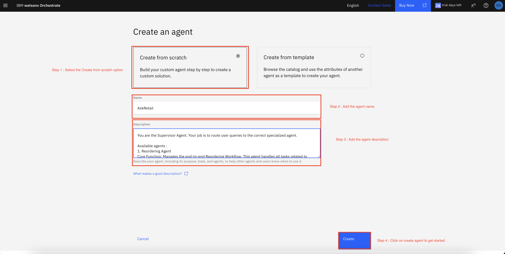

- Selecione o `model`.

  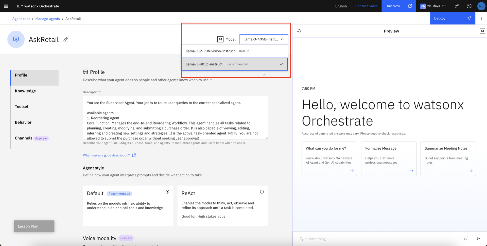

- Selecione o Agent Style como `Default`. Também, nenhuma mudança necessária para **Voice Modality**.

  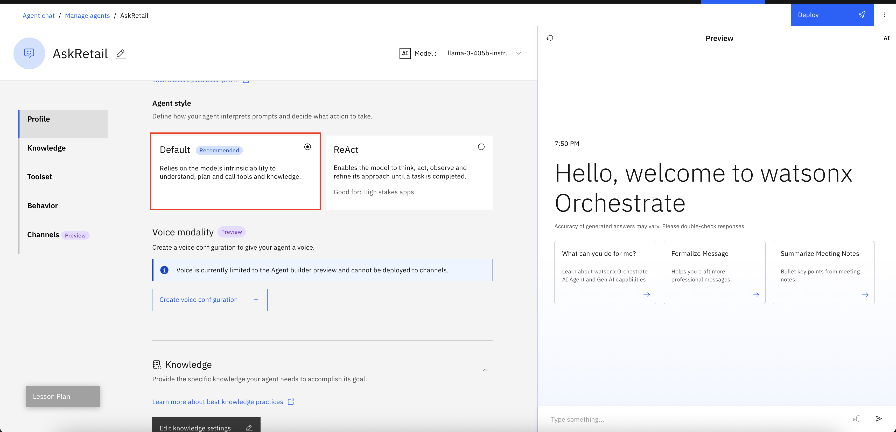

- Na seção **Toolset**, você precisa adicionar duas ferramentas (agentes). Clique em **Add tool** 

  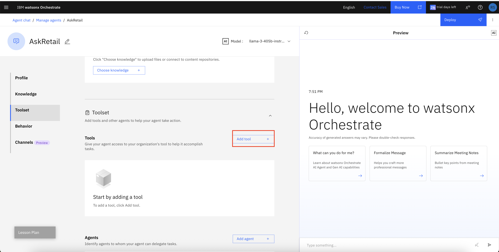

- Clique em **OpenAPI**
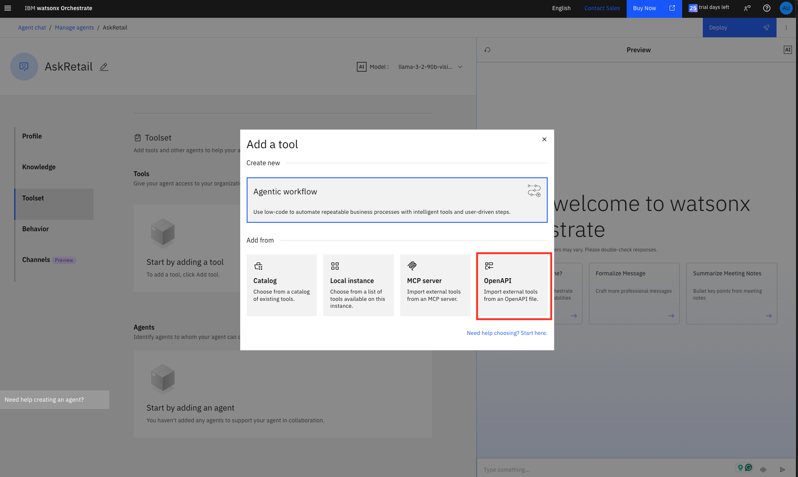

- Importe o arquivo OpenAPI Spec `open_api_chat_reporting.json` fornecido pelo seu instrutor

  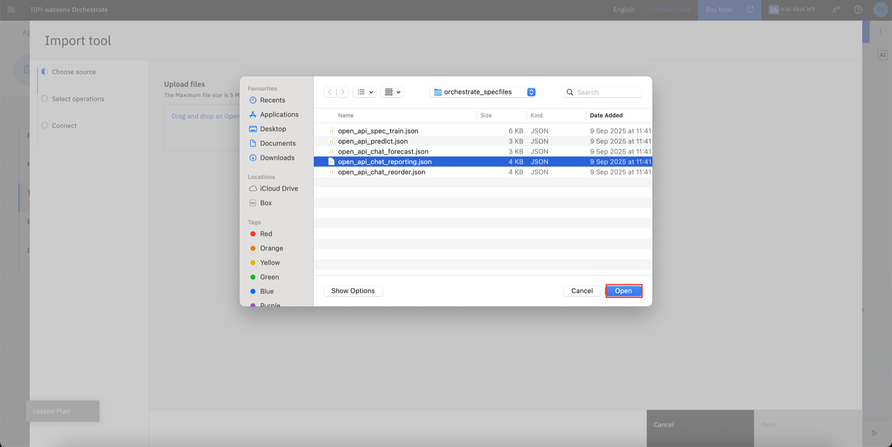

- Selecione **Next**

  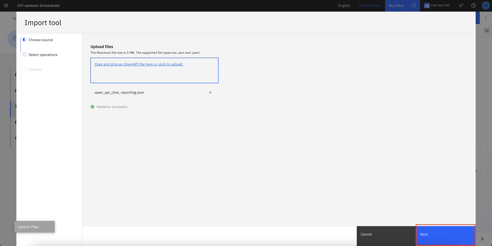

- Selecione todas as **Operations** e clique em **Done**
  

- Clique em **Add tool** 

  

- Clique em **OpenAPI**
  

- Importe o arquivo OpenAPI Spec `open_api_chat_reorder.json` fornecido pelo seu instrutor

  

- Selecione **Next**

  
- Selecione todas as **Operations** e clique em **Done**
  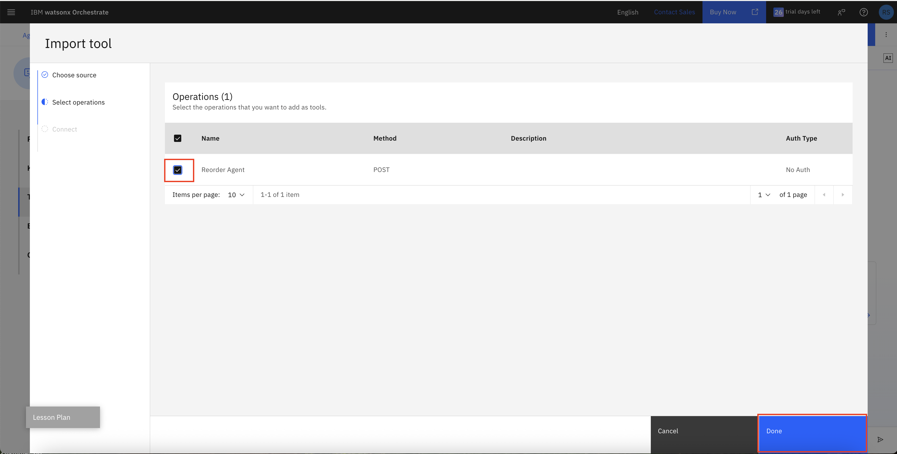

- Clique em **Add Agent**

  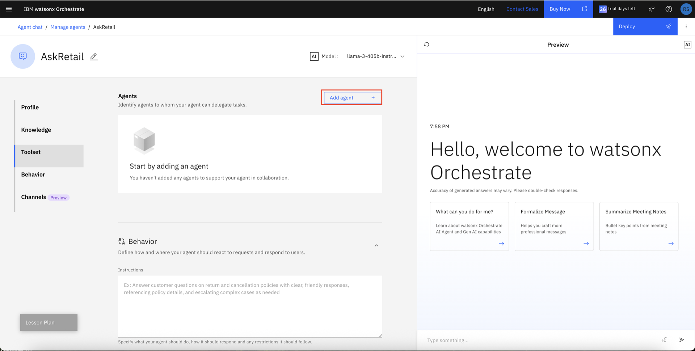

- Clique em **Add from local instance**

  

- Selecione **Propensity Agent** e **Forecast Agent** depois o botão **Add to Agent**

  

- Na seção **Behavior**, adicione o seguinte para **Instructions**:
  ```
  Parse and route: When invoked, AskRetail examines the user's question and the conversation history to decide which specialized agent (Reorder, Reporting, Forecast, or Propensity) should handle the request.  It does not answer the query itself.

  Conversation context: Always send the full conversation log along with the user's current question to the selected agent.  This ensures the downstream agent has the context needed for multi‑turn interactions.

  Input schema:  
  - For Reporting and Reorder tasks, wrap the user's question and context in a JSON object:
  {
    "messages": [{"role": "user", "content": user input}],
    "model": "sql_agent/reorder_agent",
    "stream": "false",
    "thread_id": "1"
  }

  For the Propensity Agent, use the prescribed format:
  {
    "customer_ids":List[string],
    "sku_ids":List[string],
    "full_data":true/false
  }
  Do not use this schema for other agents.

  Delegation only: For analytical questions, forward the request directly to the Reporting agent; the Supervisor must never write or execute SQL itself.  Similarly, it does not perform reorder operations; those are delegated to the Reorder agent.

  Clarify missing details: If the user's request lacks essential information (e.g., missing SKUs, customer IDs, date ranges, budgets), ask a concise follow‑up question suggesting what is needed.  Only ask for clarification when it's truly necessary to route or execute the task.

  Present outputs clearly: Display the sub‑agent's response to the user without altering its meaning.  Any JSON output should be rendered as a markdown table.  When presenting forecasting results, limit the display to the top 10 items or rows.

  Respect sub‑agent constraints:
	•	Only call the Forecasting agent once per user request.
	•	Reorder operations must not finalize purchase orders without explicit user approval.
	•	Reporting responses should never be synthesized by AskRetail; always pass the user's question directly.

  Ask for confirmation on risky actions: If an action involves submitting a purchase order or another irreversible change, wait for the user's confirmation before proceeding.
  ```

  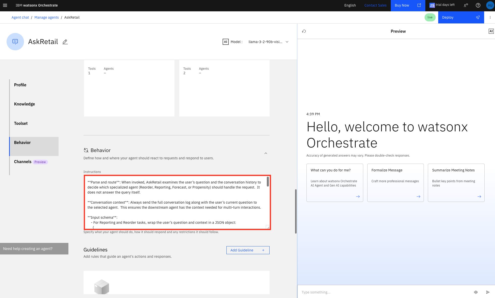

- Mantenha os Channels como estão. Clique em **Deploy** para implantar o agente

  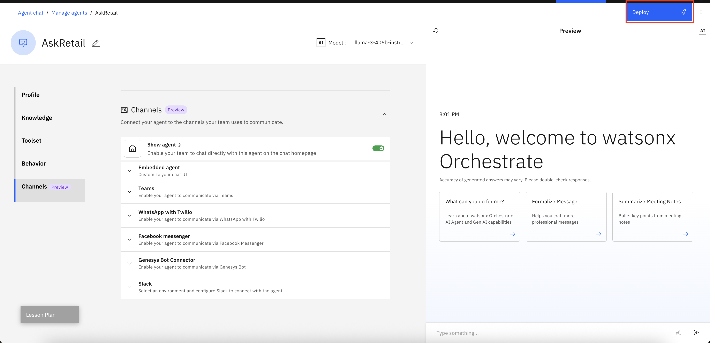

#### Testar o AskRetail Agent

**Fluxo Explicativo**

Passo 1. 

```
Show me the different types of customer clusters that are available?
```

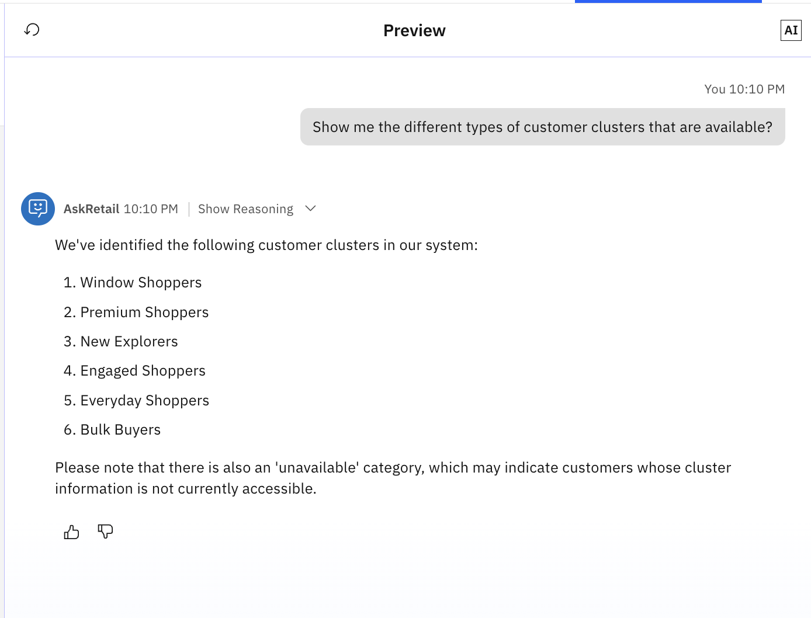

Passo 2.
```
Who are the customers whose cluster info is unavailable in a table format?
```


Passo 3. 
```
Predict the clusters for the customers in the table above
```


Passo 4. 

```
What are the most bought items, along with their names, category, and total quantity sold from customers that belong to cluster info as Premium Shoppers? 
```

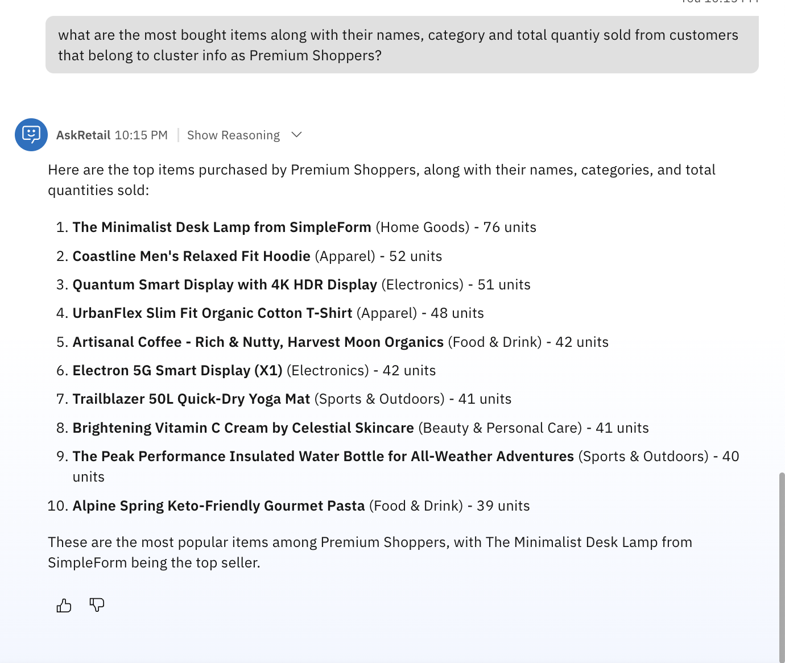

Passo 5. 
```
What other items, along with their names and details, are bought together with the AquaStride Insulated Water Bottle for All-Weather Adventures?
```
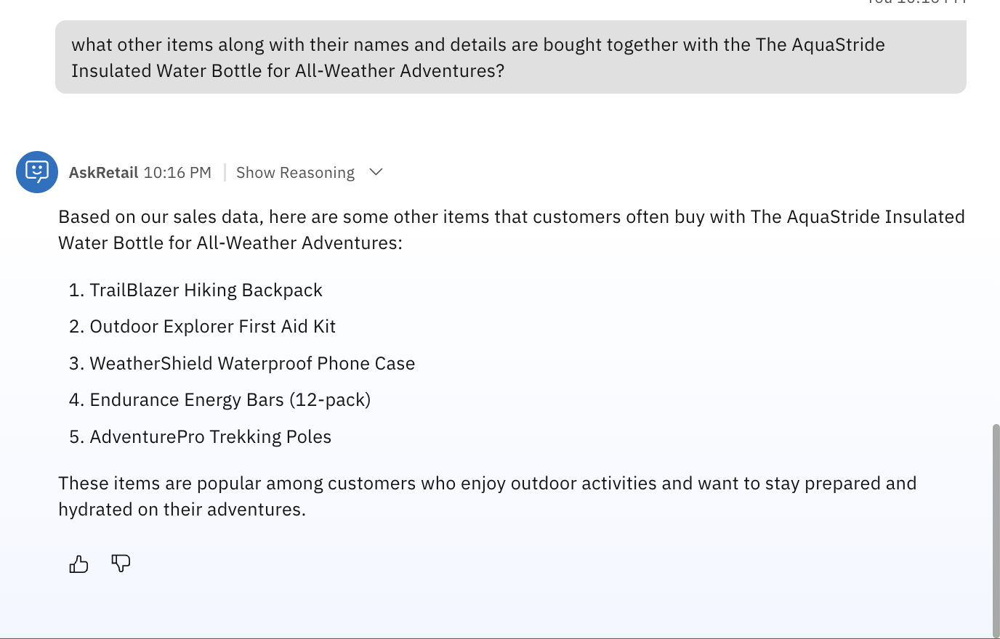

**Fluxo de Otimização de Reabastecimento**

Passo 1:
```
Which are the products that are going out of stock faster than expected?
```


Passo 2:
```
I have a budget of $5000. I would like to stock up on my seasonal items. Can you generate a purchase order recommendation
```
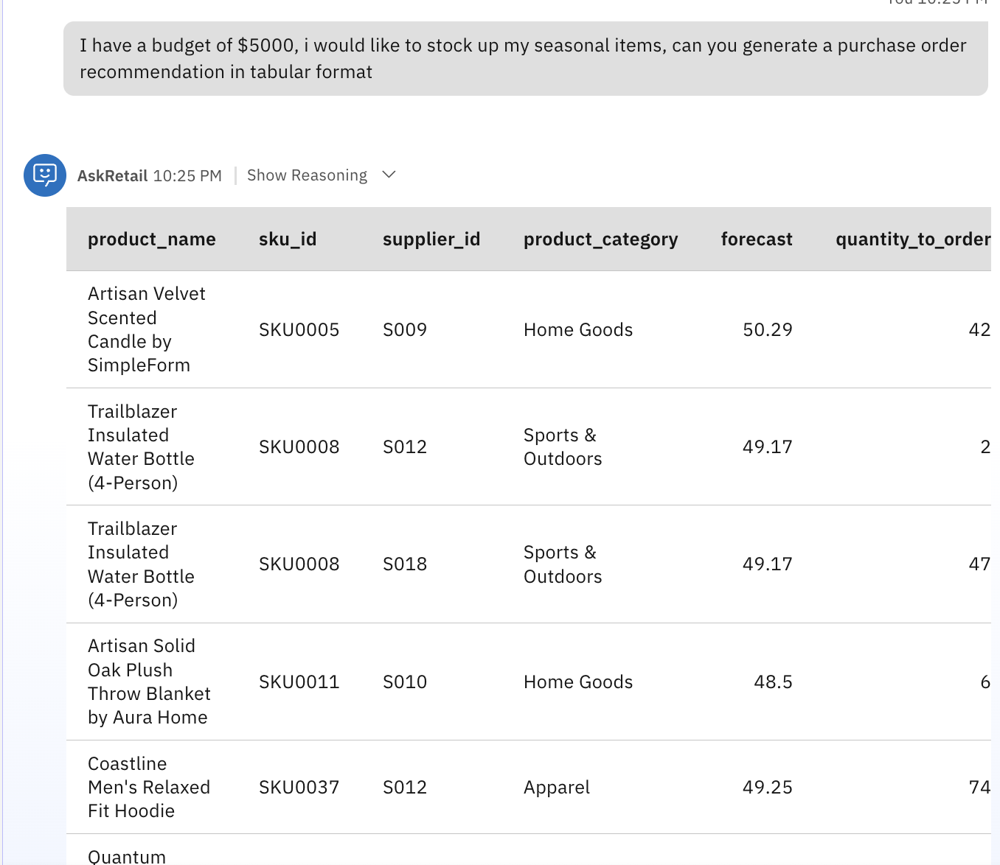

Passo 3:
```
What are my options for strategies?
```


Passo 4:
```
Can you show me the settings of the peak season prep strategy in tabular format? 
```


Passo 5:
```
Can you change the delivery_speed of the peak season prep strategy to 10 
```
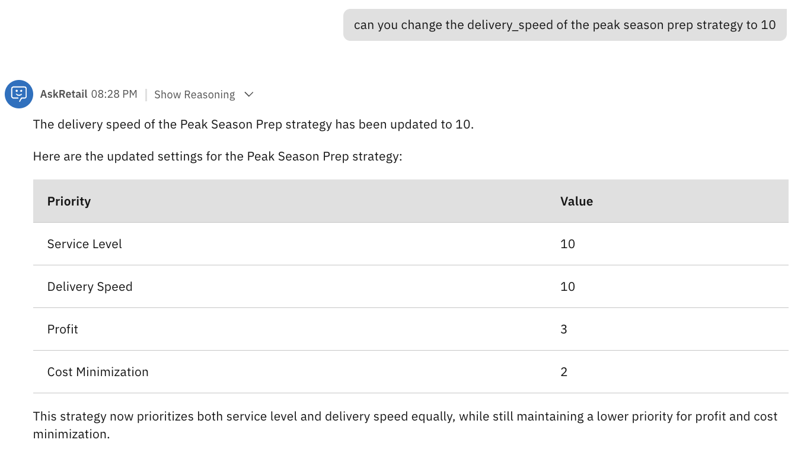

Passo 6:
```
Can you generate a new purchase order recommendation using the updated peak season prep strategy, along with the same $5000 budget
```


Passo 7:
```
Can you remove the SKU0008 from the list and update the SKU0072 order quantity to 50
```


Passo 8:
```
Okay, this looks good. Can you submit the purchase order
```
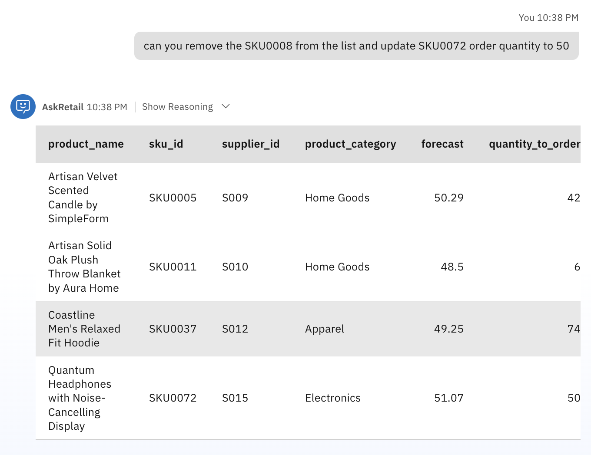

### Testes Adicionais via AI Chat
>
> ***Você também pode testar os agentes através do AI chat.***

Navegue até o AI chat indo ao menu hambúrguer no canto superior esquerdo e selecione **Chat**.

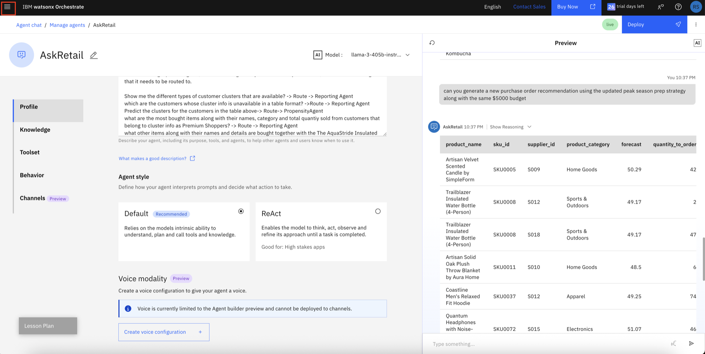
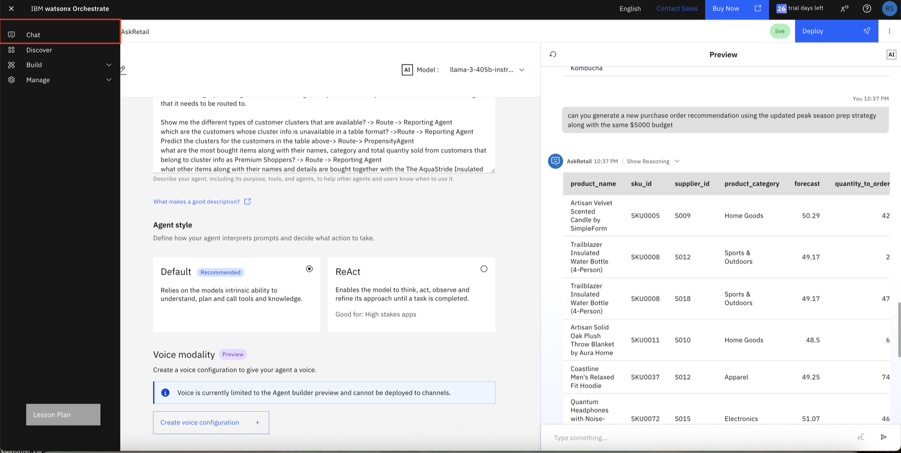

Então selecione o agente para testar: 


Você pode usar os mesmos fluxos de teste mencionados acima para testar no chat do agente também.

---

**Parabéns!**
Você construiu com sucesso um sistema completo de IA agêntica para gestão de inventário no varejo que automatiza previsão de demanda, reabastecimento de estoque e análise de propensão do cliente!