# Automatize o processamento de reivindicações de seguros com a IA da Agentic - Agente Customer

## Sumário

- [Automatize o processamento de reivindicações de seguros com a IA da Agentic - Agente Customer](#automatize-o-processamento-de-reivindicações-de-seguros-com-a-ia-da-agentic---agente-customer)
  - [Sumário](#sumário)
  - [Descrição do caso de uso](#descrição-do-caso-de-uso)
  - [Arquitetura](#arquitetura)
  - [Implementação](#implementação)
    - [Pre-requisitos](#pre-requisitos)
    - [Open Agent Builder](#open-agent-builder)
    - [Agente de sinistro de clientes](#agente-de-sinistro-de-clientes)
      - [Crie o agente de sinistro de clientes](#crie-o-agente-de-sinistro-de-clientes)
      - [Teste o Agente de sinistro de clientes](#teste-o-agente-de-sinistro-de-clientes)

## Descrição do caso de uso

Com a tecnologia Agentic AI e o Watsonx Orchestrate, esta solução permite a criação de um agente inteligente focado na experiência do cliente, que transforma e agiliza o processo de abertura e acompanhamento de sinistros.

Os clientes podem iniciar um sinistro respondendo a algumas perguntas guiadas, mesmo com informações iniciais mínimas. O agente gerencia automaticamente a coleta de informações, validação de dados e criação da solicitação de sinistro. Isso garante uma experiência rápida, precisa e intuitiva, com atualizações de status do sinistro em tempo real que aumentam a transparência e a satisfação do cliente.

O agente também fornece informações sobre apólices de seguro e o processo de sinistros através de uma base de conhecimento integrada, respondendo dúvidas dos clientes de forma clara e contextualizada.

## Arquitetura

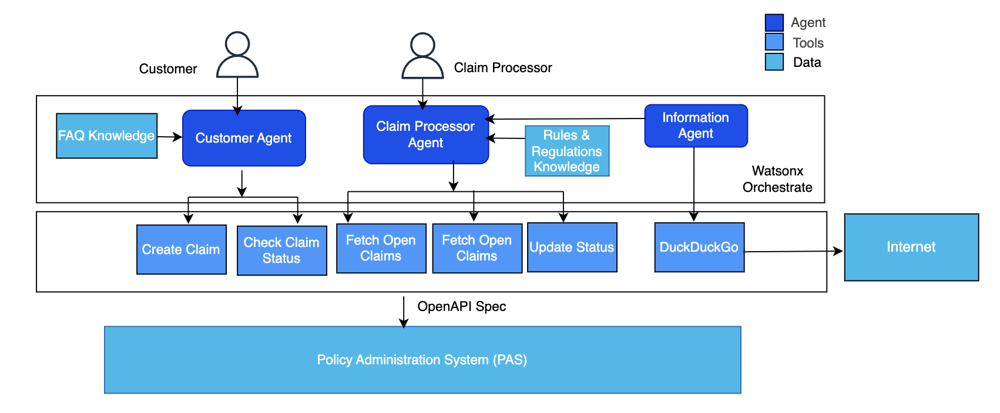

## Implementação

### Pre-requisitos

- Verifique com seu instrutor se **todos os sistemas** estão funcionando antes de continuar.
- Confirme se você tem acesso ao ambiente watsonx Orchestrate para este laboratório.

- Certifique-se de que seu instrutor forneceu o seguinte:
   - Especificação OpenAPI para o agente de cliente
   - Um nome de usuário de cliente registrado no banco de dados de seguros

### Open Agent Builder

- Log in na IBM Cloud (cloud.ibm.com). Navegue até o menu superior esquerdo e, em seguida, até a Lista de Recursos. Abra a seção IA/Aprendizado de Máquina. Você verá o serviço **watsonx Orchestrate**. Clique para abrir.


- Clique no botão "Launch watsonx Orchestrate".


- Bem-vindo ao watsonx Orchestrate. Abra o menu de hambúrguer, clique em **Build** -> **Agent Builder**.


### Agente de sinistro de clientes

#### Crie o agente de sinistro de clientes

- Clique no menu de hambúrguer e depois **Build** -> **Agent Builder**

  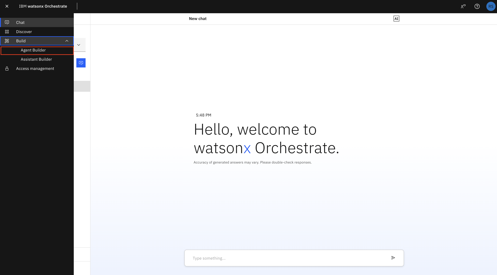

- Clique em **Create Agent**

  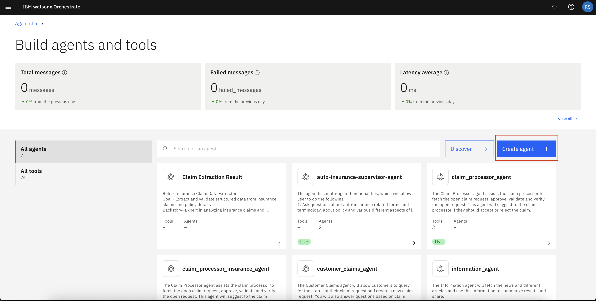

- Siga os passos de acordo com a captura de tela abaixo
  - Selecione **Create from scratch**
  - Nomeie o agente `Customer_Claims_Agent`
  - Utilize a seguinte descrição:

  ```
  O agente de Reclamações do Cliente permitirá que os clientes consultem o status de suas solicitações de reclamação e criem uma nova solicitação. Você também responderá a perguntas sobre o processo de reclamação e a apólice de seguro, utilizando a base de conhecimento.
  ```

  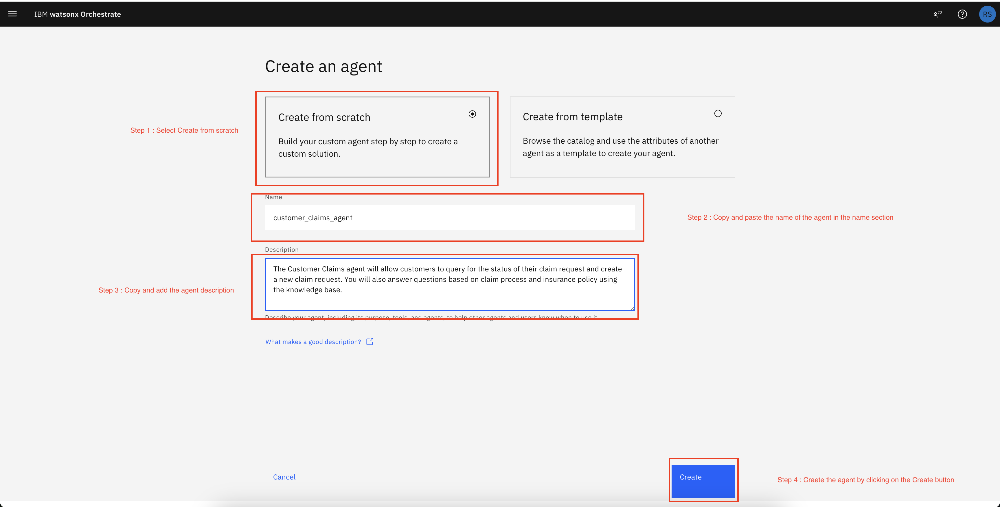

  - Clique **Create**

- Selecione `Model`. Mantenha-o como o **default**.

  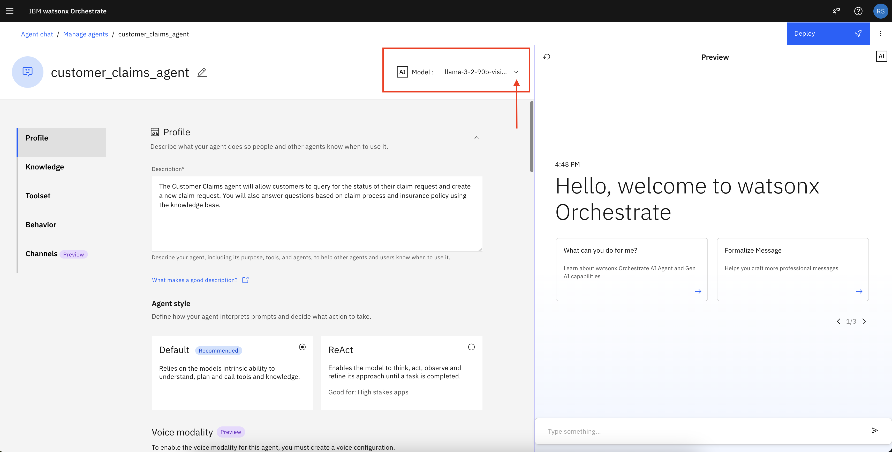

- Escolha o estilo do agente. Mantenha-o como `default`.

- Em **Welcome Message:** Ainda durante a etapa de definição do tipo de agente, você também pode configurar uma mensagem de boas vindas que será exibida na interface para o usuário, como mostrado na imagem abaixo. Essa etapa é opcional e você pode definir algo como:
```Bem vindo ao Agente X```

- Em **Quick start Prompts:** Esse passo também é opcional. Nessa sessão podemos definir atalhos para o usuário, essas mensagens serão exibidas para o usuário como botões na interface. Você pode criar esses botões clicando em `Add prompt +` e removê-los clicando no ícone de lixeira. Para que essas opções apareçam na telinha de preview do lado direito da tela, use o ícone de restart para atualizar a interface. **Não é necessário sair da página.**

- Em `Keep Voice Modality` escolha ou mantenha `No voice configuration`.

  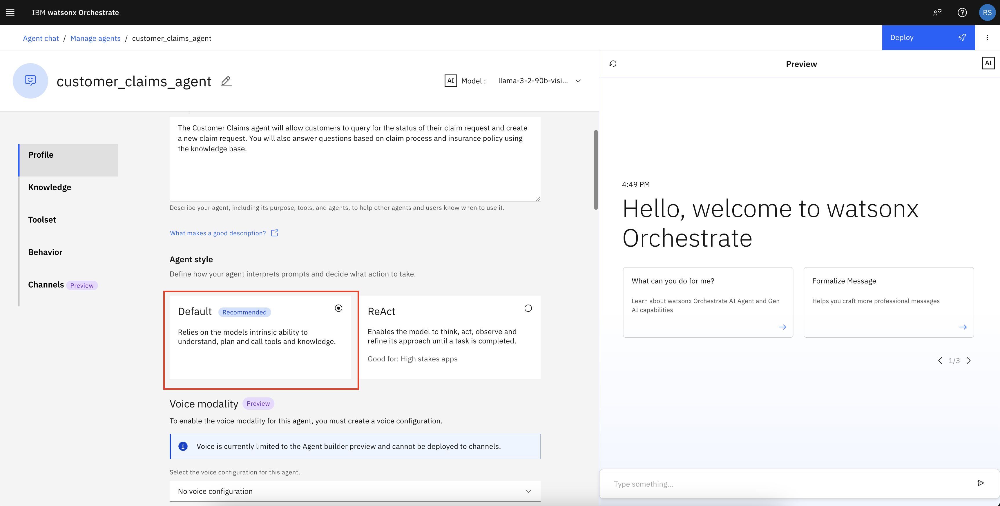
  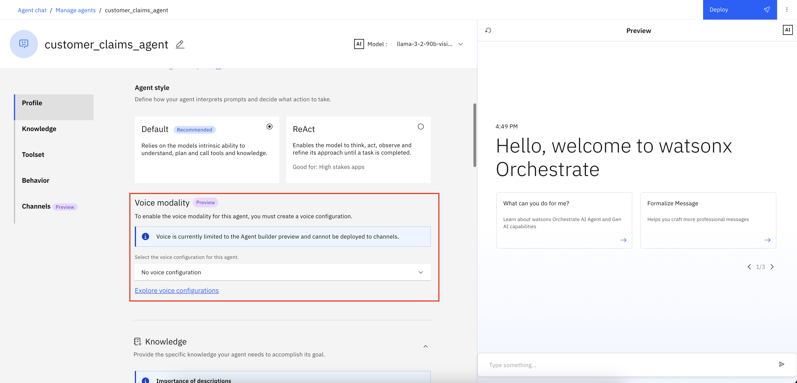


- Na seção **Knowledge**:

- Faça o upload do arquivo Automobile Insurance Knowledge Base (Arquivo "Automobile Insurance Knowledge Base.pdf" dentro da pasta "5. Agente de Sinistros de seguros" gerada após descompactar o LABS.zip) clicando em **Upload files** em **Documents**

  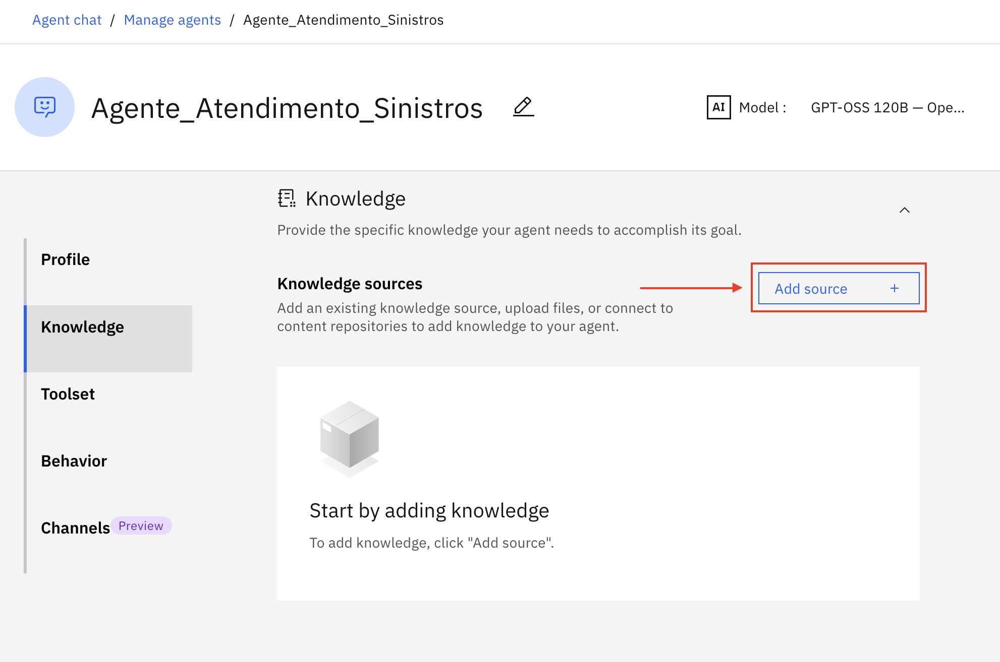
  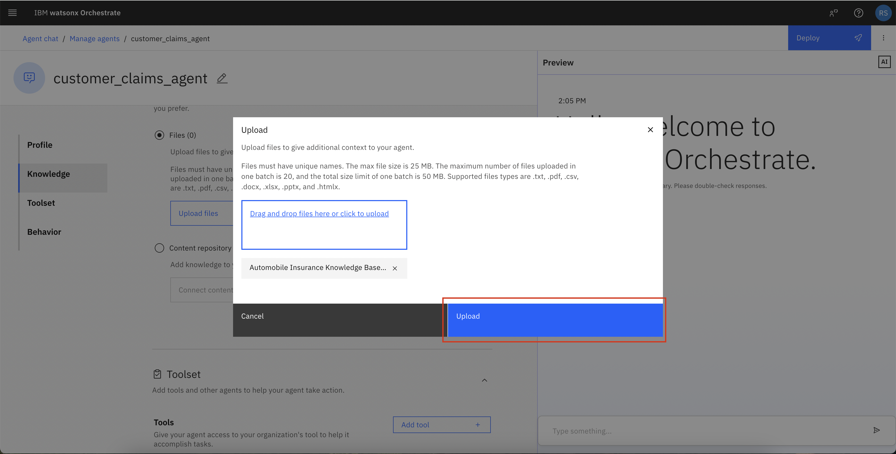
  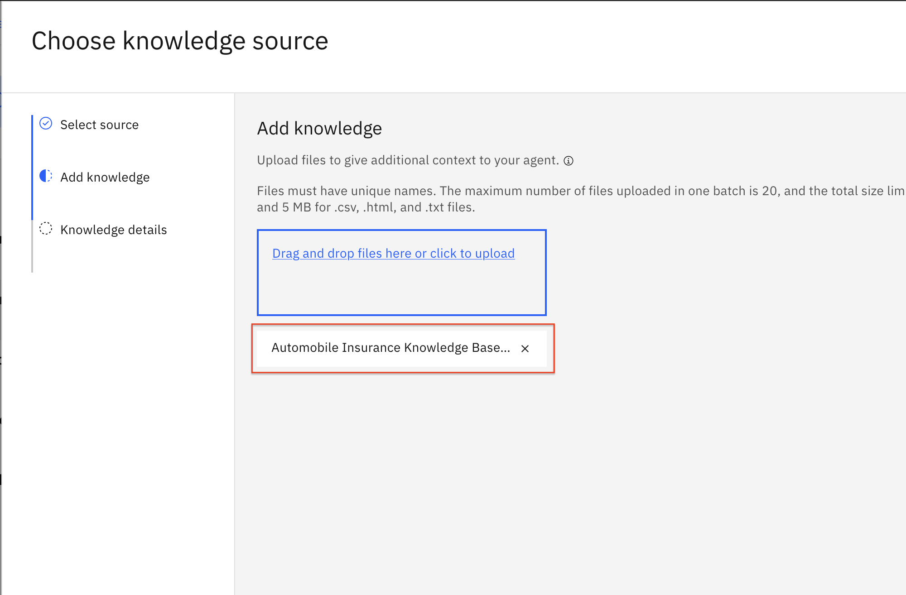

- Adicione a seguinte descrição em **Description**:

  ```
  Esta base de conhecimento aborda o tema de seguros e o processo de sinistro. Esta base de conhecimento ajudará o cliente a obter informações sobre o processo de sinistro e as regras e regulamentos de processamento de sinistros de seguro.
  ```

- Na seção **Toolset**, clique em **Add tool** 

  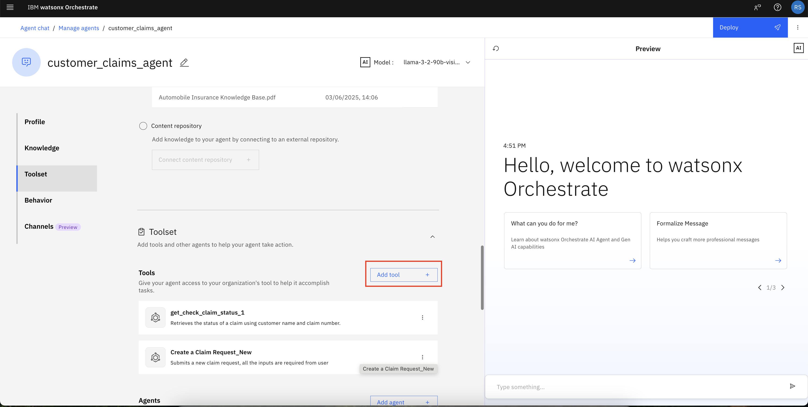

- Clique em **Import**. Importe o arquivo `customer_claims_agent_tools.json` (Arquivo "customer_claims_agent_tools.json" dentro da pasta "5. Agente de Sinistros de seguros" gerada após descompactar o LABS.zip) 

  
  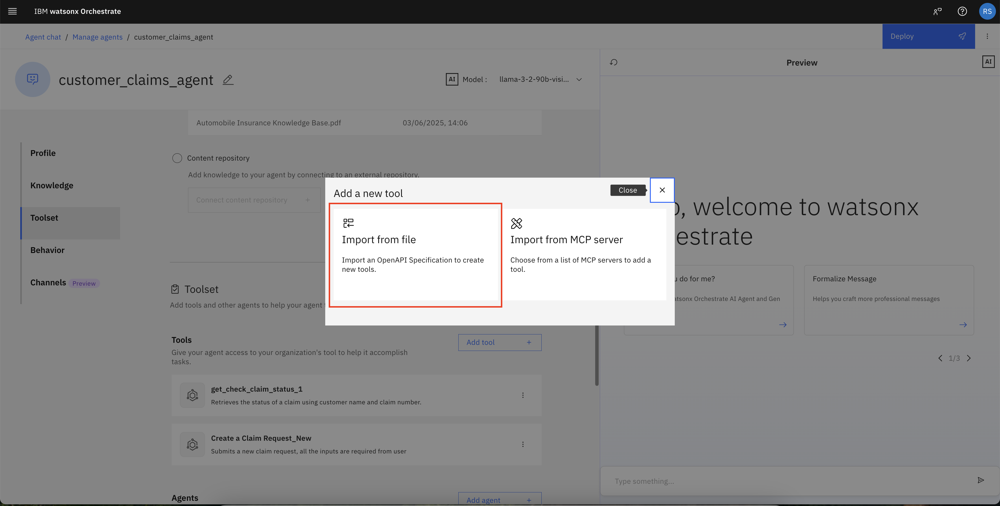
  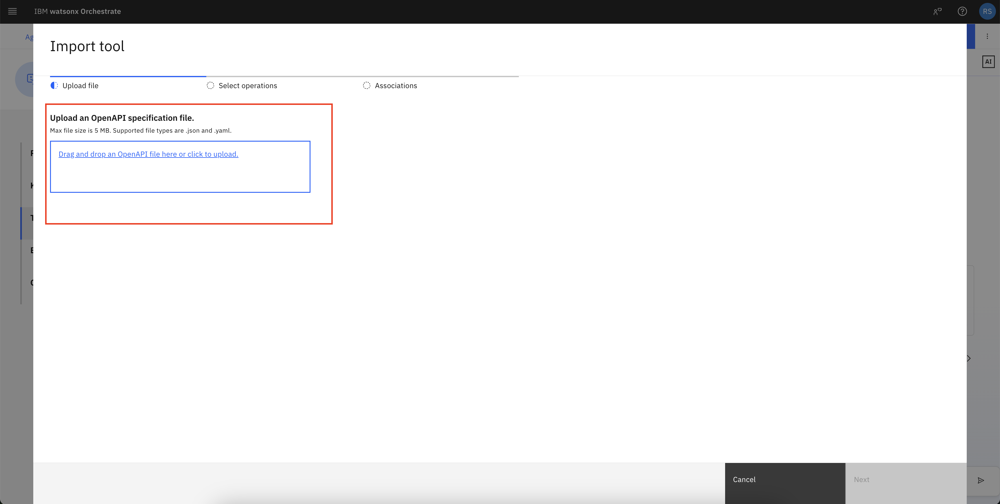

- Selecione **Next**

  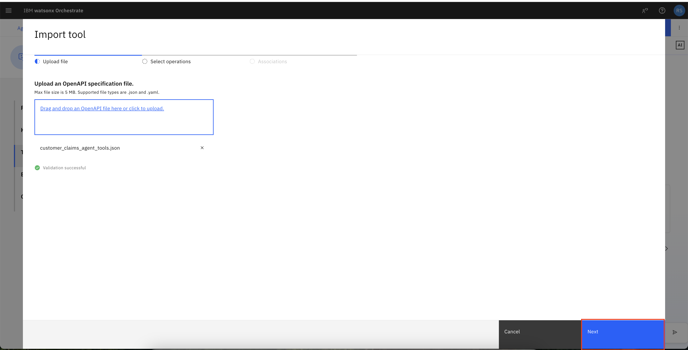
- Selecione todas as  **Operações** e clique em **Done**
  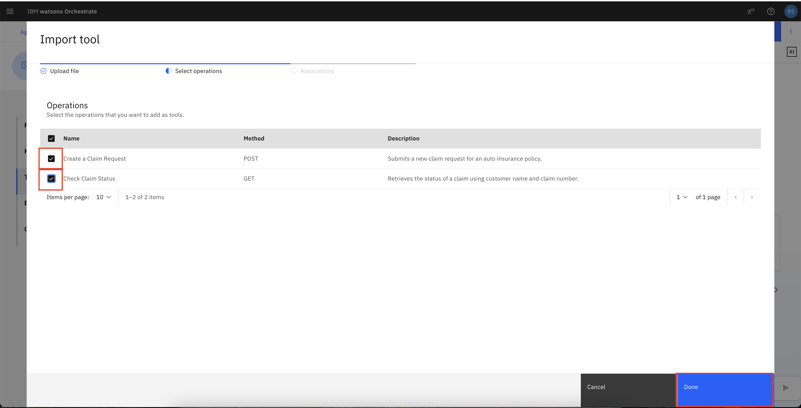

- Na seção **Behavior**, adicione o seguinte prompt ao **Instructions**:

```
Se o usuário solicitar o envio de uma reclamação, siga estas etapas:

  1. Colete as informações necessárias (sem suposições). Peça ao usuário que forneça os seguintes detalhes:
  - Nome completo (para autenticação)
  - Local do incidente
  - Data do incidente
  - Detalhes e tipo do veículo
  - Uma descrição detalhada do incidente

  Se algum destes estiver faltando, pause e solicite-o antes de continuar.

  2. Solicite todas as seguintes informações adicionais (somente se ainda não tiverem sido fornecidas):
  - O incidente foi reportado à polícia? Em caso afirmativo, qual a data e hora?
  - Houve danos? Qual o custo estimado?
  - Houve despesas médicas? Em caso afirmativo, qual o valor?

  Calcule o custo total estimado somando os danos e as despesas médicas.

  3. Crie a Solicitação de Reclamação. Após coletar todas as informações necessárias:
  - Crie um resumo conciso e estruturado do incidente e dos detalhes relacionados.
  - Use essas informações como claim_request_details na ferramenta "Criar uma Solicitação de Reclamação".

  Se a ferramenta retornar uma reclamação bem-sucedida, siga todos os procedimentos a seguir:
  - Exiba os resultados em uma tabela formatada, com cada detalhe em uma nova linha
  - Destaque o número da reclamação
  - Informe ao usuário: "Você receberá uma confirmação da sua solicitação de reclamação por e-mail."

  Se a ferramenta retornar "cliente não encontrado":
  - Responda com: "Você não está autorizado a enviar uma reclamação."
  - Não exiba nenhuma saída adicional da ferramenta.

Se o usuário perguntar sobre o Status da Reclamação, siga estas etapas:
  1. Pergunte o nome dele
  2. Pergunte o número da reclamação
  3. Use a ferramenta "Verificar Status da Reclamação" para recuperar o status da reclamação
  4. Exiba o resultado em um formato tabular limpo. Cada detalhe deve estar em uma nova linha.
  5. Encerre a conversa após exibir o status da reclamação

Se o usuário tiver dúvidas sobre:
  - Processos de seguro
  - Elegibilidade para sinistros
  - Documentação
  Consulte apenas a base de conhecimento “Automobile Insurance Knowledge Base.pdf”. Se a resposta não estiver na base de conhecimento, responda: “Não sei”.

Não faça referência à base de conhecimento ao interagir com ferramentas.
```
  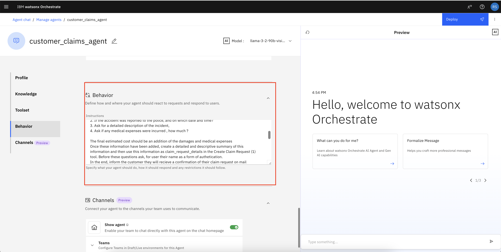

- Não há necessidade de alterar o `Channels`. Clique em **Deploy**

  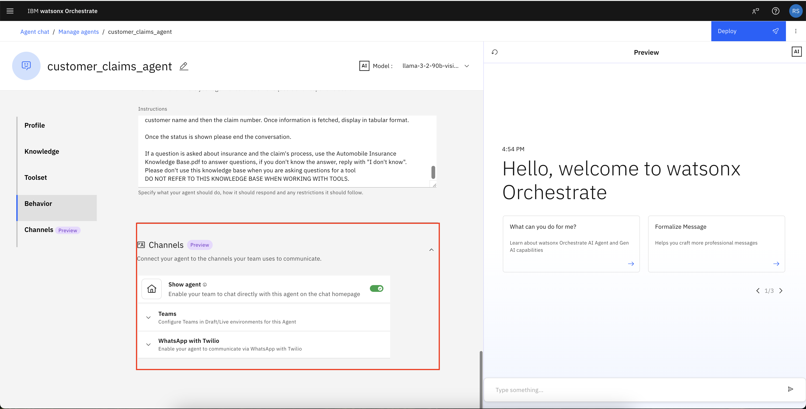
  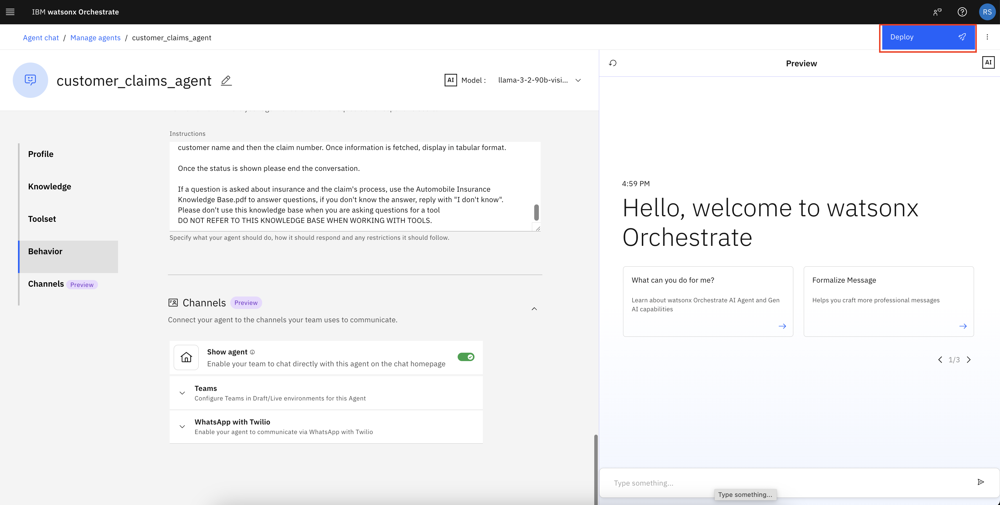

#### Teste o Agente de sinitro de clientes

Passo 1. Insira uma consulta básica:

```
Quais são os diferentes tipos de seguro de automóvel?
```

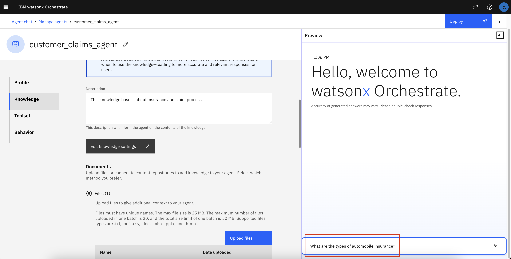

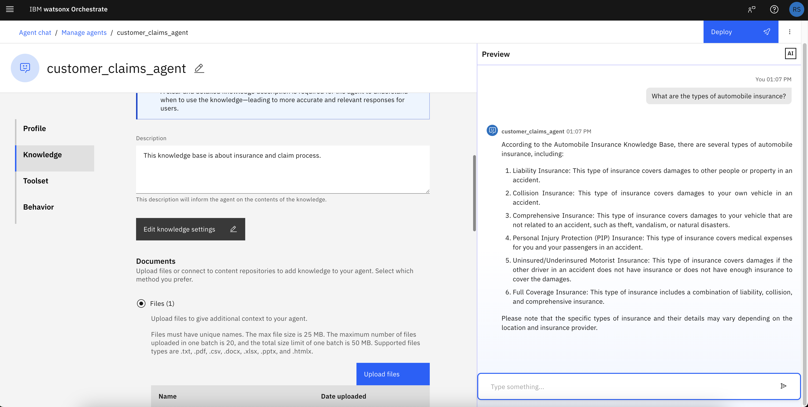

Etapa 2. Verifique o fluxo para criar uma nova reclamação

Digite o seguinte:
```
Enviar uma nova reclamação
```

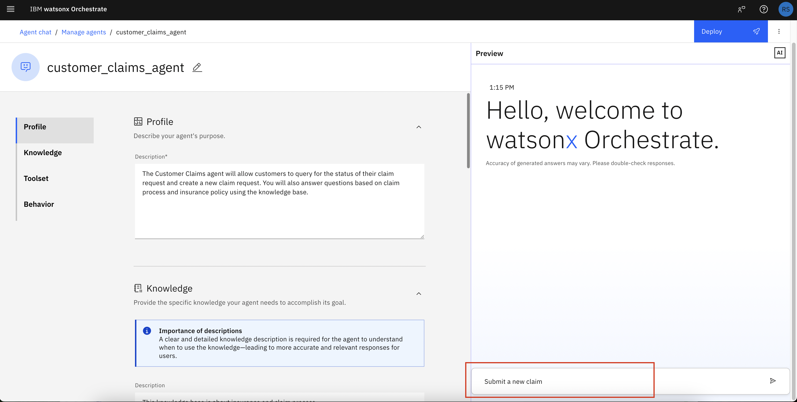

**OBSERVAÇÃO**: Escolha um dos nomes da planilha de usuários (Arquivo "Insurance_Database_v1.csv" dentro da pasta "5. Agente de Sinistros de seguros" gerada após descompactar o LABS.zip)

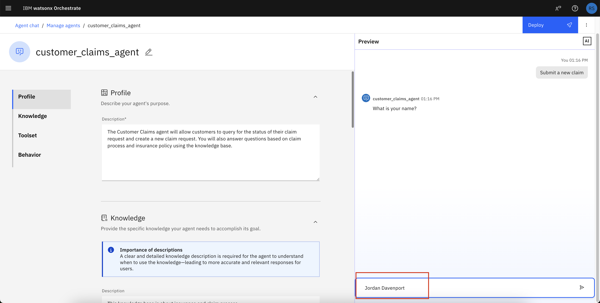

Para localização, digite:

`St Mary's Street, San Francisco, California`

ou qualquer outro endereço.

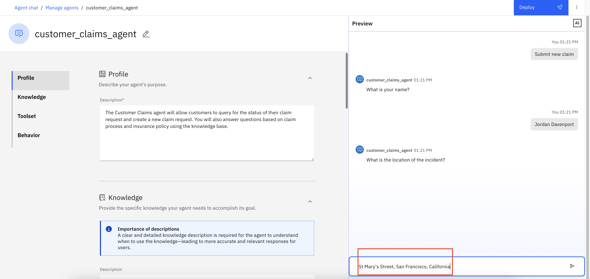

Para data entre `23-05-2025` ou qualquer outra data

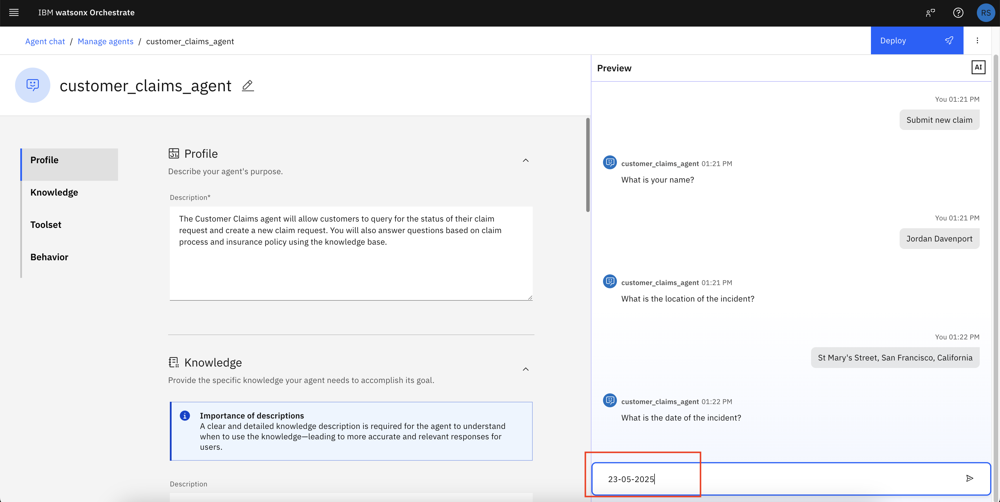

Para informações sobre o veículo, digite `Toyota Corolla, 2003` ou quaisquer outros detalhes do veículo

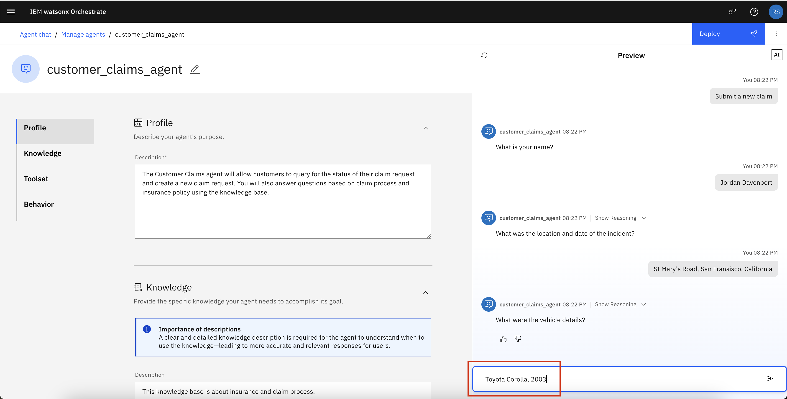

Para mais detalhes, insira:

```
Eu estava dirigindo para o trabalho quando uma caminhonete vermelha avançou o sinal vermelho e colidiu com a traseira direita do meu veículo no cruzamento. O impacto fez meu carro girar levemente, resultando em danos ao para-choque traseiro, à lanterna traseira direita e um amassado no para-choque traseiro. Eu estava usando cinto de segurança e não sofri ferimentos graves, mas relatei dores leves nas costas e consultei um médico no mesmo dia. As despesas médicas foram de US$ 3.400 e o custo do reparo dos danos foi de US$ 4.500.
```

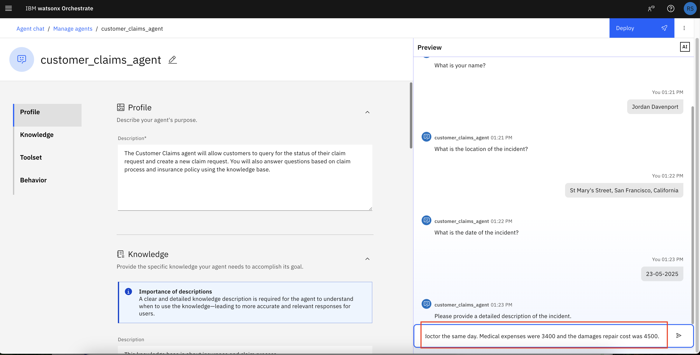

Etapa 3. Verifique o fluxo para o status da reivindicação

Insira a consulta:

```
Verifique o status da reivindicação
```

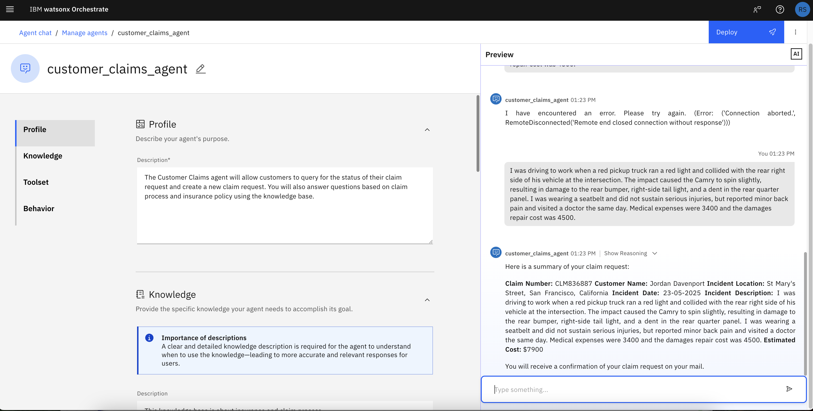

Digite o nome que você escolheu:

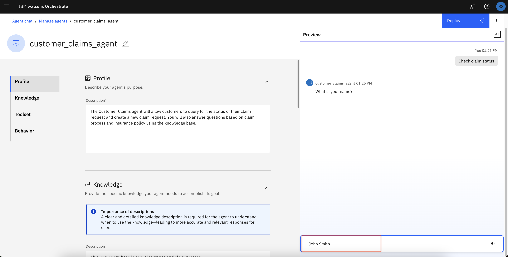

Para o número da reclamação, insira o número da reclamação do resumo da reclamação que você acabou de criar:

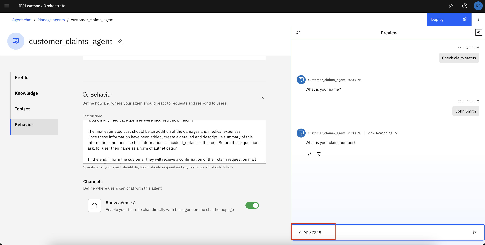

Você pode criar reivindicações adicionais para testar diferentes cenários com o agente de sinistro de clientes.

---

## Parabéns! 🎉

Você concluiu com sucesso a implementação do **Agente de Sinistro de Clientes** usando Watsonx Orchestrate. Este agente permite que os clientes:

- ✅ Abram novos sinistros de forma guiada e intuitiva
- ✅ Consultem o status de seus sinistros existentes
- ✅ Obtenham informações sobre apólices e processos de seguro

Este é o primeiro passo na construção de uma solução completa de automação de sinistros. O agente pode ser expandido com funcionalidades adicionais conforme necessário.
