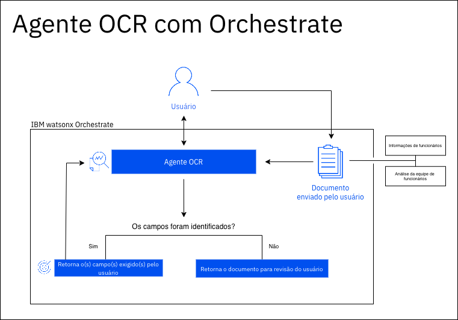

# Sumário
- [Sumário](#sumário)
- [🧑‍💼 Agente Extrator](#-agente-extrator)
  - [🎯 Objetivo](#-objetivo)
  - [📈 Valor de Negócio](#-valor-de-negócio)
  - [Arquitetura](#arquitetura)
  - [🎥 Demonstração](#-demonstração)
  - [👩‍💻👨‍💻 Laboratório prático passo a passo](#-laboratório-prático-passo-a-passo)

# 🧑‍💼 Agente Extrator

Um dos grandes desafios para qualquer organização ou usuário é gerenciar, de forma automática, informações presentes em um documento. A dificuldade de acesso à qualquer informação faz com que as tarefas sejam executadas em um ritmo lento, proporcionando atrasos em qualquer atividade relacionada.

Com a chegada dos sistemas OCR (Reconhecimento Óptico de Caracteres) em agentes e o poder dos modelos de raciocínio, isso muda: Agora é possível ter um único ponto de acesso para informações previstas em um documento de forma simples e integrada.

## 🎯 Objetivo

Com este caso de uso, vamos enfrentar o desafio adotando uma plataforma empresarial: <b>watsonx Orchestrate</b>, com recursos de agentes inteligentes e ferramentas e integrações poderosas.

Neste laboratório, você vai ver como as ferramentas pré construídas do <b>watsonx Orchestrate</b> podem se integrar a sistemas de OCR (Reconhecimento Óptico de Caracteres) permitindo a criação de ferramentas personalizadas para acessa informações em um documento.

O Watsonx Orchestrate é compatível com sistemas externos como Workday e SuccessFactors, Service Now, SalesForce. [Clique aqui](https://www.ibm.com/br-pt/products/watsonx-orchestrate/integrations) para saber mais

## 📈 Valor de Negócio

Usar um sistema com suporte de IA para otimizar processos de OCR pode gerar impactos em várias frentes: automação e eficiência operacional, redução de custos, minimização de erros humanos, agilidade e produtividade, melhoria na gestão de dados, conformidade e segurança. Tudo isso contribui para agregar valor ao negócio.

Além disso, aproveitar as capacidades de agentes traz benefícios adicionais, como mais segurança nos dados e respostas mais precisas, sem riscos de alucinação, garantindo uma experiência confiável e fortalecendo a imagem da marca.

## Arquitetura

Para simplificar a interação dos colaboradores com os sistemas de OCR, criamos o Agente Extrator, um agente inteligente desenvolvido com o IBM watsonx. Essa solução utiliza um modelo de raciocínio avançado, execução flúida de ações e uma experiência ágil para os usuários.

A arquitetura é baseada no <b>watsonx Orchestrate</b>, permitindo que o agente gerencie uma ampla variedade de consultas e solicitações de campos no documento enviado pelo usuário de forma eficiente e integrada.

## 🎥 Demonstração

[▶️ Assistir à demonstração do Agente Extrator](https://ibm.box.com/s/b8dgnlqdlcimkbylf2fg4cecez6frhud)

## 👩‍💻👨‍💻 Laboratório prático passo a passo

👉 [Clique aqui](hands-on-lab.md) para executar as instruções passo a passo aqui e implemente este caso de uso agora mesmo.