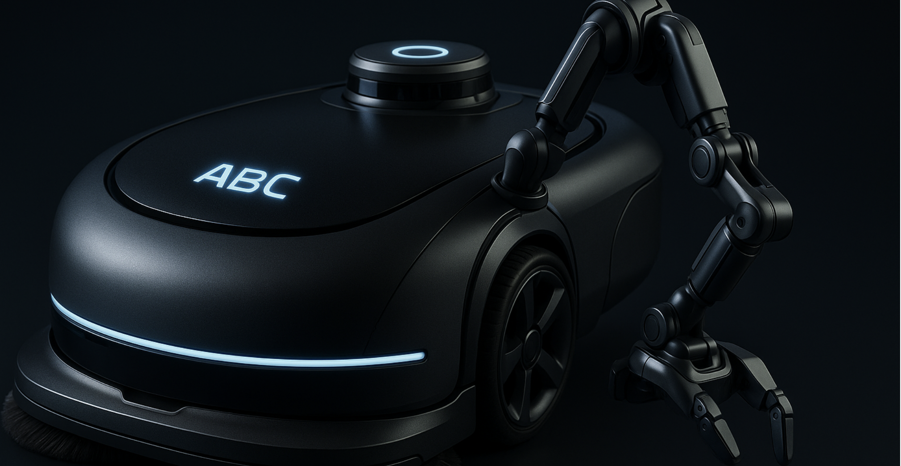
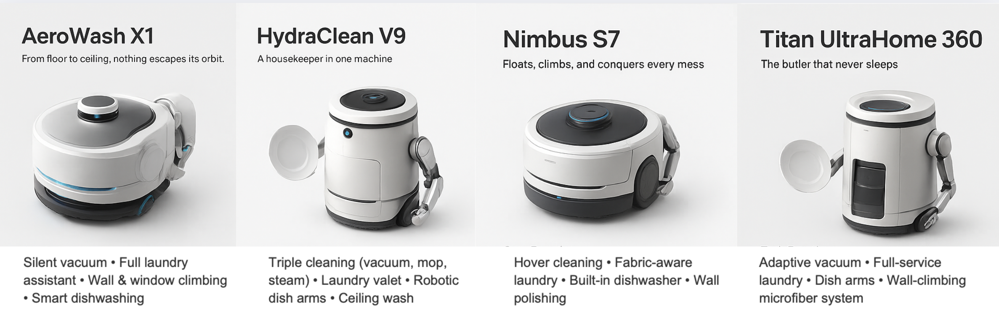
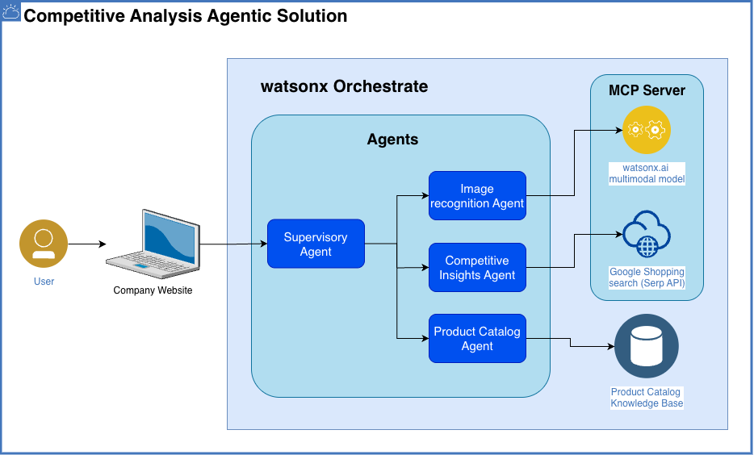

# 🥇 Análise Competitiva com Agentes IA

## 🎯 Features

`Image recognition` `MCP` `RAG` `Multi-agent orchestration` `No code`

## 🤔 O Problema

O departamento de vendas da ABC Robots enfrentava desafios na preparação de propostas comerciais para sua nova linha de robôs de limpeza doméstica de alto desempenho. Toda vez que lançam um novo modelo, a equipe de análise competitiva gasta uma grande quantidade de tempo e recursos para entregar seus insights. Os problemas incluem:

- Pesquisa manual atrasa decisões e reduz produtividade
- Posicionamento fraco prejudica diferenciação de vendas
- Resposta lenta a mudanças de mercado sem inteligência em tempo real

## 🎯 Objetivo

A ABC Robots planeja implementar um Sistema de Inteligência Competitiva alimentado por IA para automatizar pesquisa de mercado e análise de concorrentes. Este sistema ajudará equipes de vendas a rapidamente identificar e posicionar seus produtos contra concorrentes, superando as ineficiências de pesquisa manual e insights desatualizados. O objetivo é criar um sistema habilitado por IA que suporte análise competitiva e pesquisa de mercado através de:

- Extração de produtos do catálogo de produtos da empresa
- Identificação e extração de características-chave de cada produto
- Busca por produtos concorrentes baseada em atributos-chave
- Geração de tabela de comparação competitiva estruturada com preço, características e diferenciais
- Execução de Análise SWOT (Forças, Fraquezas, Oportunidades e Ameaças) para fornecer insights estratégicos mais profundos

Ao automatizar essas tarefas, a empresa visa acelerar processos de vendas, melhorar precisão de dados e habilitar equipes de vendas a tomar decisões informadas mais rapidamente.

## 📈 Valor de Negócio

- Redução no tempo de pesquisa manual de concorrentes
- Atualizações automatizadas em tempo real sobre competição de mercado
- Melhoria na efetividade de apresentações de vendas

## 🏛️ Arquitetura

## 💡 Pré-requisitos

- Acesso ao watsonx Orchestrate
- Chave de API IBM configurada
- Arquivo `Vaccum_cleaners_v2.docx` fornecido pelo instrutor
- URL do servidor MCP fornecida pelo instrutor
- Arquivo `abc-robots-website-final.zip` para incorporar chat no website

## 📝 Laboratório prático passo a passo

👉👉👉 [Clique aqui](./hands-on-lab-competitive-analysis.md) para acessar as instruções detalhadas e implementar este caso de uso.

**Tempo estimado**: 60-90 minutos

## 🎬 Vídeo de Demonstração

Em breve
