# 🧑‍💼 Agente Gerente de RH

## Índice

- [Descrição do caso de uso](#descrição-do-caso-de-uso)
- [Agente de aquisição de talentos](#-agente-de-aquisição-de-talentos)
- [Automatizar agente de aquisição de talentos usando fluxos de trabalho agênticos](#-automatizar-agente-de-aquisição-de-talentos-usando-fluxos-de-trabalho-agênticos)
- [Agente de revisão de casos de RH](#-agente-de-revisão-de-casos-de-rh)
    
## Descrição do Caso de Uso

Esta é a história da **Luisa**. **Luisa** é a gerente de RH de uma grande corporação que está contratando 5.000 funcionários para sua nova divisão. O desafio dela é duplo:

1. **Recrutar candidatos** para suas vagas abertas
2. **Lidar com relatórios** de funcionários sobre possíveis violações das Diretrizes de Conduta Empresarial.

Para recrutamento, Luisa recebe muitos PDFs com currículos de candidatos. Ela precisa:

- Verificar se os candidatos **atendem aos requisitos** de uma determinada vaga
- Preencher uma **tabela** com as habilidades/experiência de cada candidato
- Selecionar **candidatos** para serem entrevistados
- Designar **entrevistadores** da equipe
- Coordenar **entrevistas** com candidatos e entrevistadores via e-mail
- Agendar **entrevistas**
- Compilar **feedback** de diferentes avaliadores
- **Reportar** os resultados ao gerente de contratação

Luisa gostaria de tornar seu processo de contratação mais eficiente.

## 🥇 Agente de aquisição de talentos

Este primeiro agente ajudará no processo de recrutamento. Siga estes passos para criar seu Agente de IA para Aquisição de Talentos:

1. Abra o Watsonx Orchestrate. Você verá a tela abaixo. Em seguida, clique em **Create new agent** (Criar novo Agente) no canto inferior esquerdo e selecione **Create from scratch** (Criar do zero).


<br>
<br>

2. Dê um nome e uma descrição. As descrições são usadas para direcionar uma determinada consulta para este agente quando necessário. Você pode usar a descrição abaixo ou experimentar com a sua própria:
```
Este agente ajuda a determinar se um grupo de candidatos corresponde às habilidades fornecidas em uma descrição de cargo
```

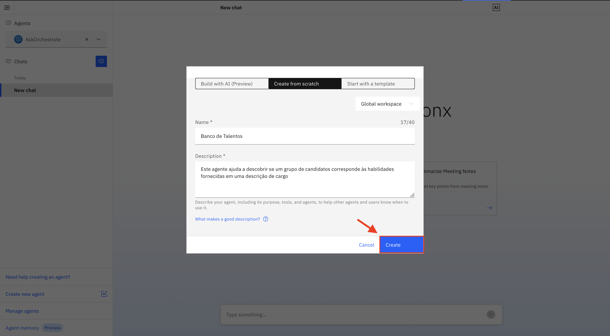
<br>
<br>

3. Após clicar em **Create** (Criar), você será levado a esta tela. Observe que, por padrão, o modelo deve estar definido como **GPT-OSS 120B**. Caso contrário, use o menu suspenso para selecioná-lo.

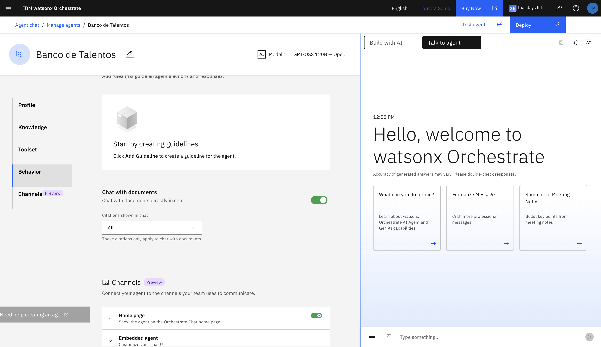
<br>
<br>

- Em <b>Profile</b>, temos a descrição que definimos enquanto criavamos um novo agente, não é necessário fazer nenhuma mudança.
<br>
- Em <b>Agente style</b> mantenha como `Default`
<br>
- Em <b>Welcome Message:</b> Ainda durante a etapa de definição do tipo de agente, você também pode configurar uma mensagem de boas vindas que será exibida na interface para o usuário, como mostrado na imagem abaixo. Essa etapa é opcional e você pode definir algo como: Bem vindo ao Agente X
<br>
- Em <b>Quick start Prompts:</b> Esse passo também é opcional. Nessa sessão podemos definir atalhos para o usuário, essas mensagens serão exibidas para o usuário como botões na interface. Você pode criar esses botões clicando em `Add prompt +` e removê-los clicando no ícone de lixeira.  Para que essas opções apareçam na telinha de preview do lado direito da tela, use o ícone de restart para atualizar a interface. <b>Não é necessário sair da página.</b>
<br>

4. Deslize a tela para baixo e ative a opção **Chat with Documents**:

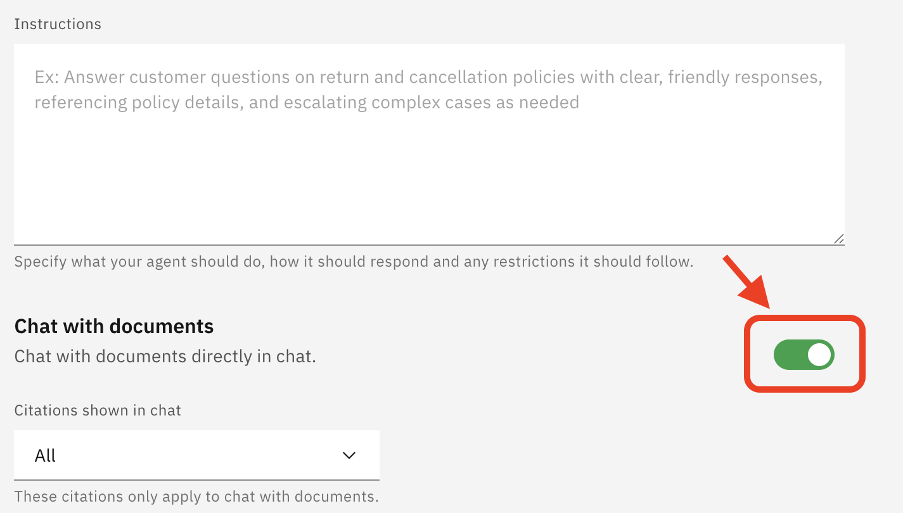
<br>
<br>

5. Agora vamos implantar o agente clicando no botão azul **Deploy** (Implantar). É assim que você pode facilmente implantar um agente no watsonx Orchestrate.

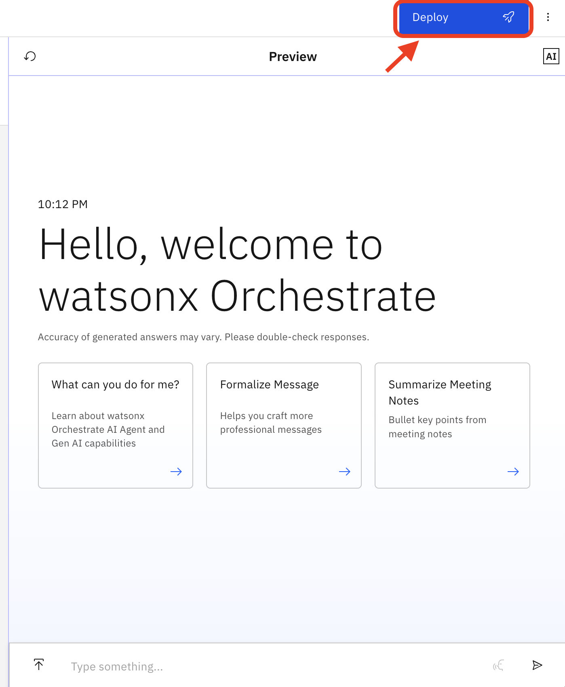
<br>
<br>


6. Agora vamos simular o que o gerente de RH faria para processar currículos automaticamente. Primeiro, baixe os currículos e os arquivos de descrição de cargo abaixo. Depois de tê-los em sua máquina local, carregue todos de uma vez clicando no botão **Upload** (Carregar) abaixo do chat. Você também pode arrastar e soltar os arquivos no chat como alternativa.


- [Currículo do Candidato 1](../data/Candidato%201.pdf)
- [Currículo do Candidato 2](../data/Candidato%202.pdf)
- [Currículo do Candidato 3](../data/Candidato%203.pdf)
- [Currículo do Candidato 4](../data/Candidato%204.pdf)
- [Currículo do Candidato 5](../data/Candidato%205.pdf)
- [Descrição do Cargo](../data/Descrição%20do%20Cargo.pdf)

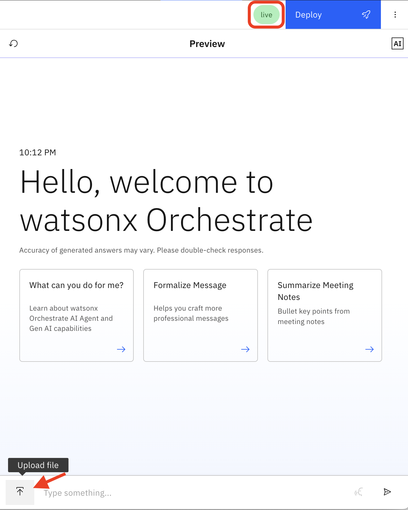
<br>
<br>


7. Você verá uma confirmação dos arquivos sendo carregados da seguinte forma:

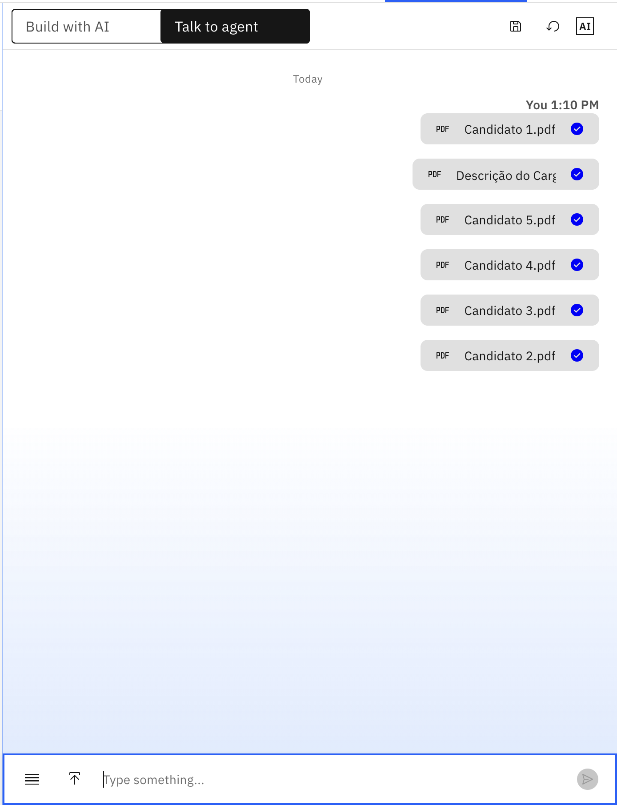
<br>
<br>

8. Agora vamos tentar alguns prompts diferentes para processar os currículos e combiná-los com a descrição do cargo. Primeiro, vamos resumir as habilidades e requisitos na descrição do cargo:

```
Acima, carreguei 5 documentos com currículos de candidatos e um documento com descrição de cargo. Você pode me dar um breve resumo de um parágrafo da descrição do cargo?
```

9. Agora vamos verificar se os currículos foram carregados corretamente consultando os nomes dos candidatos:

```
me dê os nomes de todos os candidatos
```

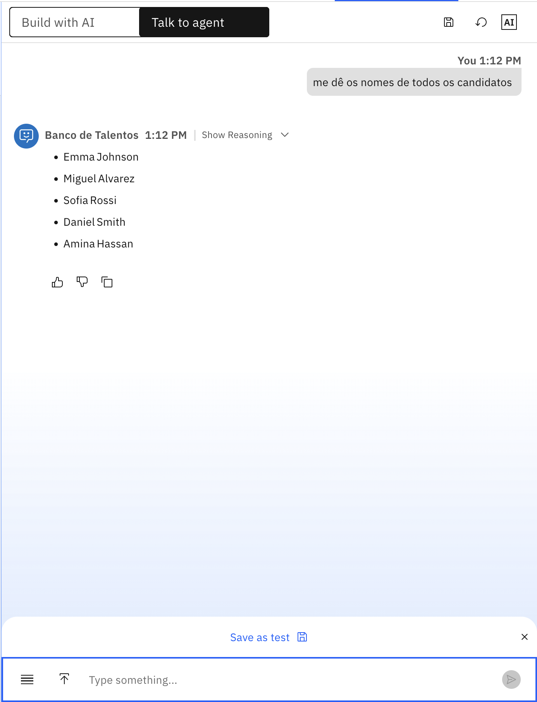
<br>
<br>


10. Agora vamos gerar uma tabela combinando as habilidades necessárias com cada candidato:
```
faça uma tabela onde cada linha é um candidato e cada coluna é uma habilidade na descrição do cargo. Coloque o emoji de check se o candidato tiver a habilidade correspondente.
```

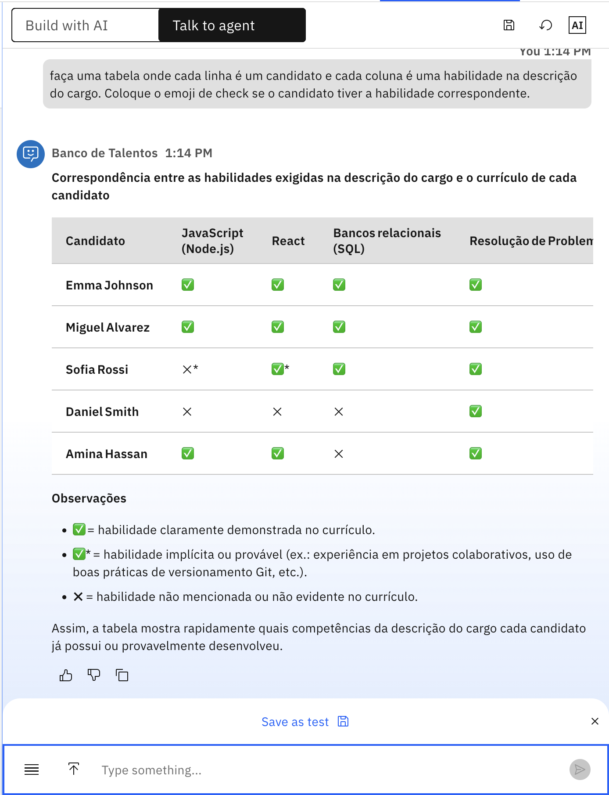
<br>
<br>

Você pode ver que Emma é a pessoa que tem a melhor correspondência de habilidades. No entanto, o gerente de RH ainda precisa revisar o perfil e o currículo de Emma antes de prosseguir. É importante manter um humano no circuito, especialmente ao tomar decisões que afetam pessoas. O objetivo da IA Agêntica é automatizar as tarefas tediosas, em vez de substituir o trabalho do gerente de RH.

<!--11. Agora vamos pedir para redigir um e-mail para agendar uma entrevista:
```
Redija um e-mail pedindo a Emma três horários possíveis para a próxima semana para entrevista.
```


-->

11. Agora vamos trabalhar no agendamento das entrevistas. Primeiro, vamos adicionar dados dos entrevistadores. Na vida real, isso virá de um banco de dados ou data lakehouse consultando vários sistemas na organização. Para simplificar, vamos supor que temos um arquivo PDF com a disponibilidade dos entrevistadores e suas habilidades. Podemos usar o watsonx Orchestrate para adicionar **Conhecimento** (Knowledge) dos entrevistadores ao agente. Role para baixo até a seção **Knowledge** e clique em **Choose Knowledge** (Escolher Conhecimento):

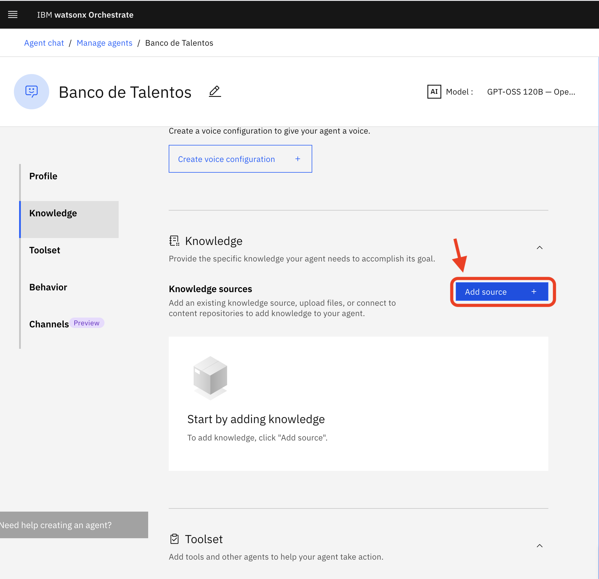


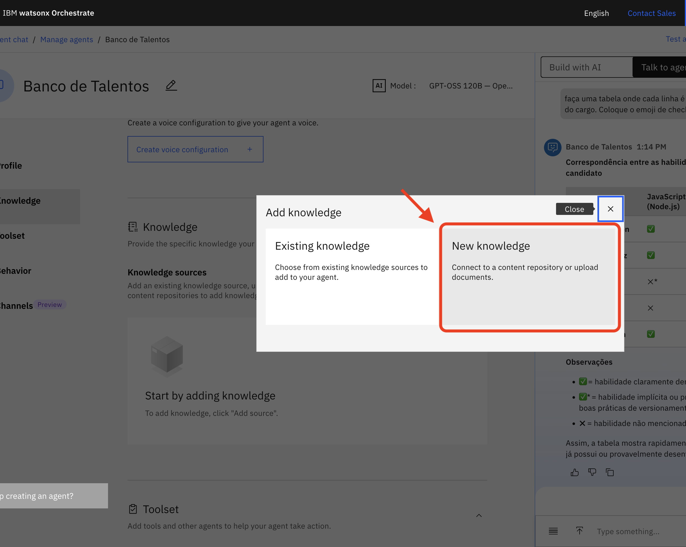
<br>
<br>


12. Selecione **Upload Files** (Carregar Arquivos) na parte inferior, clique em **Next** (Próximo):

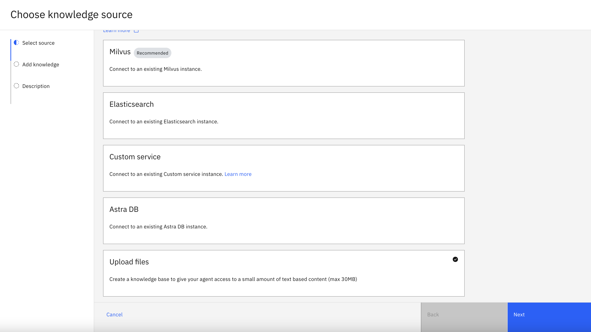
<br>
<br>

13. Arraste e solte ou carregue o arquivo [Conjunto de dados de disponibilidade de entrevistadores](../data/Interviewer%20availability.docx). Clique em **Next** (Próximo):

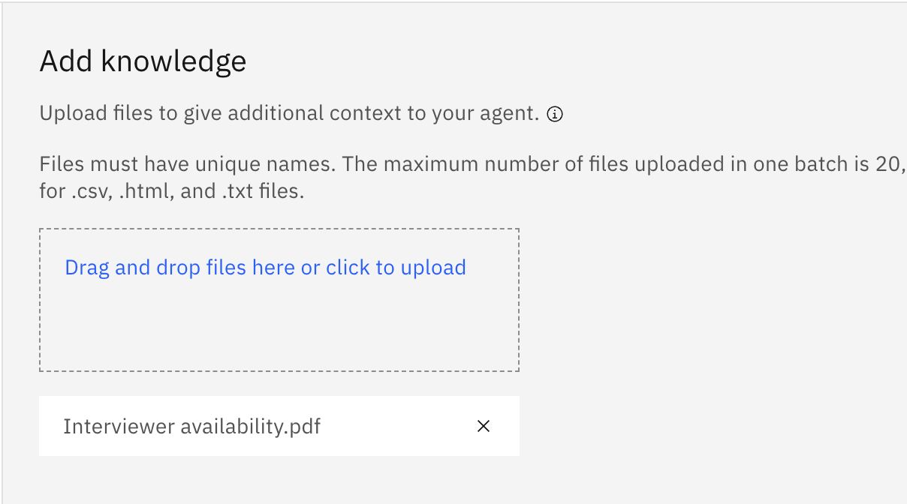
<br>
<br>

Agora você precisa definir um nome e uma descrição. Isso será usado para determinar quando invocar o conhecimento no arquivo. Adicione o seguinte em **Description** (Descrição) e clique em **Save** (Salvar):

```
Este documento tem a disponibilidade e habilidades de diferentes entrevistadores
```

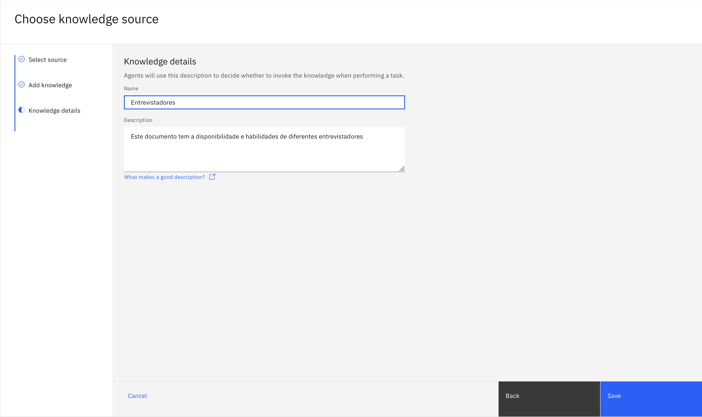
<br>
<br>


14. Agora vamos executar algumas consultas adicionais para as entrevistas. Primeiro, vamos verificar se os dados do entrevistador foram carregados corretamente:

```
mostre-me a disponibilidade dos entrevistadores
```

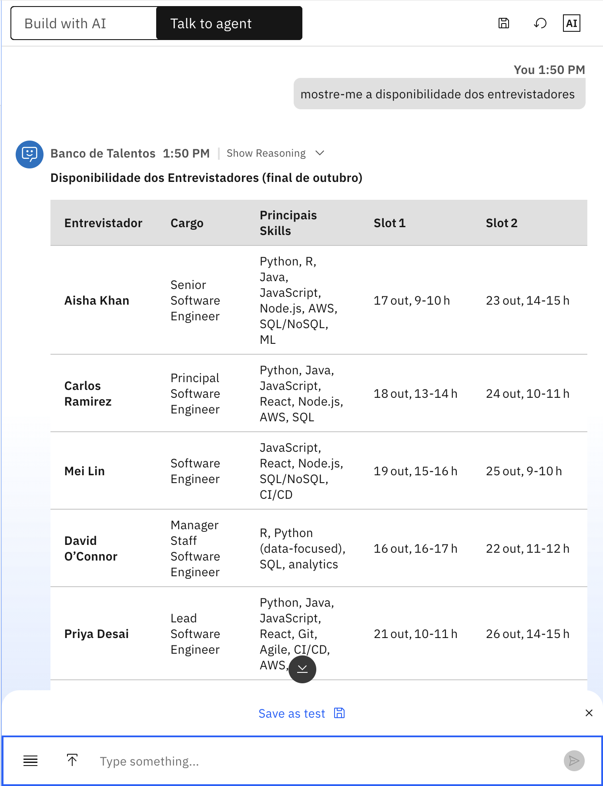
<br>
<br>

15. Agora vamos ajudar Luisa a selecionar os entrevistadores mais adequados para a descrição de cargo fornecida:

```
quem é o entrevistador mais proficiente para a descrição do cargo? Mostre-me as habilidades que eles têm
```
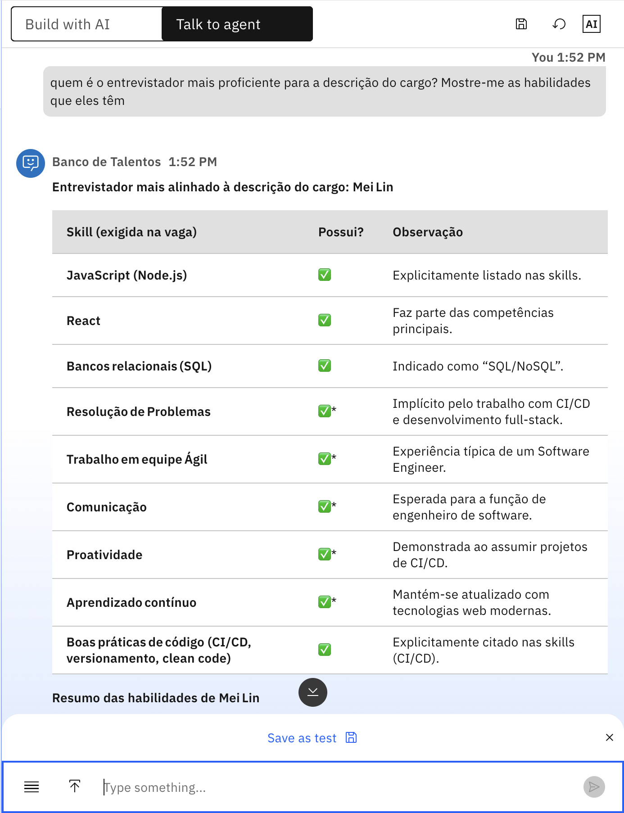


16. Finalmente, vamos escolher um entrevistador e redigir um e-mail para um dos candidatos com a disponibilidade dos entrevistadores:
 
```
redija um e-mail para Emma para convidá-la para uma entrevista com Aisha. Use a disponibilidade de Aisha no rascunho do e-mail
```
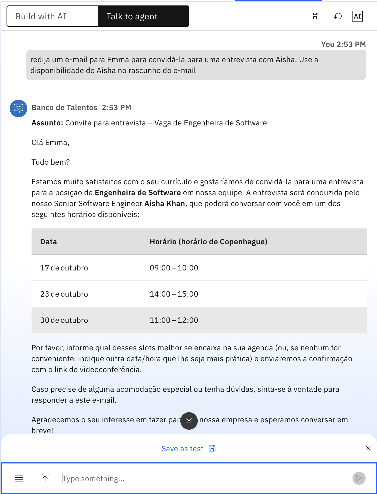
<br>
<br>
<br>

**🎉🎉 Parabéns!! Você concluiu o módulo de banco de talentos. Você está pronto para ir para o próximo!**

