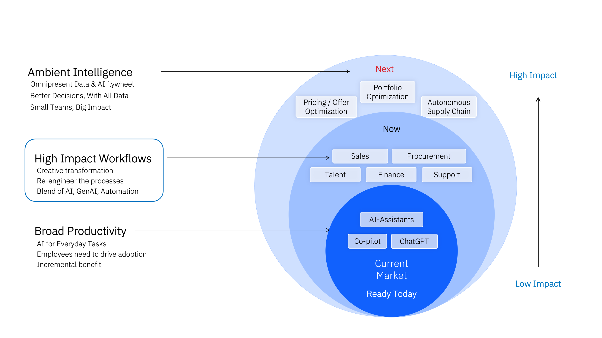

# Sumário
- [Sumário](#sumário)
- [🧑‍💼 Agentes de IA watsonx para Procurement](#-agentes-de-ia-watsonx-para-procurement)
- [🤔 O Problema](#-o-problema)
- [🎯 Objetivo](#-objetivo)
- [📈 Valor de Negócio](#-valor-de-negócio)
- [🏛️ Arquitetura](#-arquitetura)
  - [Capacidades-Chave dos Agentes de IA para Procurement com watsonx Orchestrate](#capacidades-chave-dos-agentes-de-ia-para-procurement-com-watsonx-orchestrate)
- [🎥 Demonstração](#-demonstração)
- [📝 Laboratório prático passo a passo](#-laboratório-prático-passo-a-passo)

# 🧑‍💼 Agentes de IA watsonx para Procurement

 

Neste laboratório, você vai construir e interagir com **Agentes de IA para Procurement**, projetados para transformar processos de compras através de automação inteligente e experiência de compra guiada. Usaremos cenários de procurement empresarial para demonstrar como a IA agêntica pode revolucionar a função de compras.

## 🤔 O Problema

Equipes de procurement enfrentam desafios significativos que impactam eficiência e resultados:

**Desafios operacionais:**
- **Processos manuais**: Tarefas repetitivas consomem tempo valioso das equipes
- **Risco de fornecedores**: Dificuldade em avaliar e monitorar riscos continuamente
- **Conformidade**: Garantir aderência a políticas e regulamentações complexas
- **Atrasos no ciclo**: Processos lentos desde a solicitação até o pagamento
- **Falta de visibilidade**: Dados fragmentados dificultam decisões em tempo real

**Impacto no negócio:**
- Custos operacionais elevados
- Riscos não identificados na cadeia de suprimentos
- Experiência frustrante para usuários de negócio
- Perda de oportunidades de economia
- Baixa produtividade das equipes

## 🎯 Objetivo

Este caso de uso visa familiarizá-lo com **Agentes de IA watsonx para Procurement**, um passo em direção à adoção de uma plataforma de nível empresarial, watsonx Orchestrate, equipada com capacidades completas de IA agêntica para empresas:

✅ **Multi-agent orchestration**
- Planejamento dinâmico de agentes e ferramentas necessários para atingir objetivos do usuário

✅ **Agentes de IA pré-construídos**
- Acelere a transformação de IA de funções de negócio usando agentes prontos do catálogo

✅ **Construa seus próprios agentes**
- Use ferramentas low code e pro code para estender/customizar agentes pré-construídos
- Construa agentes do zero
- Importe agentes externos diretamente e via ferramentas MCP

✅ **Agent Ops**
- Avalie precisão e acurácia dos agentes de IA
- Monitore uso de agentes e acesso a fontes de dados
- Alinhe com políticas de governança para seguir acesso de privilégio mínimo

**Neste laboratório**, você verá como um usuário de negócio é assistido por um Agente para alcançar uma **experiência de compra guiada**, ajudando o usuário a:
- Buscar itens no catálogo
- Entender fornecedores que oferecem esses itens
- Criar uma solicitação de compra com o item selecionado

## 📈 Valor de Negócio

O caso de uso deste laboratório permite que um usuário de negócio crie uma solicitação de compra perfeitamente através da interface de chat, **sem precisar acessar a plataforma de procurement empresarial backend**, que poderia ser SAP Ariba, Coupa, S4 HANA, Oracle Fusion ou muitas outras.

### Benefícios Imediatos

**Para Usuários de Negócio:**
- **Produtividade aprimorada**: Crie solicitações de compra sem sair do chat
- **Experiência simplificada**: Interface conversacional intuitiva
- **Acesso rápido**: Busca e seleção de itens em linguagem natural
- **Menos treinamento**: Não precisa conhecer sistemas complexos de ERP

**Para Equipes de Procurement:**
- **Automação de tarefas rotineiras**: Rascunho de RFx, processamento de pedidos e faturas
- **Onboarding de fornecedores**: Avaliação automatizada de riscos
- **Sourcing mais rápido**: Descoberta inteligente de fornecedores
- **Mitigação de riscos**: Monitoramento contínuo de performance

### Impacto Estratégico

Com casos de uso mais complexos, tipicamente abrangendo múltiplos sistemas ou envolvendo interpretação manual, a IA agêntica pode trazer ganhos de eficiência ainda maiores:

- **Redução significativa de custos**: Automação de processos manuais
- **Sourcing mais rápido**: Aceleração do ciclo source-to-pay
- **Foco estratégico**: Equipes podem se concentrar em iniciativas de maior valor
- **Agilidade e resiliência**: Resposta rápida a mudanças de mercado
- **Vantagem competitiva**: Transformação do procurement em diferencial estratégico

## 🏛️ Arquitetura

Agentes de IA para Procurement usando IBM watsonx Orchestrate aproveitam:

1. **Motor de orquestração multiagente** que garante planejamento e raciocínio inteligentes, execução perfeita de ações e experiência responsiva para usuários de negócio

2. **Integração com plataformas líderes de ERP e procurement**, para processar dados de negócio usando os Agentes e suas ferramentas subjacentes

### Capacidades-Chave dos Agentes de IA para Procurement com watsonx Orchestrate

**1. Automação Source-to-Pay Completa**

Atividades upstream:
- Descoberta de fornecedores e avaliação de riscos
- Rascunho de RFP
- Gestão de eventos de sourcing e contratos

Atividades downstream:
- Criação de solicitações de compra
- Rastreamento de ordens de compra
- Gestão de recebimentos de remessas
- Processamento de faturas de fornecedores

**2. Interação em Linguagem Natural**

- Interface de chat agêntica intuitiva
- Múltiplos canais: Slack, MS Teams, chat incorporado
- Comunicação direta entre colaboradores e plataformas backend de procurement

**3. Conhecimento Organizacional Personalizado**

- Enriquecimento com políticas específicas da organização
- Templates customizados
- Respostas moldadas de acordo com diretrizes corporativas

## 🎥 Demonstração

Veja o vídeo que demonstra o agente que você usará neste laboratório. Ele permite buscar itens no catálogo, encontrar fornecedores e criar requisições de compra:

[▶️ Assistir demonstração do Procurement Agent](https://github.ibm.com/user-attachments/assets/35cd9d6b-495b-42eb-9d8a-cf0d24d73d7e)

## 📝 Laboratório prático passo a passo

👉👉👉 [Clique aqui](./assets/downloads/procurement_bootcamp-Setup.docx) para acessar as instruções detalhadas passo a passo sobre como implementar este caso de uso.

**Arquivos necessários para o laboratório:**

Você precisará baixar os seguintes arquivos da pasta [downloads](./assets/downloads/):
- `procurement_bootcamp-Setup.docx` - Instruções completas do laboratório
- `Procurement_App.yaml` - Configuração da aplicação
- `European-Union-Government-Procurement-Guide-ENG.pdf` - Documento de conhecimento

**Tempo estimado**: 60-90 minutos

**Pré-requisitos**:
- Acesso ao watsonx Orchestrate
- Familiaridade com conceitos de procurement
- Conhecimento básico de agentes de IA

---

> [!IMPORTANT]
> Este laboratório usa um simulador para sistema ERP/Procurement. No entanto, isso pode ser facilmente alterado para qualquer sistema real em produção, como SAP Ariba, Coupa, SAP S4 HANA, Oracle Fusion e outros.

**Features demonstradas**: `Multi-agent orchestration` `Backend connection` `Pre-built agents` `Low code` `Guided buying` `Natural language interface`