# Explorador de Produtos (Product Scout Agent)

Neste exercício, você vai construir e interagir com um Agente Explorador de Produtos, projetado para ajudar consumidores a tomar decisões mais seguras e informadas ao comprar produtos alimentícios online. Usaremos uma rede de supermercados fictícia chamada FreshLane Markets como a empresa que desenvolve esta solução agêntica.


**Cenário**: Imagine um cliente navegando em uma loja de supermercado online. Ele quer saber mais sobre um produto antes de adicioná-lo ao carrinho — especificamente se contém ingredientes que podem causar reações alérgicas e se há recalls (recolhimentos) ativos sobre o produto. Para apoiar isso, a loja oferece um agente de IA que automatiza a busca de informações em nome do cliente. Em vez de verificar manualmente vários sites, o cliente pode confiar no agente para rapidamente apresentar detalhes críticos sobre conteúdo nutricional, alérgenos e questões de segurança.

**Contexto de Negócio**: Para um varejista, oferecer esse tipo de assistência com IA agêntica reduz o risco para o cliente, melhora a confiança e aprimora a experiência geral de compra. Também pode reduzir a carga sobre as equipes de suporte ao cliente, que de outra forma gastariam tempo significativo respondendo perguntas sobre segurança de produtos. Idealmente, a loja integraria sua própria biblioteca de produtos em tal agente. Para este exercício prático, no entanto, simularemos a mesma funcionalidade usando uma consulta à Open Food Foundation (OFF) para recuperar informações de produtos.

**Arquitetura da Solução**


**Vídeo**

Abaixo está um vídeo que demonstra todo o cenário.

[Vídeo do Product Scout](https://github.ibm.com/skol/agentic-ai-client-bootcamp/assets/13654/c722ea5e-5f7b-442c-93d2-e3ec7d13de6f)

## O Agente Open Food Foundation

**Contexto:** O primeiro agente que criaremos é chamado de "Agente Open Food Foundation". A Open Food Foundation é uma organização sem fins lucrativos que ajuda agricultores, produtores e comunidades a vender alimentos online, e também oferece uma API aberta que permite buscar produtos alimentícios e recuperar detalhes sobre esses produtos. Nosso agente aproveitará esta API e oferecerá uma interface de linguagem natural que permite encontrar detalhes sobre produtos alimentícios.

**Instruções passo a passo:** Abra a página inicial do watsonx Orchestrate no seu navegador. Clique em 'Create new agent', como mostrado abaixo:

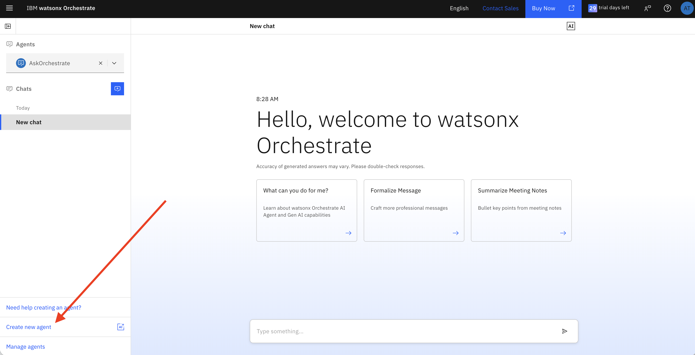

Selecione a aba 'Create from scratch'. Nomeie o novo agente como "Agente Open Food Foundation". Para a descrição, insira o seguinte:

```
Um agente que encontra detalhes sobre produtos alimentícios da Open Food Foundation (Fundação Aberta de Alimentos).
```

Clique em "Create".

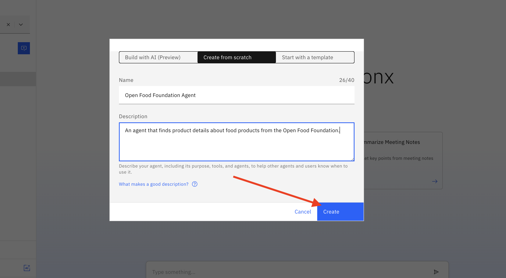

Para conectar o agente às ferramentas que permitem usar as APIs da Open Food Foundation, role para baixo até a seção 'Toolset' (ou selecione o link 'Toolset' no menu à esquerda da página). Clique em 'Add tool.'

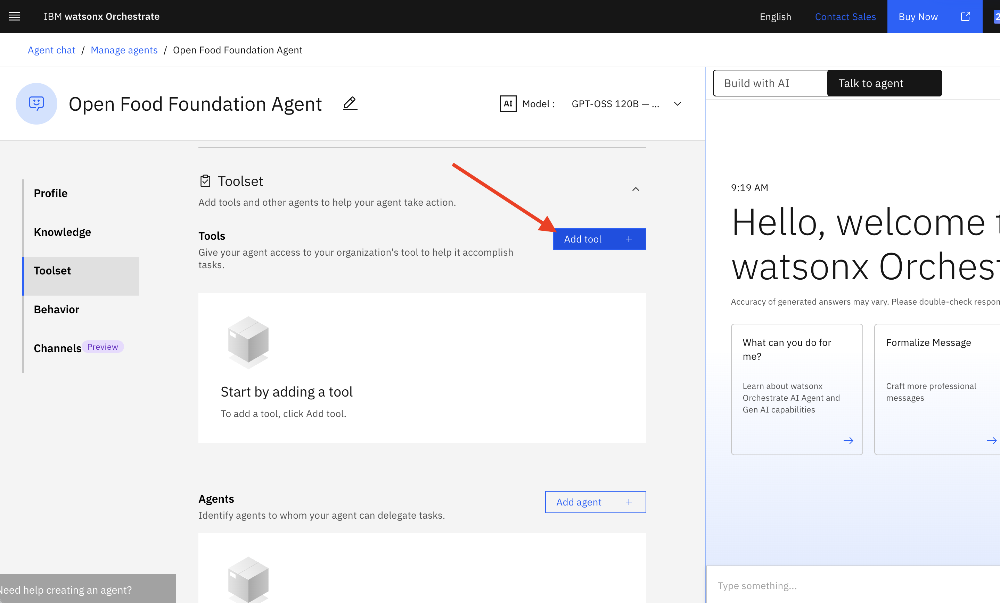

No diálogo seguinte, selecione 'Local instance.' As ferramentas que usamos já foram carregadas no ambiente.

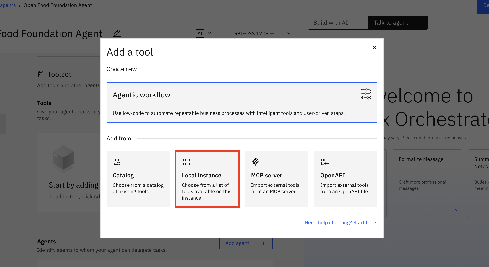

Selecione as ferramentas chamadas 'off_product_tool' e 'off_search_tool' e clique em 'Add to agent'. (Note que sua instância pode ter mais ferramentas listadas do que mostrado na captura de tela abaixo.)

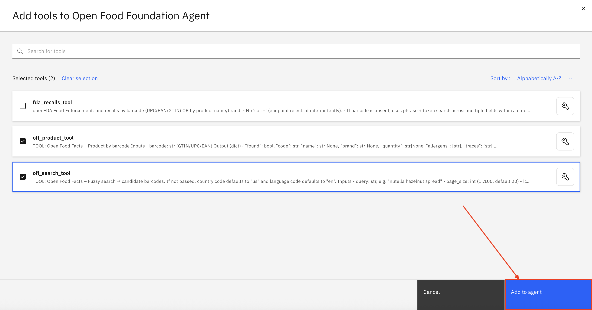

A ferramenta off_search_tool realiza uma busca baseada no nome de um produto e retorna o 'código de barras' associado para cada um.
A ferramenta off_product_tool recupera detalhes sobre o produto, baseado no código de barras.
Ambas as ferramentas trabalham em conjunto.
O agente escolherá a ferramenta certa para uma determinada tarefa com base na descrição da ferramenta.
Para fornecer orientação adicional ao agente sobre isso, role para baixo até a seção 'Behavior' da configuração do agente e adicione o seguinte à seção 'Instructions':

```
Use the off_search_tool to find products' bar codes matching the search string, then always use the off_product_tool to retrieve details about the product that matches the ask best.
If parameters are missing, use default values.
```

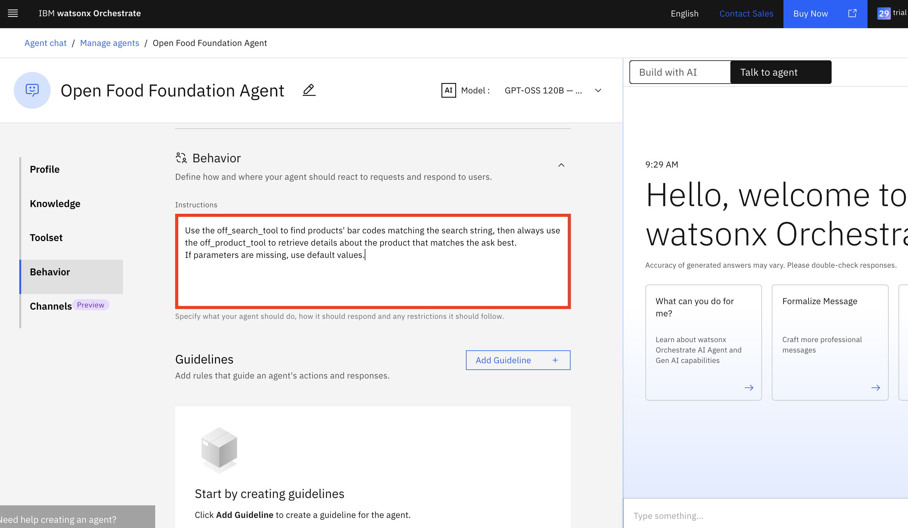

Agora estamos prontos para testar o novo agente. Note que você pode interagir com o agente a qualquer momento através da janela 'Preview'. As mudanças que você faz na configuração do agente são aplicadas imediatamente.

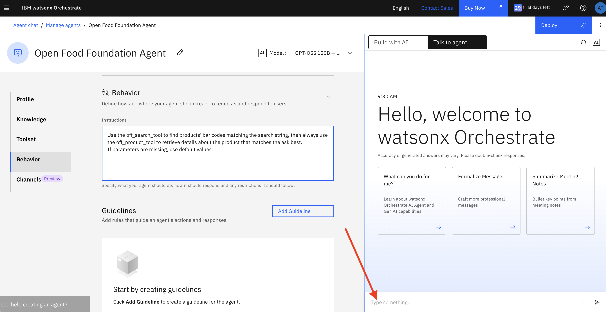

Digite uma pergunta para o agente na janela Preview, por exemplo:

```
Please give me detailed product information about Pringles original.
```

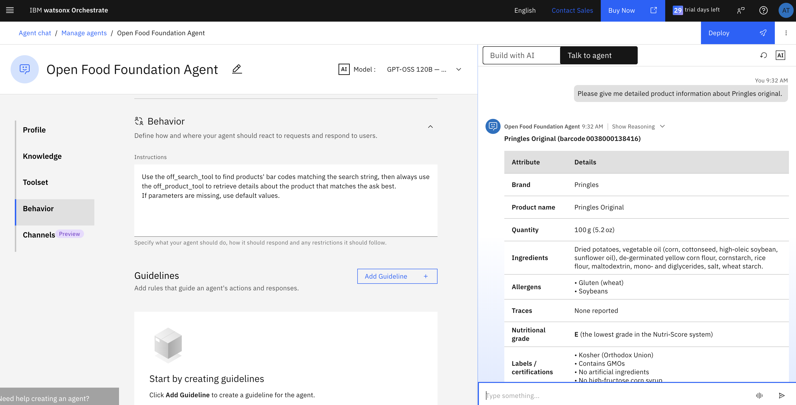

Como o agente chegou a esta resposta? Descubra expandindo a seção 'Show reasoning' na janela Preview.

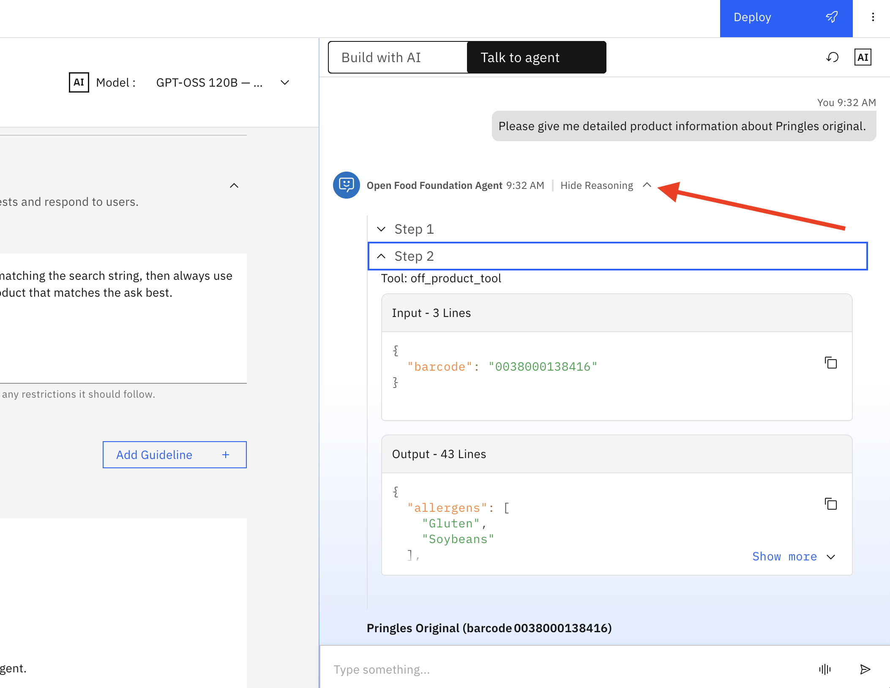

Ela mostra que a resposta foi construída em duas etapas:
1. O agente usou a ferramenta off_search_tool para encontrar um código de barras adequado para o produto. Note que o termo de busca 'Pringles original' pode levar a múltiplos produtos individuais sendo retornados. O agente escolhe o mais adequado.
2. O agente passa o código de barras associado para a segunda ferramenta, off_product_tool. O agente então usa os dados retornados desta etapa e formula uma resposta para o usuário.

Sinta-se à vontade para fazer perguntas sobre outros produtos, por exemplo 'Campbell's tomato soup', ou 'Lay's classic potato chips'.

## O Agente FDA Recalls

Agora vamos construir o segundo agente que fornece informações sobre recalls da FDA para um determinado produto. Ele utiliza uma ferramenta que chama uma API pública oferecida pela Food and Drug Administration (Administração de Alimentos e Medicamentos dos EUA).

Para voltar à página principal do painel de agentes, clique em 'Manage agents' no canto superior esquerdo da página.

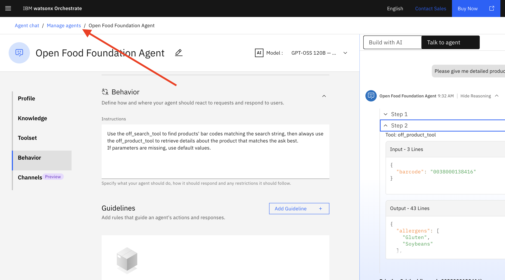

Clique no link 'Create agent +' no lado direito da página.

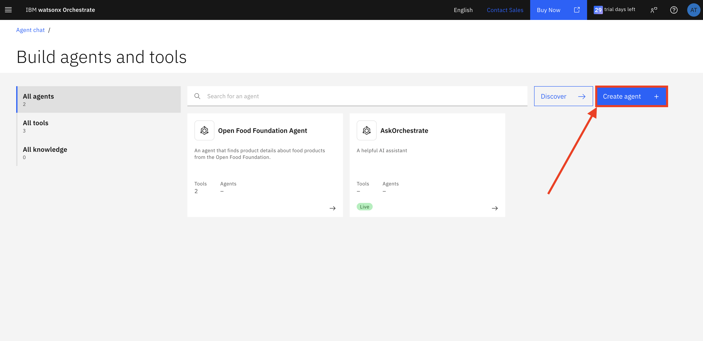

Mantenha a opção 'Create from scratch' selecionada. Insira 'Agente Recalls FDA' como o nome do novo agente e dê a ele esta descrição:

```
Um agente que encontra recalls (recolhimentos) da FDA para um determinado produto.
```

Então clique em 'Create'.

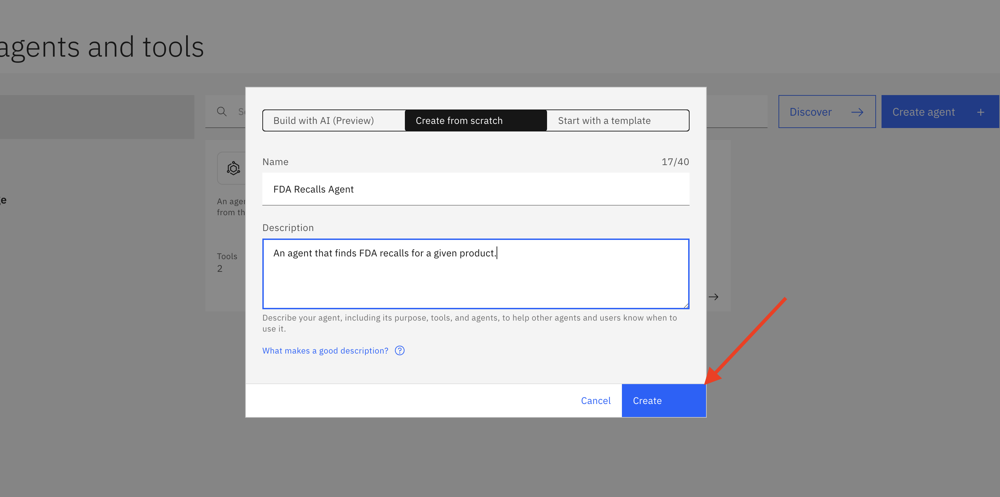

Role para baixo até a seção 'Toolset' e clique em 'Add tool', como mostrado abaixo:

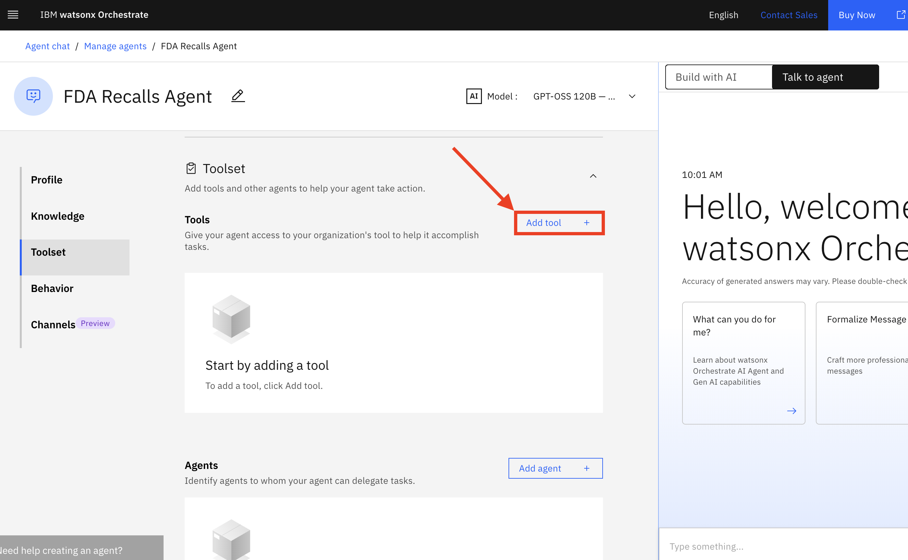

Clique na caixa dizendo 'Local instance', e na lista de ferramentas mostrada, selecione a ferramenta 'fda_recalls_tool' e clique em 'Add to agent'.

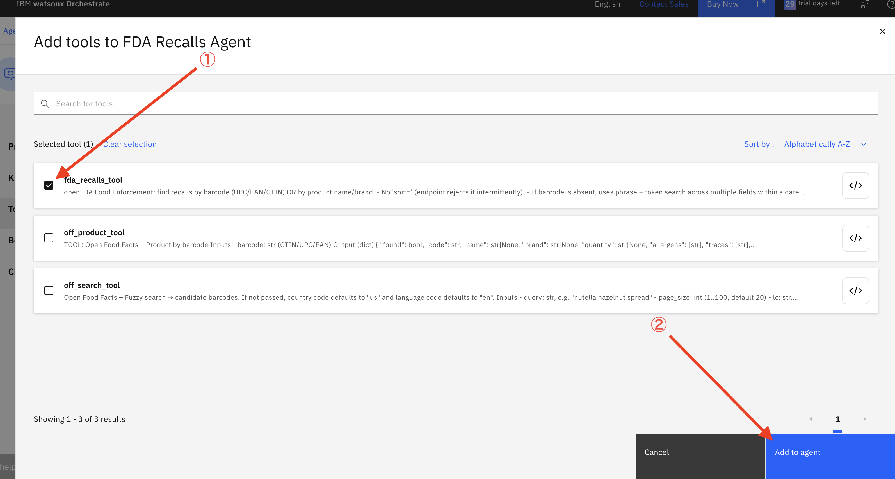

O agente deve ser capaz de selecionar esta ferramenta simplesmente com base em sua própria descrição, mas também podemos adicionar uma breve instrução à seção Behavior do agente. Role para baixo até a seção Behavior e adicione o seguinte às Instructions:

```
Use the fda_recalls_tool to find recalls for a given product name.
```

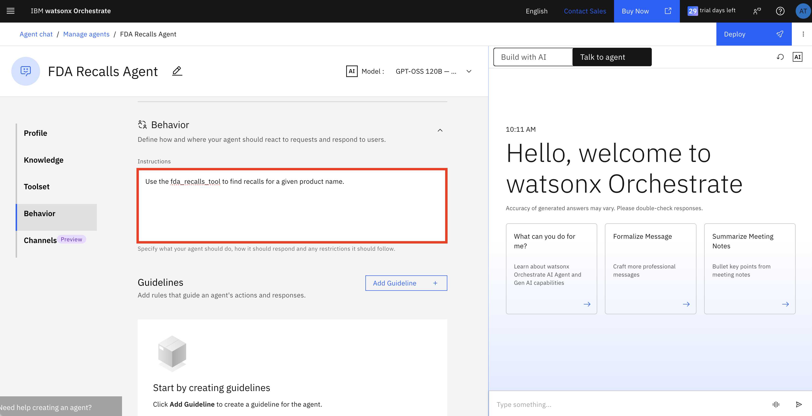

Agora estamos prontos para testar este agente. Insira a seguinte mensagem no campo de entrada Preview:

```
Tell me if there are ongoing recalls for the Barilla spaghetti brand.
```

O agente deve retornar uma mensagem dizendo que não há recalls em andamento. Faça uma pergunta de acompanhamento:

```
and how about Sam's Pecorino Romano?
```

No momento em que este texto foi escrito, há um recall ativo da FDA para este produto e o agente deve retornar uma mensagem confirmando isso. Use o dropdown 'Show Reasoning' para verificar que a ferramenta foi chamada conforme esperado.

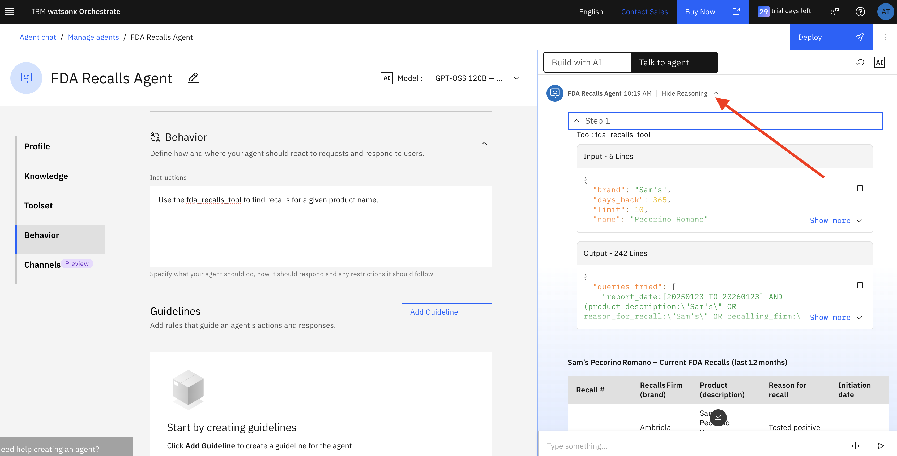

Você agora criou dois agentes, um que fornece informações detalhadas sobre produtos e outro que fornece informações sobre quaisquer recalls da FDA em andamento. A seguir, vamos criar um terceiro que lida com scores nutricionais e diretrizes alimentares.

## O Agente Nutricao

Este agente contribuirá com informações nutricionais para nossa solução. Para criá-lo, volte ao painel principal do construtor de agentes clicando no link 'Manage agents' no canto superior esquerdo da janela.

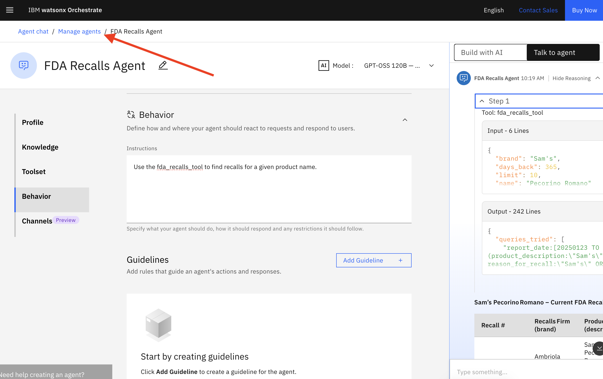

Clique em 'Create agent +', e selecione a aba 'Create from scratch'. Insira 'Agente Nutricao' como o nome do novo agente e dê a ele a seguinte descrição.

```
Este agente fornece explicações sobre scores/notas nutricionais, bem como diretrizes alimentares gerais.
```

Então clique em 'Create'.

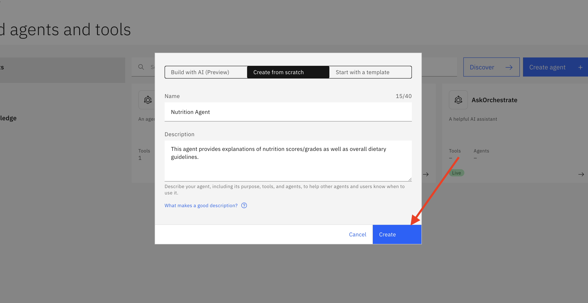

Diferente dos exemplos anteriores, onde usamos ferramentas com o agente para atender solicitações, aqui usaremos uma 'knowledge base' (base de conhecimento). As informações que precisamos, sobre scores nutricionais e diretrizes alimentares, estão disponíveis em arquivos simples, um arquivo de texto e outro PDF. Faremos upload deles para o watsonx Orchestrate e os disponibilizaremos para o agente executar buscas.

Role para baixo até a seção Knowledge da configuração do agente. Clique em 'Add source'.

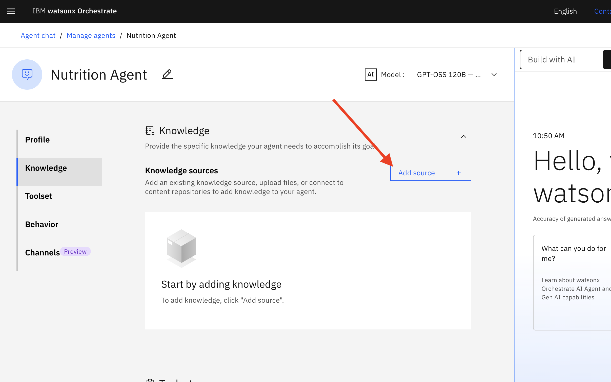

Clique em 'New knowledge'.

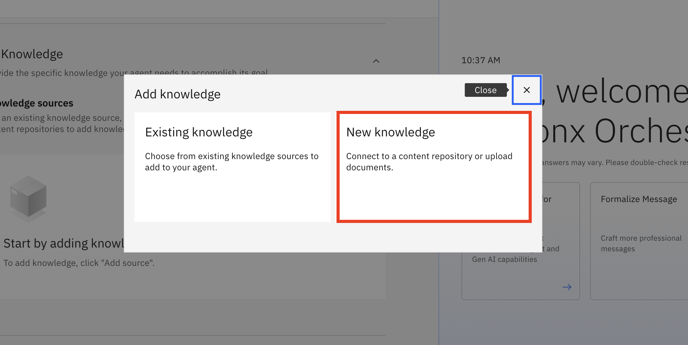

Veja como há vários métodos para adicionar conhecimento à base de conhecimento, incluindo conexão com datastores existentes. Aqui, simplesmente faremos upload dos arquivos diretamente. Selecione 'Upload files' e clique em 'Next.'

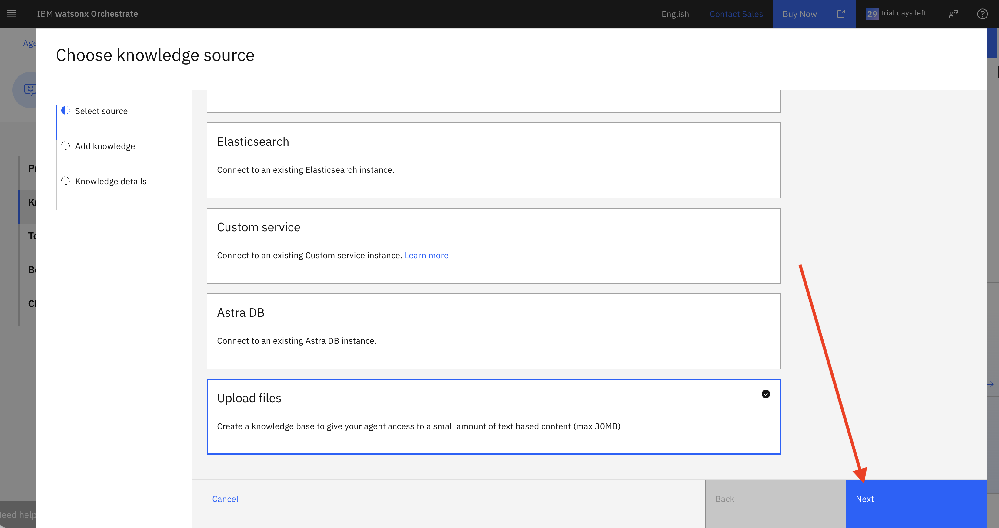

Clique em 'Drag and drop files here or click to upload' e selecione dois arquivos para upload:
- [Dietary_Guidelines_forAmericans.pdf](./knowledge/Dietary_Guidelines_for_Americans.pdf)
- [NutriScore_thresholds.txt](./knowledge/NutriScore_thresholds.txt)

Então clique em 'Next'.

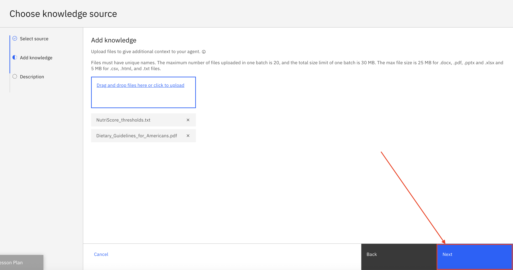

Na próxima parte do diálogo, dê um nome ao conhecimento e insira o seguinte como a descrição da base de conhecimento:

```
Este conhecimento contém detalhes sobre scores nutricionais (notas nutricionais) e diretrizes alimentares.
```

Estas descrições são importantes, porque o agente usa este conhecimento ao atender uma solicitação. Clique em 'Save.'


O upload e processamento podem levar algum tempo. Quando completo, você verá o seguinte na seção Knowledge do agente.

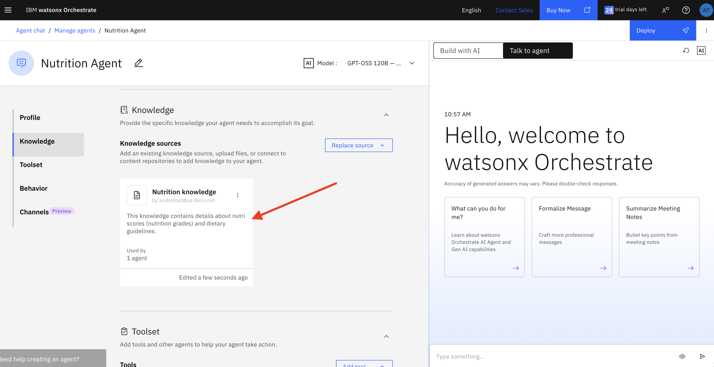

Vamos testar o novo agente. Insira o seguinte no campo de entrada Preview:

```
What is nutrition score 'd' and what are related dietary guidelines?
```

Se você expandir a seção 'Show Reasoning' ao lado da resposta do agente, você deve ver que ele foi à sua base de conhecimento interna para encontrar a resposta.

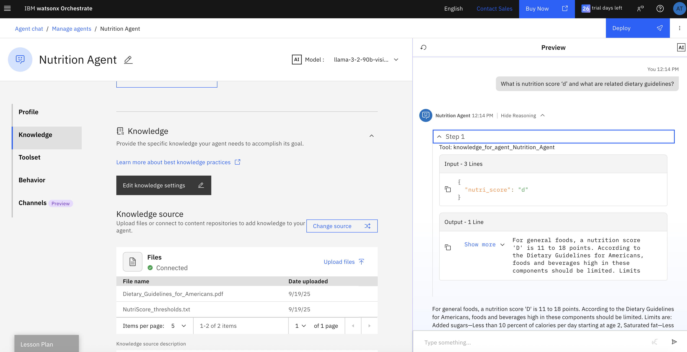

Você também pode ver na base de conhecimento de onde a resposta foi derivada. No final da mensagem de resposta há um ícone dropdown. Quando você clica nele, ele mostrará as fontes que encontrou. No nosso caso, mostra que 5 fontes relevantes na base de conhecimento foram identificadas, e permite que você role por cada uma delas.


Clique em 'View source' para ver o que foi extraído do arquivo fonte - neste caso, o arquivo PDF com diretrizes alimentares é a segunda fonte que foi usada - que a busca retornou.

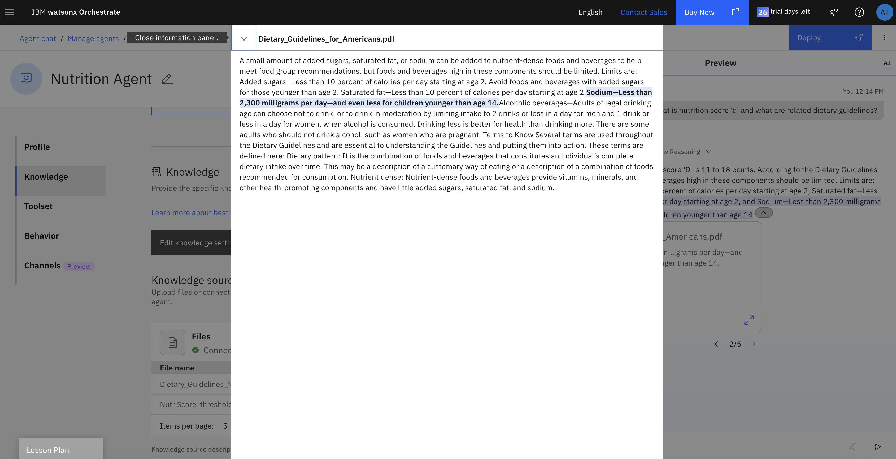

## O Agente FreshLaneMarket Product Scout

O último passo para completar a solução é criar um 'agente supervisor'. Ou seja, um agente que usa os outros agentes e ferramentas, e os orquestra para atender uma determinada solicitação. Ele também é o ponto de contato com o usuário final no nosso caso.

Clique no link 'Manage agents' no canto superior esquerdo da janela.

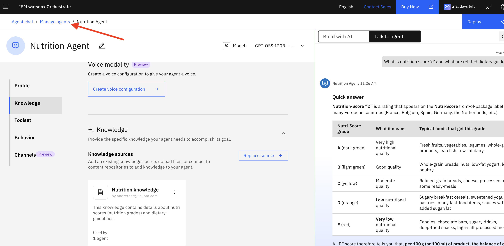

Clique no link 'Create agent +' como antes. O nome do agente supervisor é 'FreshLaneMarket Product Scout'. Insira isto como a descrição e clique em 'Create':

```
Um agente que encontra detalhes sobre produtos alimentícios.
```

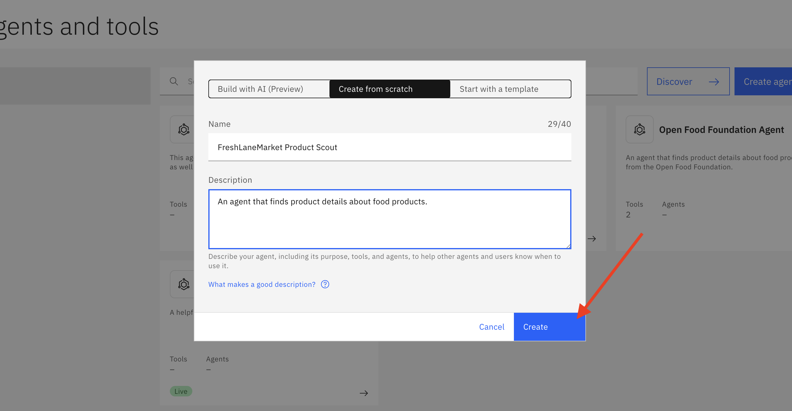

Role para baixo até a seção 'Toolset' e clique em 'Add agent +'.

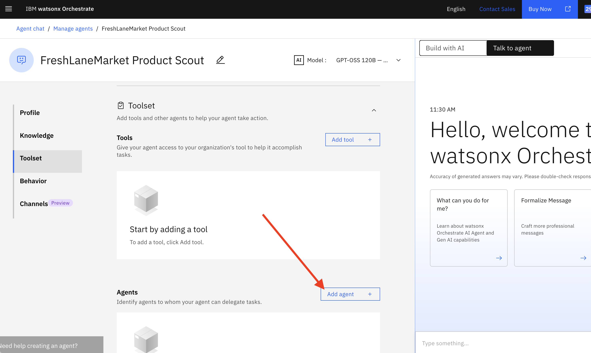

Use a opção 'Local instance'.

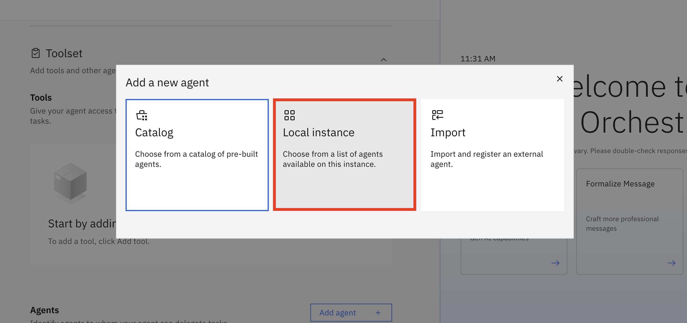

Certifique-se de selecionar todos os três agentes que criamos, ou seja, o 'Agente Recalls FDA', o 'Agente Nutricao' e o 'Agente Open Food Foundation'. Então clique em 'Add to agent.'


Agora role para baixo até a seção 'Behavior' e insira o seguinte no campo 'Instructions'.

```
Use the OpenFoodFoundation agent to retrieve information about products. You can use the same agent to retrieve an explanation of the nutrition grade of a given product.
Use the NutritionAndGuidelines agent for find explanations for a specific nutrition grade or score. Use the NutritionAndGuidelines agent also for dietary guidelines.
Use the FDARecalls agent to find out of there are any recalls for a given product name or barcode.
```

Assim como fizemos para ferramentas anteriormente, aqui dizemos ao agente supervisor quando usar um agente colaborador.

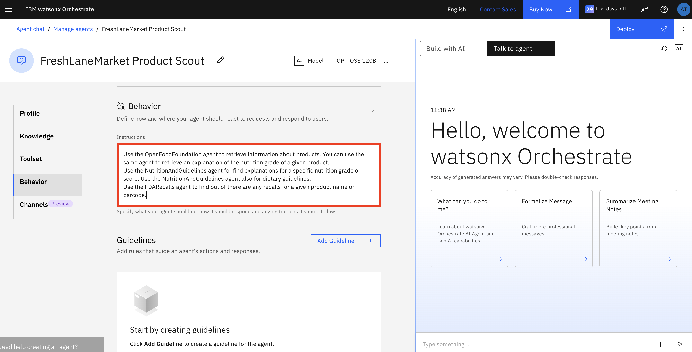

Pronto, estamos prontos para testar! Insira o seguinte no campo de entrada 'Preview':

```
Can you give me product information about Gatorade lemon lime including allergens and nutrition value, as well as potential FDA recalls? Please also give me a short explanation of its nutrition grade.
```

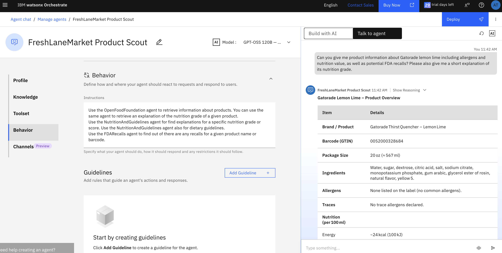

Se você expandir o raciocínio que ocorreu, notará que vários passos foram executados para responder à solicitação. O agente supervisor roteou a solicitação para os agentes colaboradores (neste caso, todos os três), os agentes colaboradores por sua vez usaram suas respectivas ferramentas, e finalmente o agente supervisor formulou a resposta final.

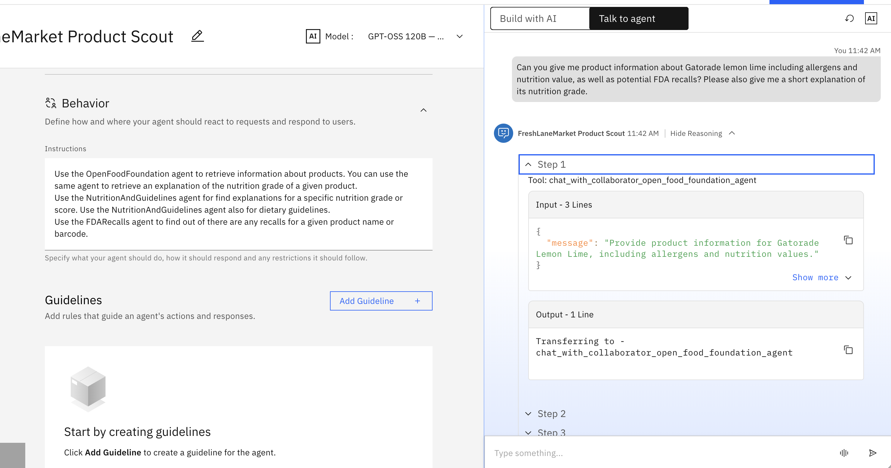

Tudo está funcionando conforme o esperado.

### Chat incorporado

Vamos assumir que queremos oferecer este agente para chat incorporado no website da FreshLane Markets. Para fazer isso, precisamos capturar o script que exibe o frontend do chat. Vá para a seção 'Channels'. Expanda a opção 'Embedded agent' e copie o script gerado para a área de transferência, como mostrado abaixo.

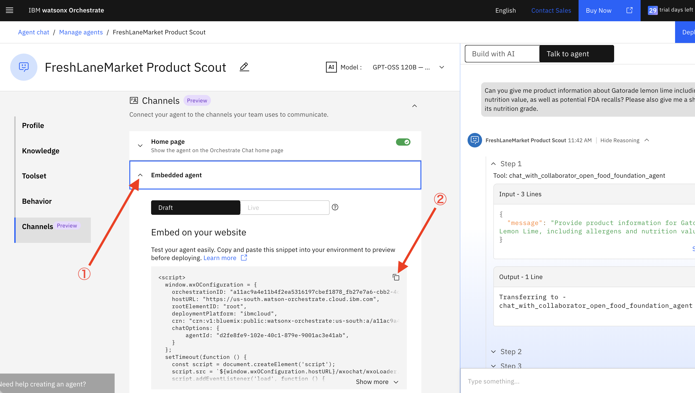

Neste exercício, simularemos o website da FreshLane Markets com um arquivo HTML simples. O script que acabamos de copiar para a área de transferência precisa ser adicionado a esse arquivo. Então vamos abrir o arquivo [index.html](./index.html) em um editor.

> Você pode ter que clicar com o botão direito no arquivo para abri-lo em um editor. Por padrão, ele seria carregado no seu navegador, mas antes de fazermos isso, precisamos editá-lo


Role até o final do arquivo e cole o conteúdo da área de transferência logo após a linha que diz `<!-- 🔌 Paste your chat widget <script> here.  -->`. (Certifique-se de que está antes do elemento `</body>`!)

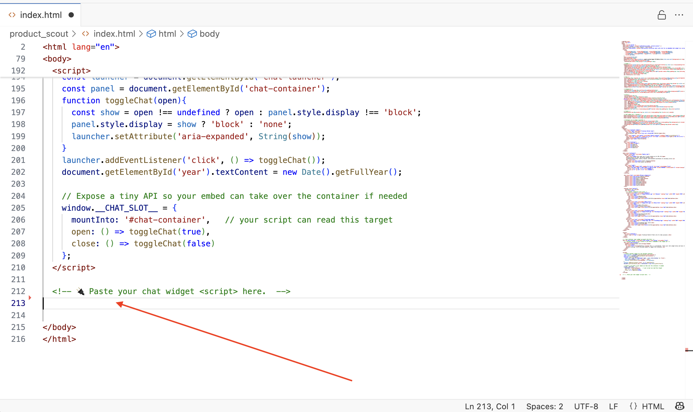

Depois de colar o código, salve o arquivo. Agora você pode simplesmente arrastar e soltar o arquivo em uma aba vazia do navegador, ou usar a opção 'File -> Open' do seu navegador.

> Note que para executar este arquivo com sucesso, você precisa ter a pasta inteira onde ele está baixada em sua máquina. Se você ainda não clonou o repositório inteiro em sua máquina, pode fazê-lo, ou baixar a pasta [usecases/product_scout](.) para sua máquina. Caso contrário, você estará perdendo as imagens que o arquivo index.html referencia.

Uma vez carregado, você deve ver um pequeno círculo azul no canto inferior direito da página.

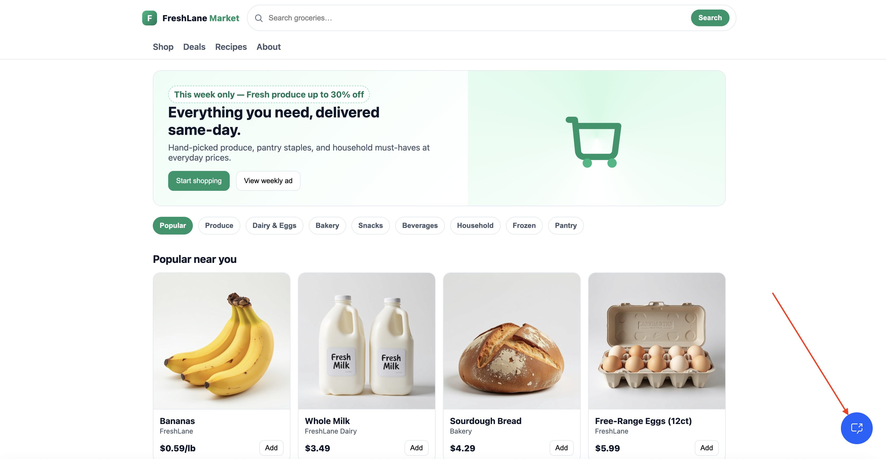

Clicar nesse círculo abre a janela de chat, que se parecerá com a janela Preview que tínhamos no construtor de agentes. Agora vamos validá-lo inserindo uma solicitação, por exemplo:

```
Can I get more information about Eggland's Best large eggs?
```

Note que você pode fazer perguntas de acompanhamento, por exemplo:

```
How about Chiquita bananas?
```

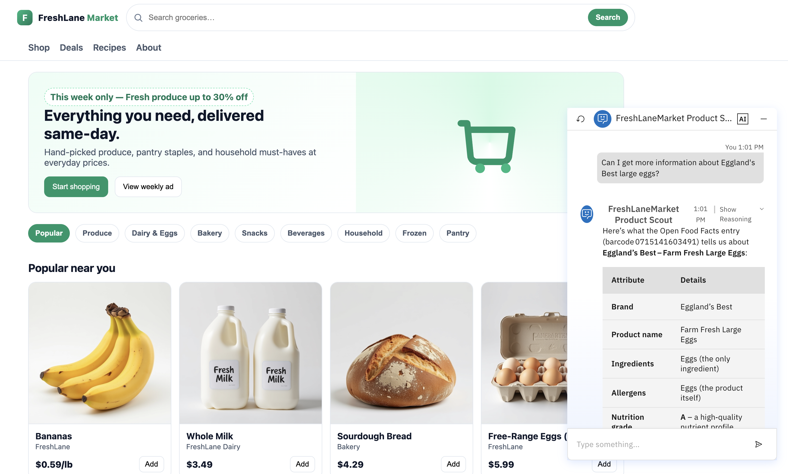

**Parabéns!**
Você construiu uma solução completa de IA agêntica que permite fazer perguntas sobre produtos alimentícios utilizando vários agentes e ferramentas para recuperar as informações necessárias em uma interface simples para seu cliente no seu website.