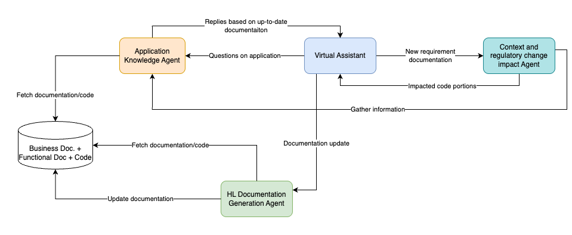
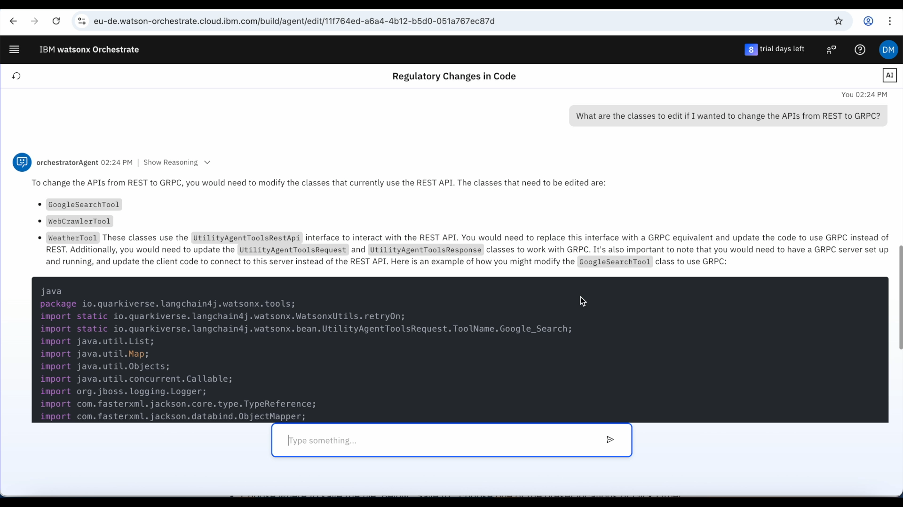

# Sumário
- [Sumário](#sumário)
- [🥇 Mudanças Regulatórias no Código](#-mudanças-regulatórias-no-código)
- [🤔 O Problema](#-o-problema)
- [🎯 Objetivo](#-objetivo)
- [📈 Valor de Negócio](#-valor-de-negócio)
- [🏛️ Arquitetura](#-arquitetura)
  - [Agentes Especializados](#agentes-especializados)
- [🎥 Demonstração](#-demonstração)
- [📝 Laboratório prático passo a passo](#-laboratório-prático-passo-a-passo)

# 🥇 Mudanças Regulatórias no Código

Neste laboratório, você vai construir e implementar um **Sistema de Análise de Impacto de Código orientado por IA**, projetado para automatizar a análise de impacto de mudanças regulatórias e funcionais em aplicações complexas e legadas. Usaremos a **ABC Corp**, uma empresa fictícia em setor altamente regulado, como contexto para este caso de uso.

## 🤔 O Problema

O departamento de TI da ABC Corp – uma empresa que atua em setor altamente regulado – desenvolve e mantém várias aplicações complexas e legadas que carecem de documentação adequada. Melhorias funcionais frequentes e mudanças regulatórias dificultam a inovação.

**Desafios enfrentados:**

Quando recebem requisitos para novas funcionalidades ou mudanças regulatórias para cumprir, o departamento de TI da ABC Corp gastava muito tempo entendendo qual seria o impacto e esforço necessário e onde intervir.

**Problemas incluem:**

- **Forte dependência de integradores de sistemas** que desenvolveram a aplicação e do arquiteto – às vezes envelhecido ou prestes a se aposentar – que projetou ou mantém a aplicação

- **Possíveis multas regulatórias** se mudanças regulatórias não forem feitas de forma oportuna e adequadamente documentadas

- **Lento time-to-market** e taxas de consultoria caras

- **Perda de conhecimento** quando especialistas deixam a empresa

- **Documentação desatualizada** que não reflete o estado atual do código

## 🎯 Objetivo

A ABC Corp planeja implementar uma ferramenta de **Análise de Impacto de Código orientada por IA** para automatizar e agilizar tal análise, também ingerindo e retendo o conhecimento de aplicação dos SMEs (Subject Matter Experts) e disponibilizando-o para cada desenvolvedor e usuário de negócio.

**Este sistema ajudará as equipes de DevOps a:**

✅ Identificar rapidamente porções de código impactadas

✅ Gerar documentação atualizada após cada release da aplicação

✅ Superar ineficiências de pesquisa manual e documentação desatualizada

✅ Preservar conhecimento de especialistas no sistema

✅ Responder perguntas sobre impacto de mudanças regulatórias

✅ Manter documentação funcional e de negócio sempre atualizada

## 📈 Valor de Negócio

**Para Equipes de Desenvolvimento:**
- **Manutenção de código simplificada**: Análise automatizada de impacto reduz tempo de pesquisa
- **Risco reduzido de perda de conhecimento**: Conhecimento de SMEs capturado e disponível
- **Onboarding acelerado**: Novos desenvolvedores têm acesso a documentação completa e atualizada
- **Tempos de implementação reduzidos**: Identificação rápida de áreas impactadas

**Para o Negócio:**
- **Conformidade regulatória**: Mudanças regulatórias implementadas de forma oportuna e documentadas adequadamente
- **Redução de custos**: Menos dependência de consultores externos caros
- **Time-to-market melhorado**: Análise de impacto mais rápida acelera entregas
- **Mitigação de riscos**: Evita multas regulatórias por não conformidade

**Para a Organização:**
- **Documentação sempre atualizada**: Funcional e técnica refletindo estado atual
- **Eficiência aumentada**: Automação de tarefas manuais e repetitivas
- **Qualidade melhorada**: Análise consistente e completa de impactos
- **Independência de fornecedores**: Menor lock-in com integradores de sistemas

## 🏛️ Arquitetura

Para agilizar o processo de análise de impacto devido a mudanças em regulamentações e contexto, projetamos um **Sistema de IA Multiagente** que pode gerar documentação de negócio e funcional, sugerir em quais porções de código executar modificações ou inserir melhorias, além de responder perguntas tecnológicas e de alto nível sobre as aplicações em escopo.

Este sistema aproveita uma abordagem colaborativa multiagente para apoiar a equipe de DevOps, garantindo eficiência e precisão.

### Agentes Especializados

A arquitetura consiste em agentes de IA especializados trabalhando juntos para executar funções-chave:

**1. HL Documentation Generation Agent (Agente de Geração de Documentação de Alto Nível)**
- Cria e atualiza documentação funcional/de alto nível
- Aproveita código e documentação existente
- Incorpora informações fornecidas pelo usuário

**2. Application Knowledge Agent (Agente de Conhecimento da Aplicação)**
- Especialista no domínio da aplicação
- Responde perguntas específicas sobre documentação de negócio e funcional
- Fornece porções de código relacionadas
- Acessa base de conhecimento com código-fonte e documentação de negócio

**3. Context and Regulatory Change Impact Agent (Agente de Impacto de Mudanças Regulatórias)**
- Avalia análise de impacto que requisitos e mudanças regulatórias podem ter no código
- Identifica pacotes e classes que precisam ser modificados
- Colabora com Application Knowledge Agent para obter informações

**4. Regulatory Change Orchestrator Agent (Agente Orquestrador)**
- Coordena todos os agentes especializados
- Interpreta solicitações dos usuários
- Delega tarefas aos agentes apropriados
- Combina resultados para fornecer respostas completas

**Fluxo de Trabalho:**

Este sistema aproveita o poder dos agentes do watsonx Orchestrate para:
- Automatizar análise de mudanças
- Aprimorar qualidade da documentação
- Minimizar esforço manual e tempo gasto no onboarding de novos desenvolvedores na equipe de DevOps

Através do assistente de chat do watsonx Orchestrate, os agentes colaboram e delegam tarefas suavemente, entregando insights abrangentes e permitindo tomada de decisão informada.

## 🎥 Demonstração

Veja o vídeo que demonstra a solução completa:

[▶️ Assistir demonstração do Regulatory Changes in Code](video/Regulatory_changes_in_code_demo.mp4)

## 📝 Laboratório prático passo a passo

👉👉👉 [Clique aqui](./hands-on-lab-regulatory-changes-in-code.md) para acessar as instruções detalhadas e implementar este caso de uso.

Neste laboratório você vai:

1. **Criar o Application Knowledge Agent** - Especialista em documentação e código da aplicação
2. **Criar o HL Documentation Generation Agent** - Para gerar e atualizar documentação funcional
3. **Criar o Context and Regulatory Change Impact Agent** - Para avaliar impacto de mudanças regulatórias
4. **Criar o Regulatory Change Orchestrator Agent** - Agente principal que coordena todos os outros
5. **Testar o sistema completo** - Validar análise de impacto e geração de documentação

**Tempo estimado**: 90-120 minutos

**Pré-requisitos**:
- Acesso ao watsonx Orchestrate
- Conclusão do guia de [configuração de ambiente](../../environment-setup)
- Familiaridade com conceitos de agentes de IA
- Conhecimento básico de desenvolvimento de software

---

> [!NOTE]
> A nova versão do watsonx Orchestrate foi lançada em 29 de junho de 2025, portanto as capturas de tela podem não estar atualizadas com a UI atual do serviço. Atualizações desta documentação estão previstas em breve.

> [!IMPORTANT]
> Se você é um instrutor executando este laboratório, verifique os **Guias do Instrutor** para configurar todos os ambientes e sistemas necessários.

**Features demonstradas**: `Multi-agent orchestration` `Code analysis` `Documentation generation` `Regulatory compliance` `Knowledge retention` `Impact analysis`