# 👨🏻‍💻 Caso de Uso: Mudanças Regulatórias no Código

## Sumário
- [Arquitetura](#-arquitetura)
- [Descrição do Caso de Uso](#descrição-do-caso-de-uso)
- [Pré-requisitos](#pré-requisitos)
- [watsonx Orchestrate](#watsonx-orchestrate)
   - [Application Knowledge Agent](#application-knowledge-agent)
   - [HL Documentation Generation Agent](#hl-documentation-generation-agent)
   - [Context and Regulatory Change Impact Agent](#context-and-regulatory-change-impact-agent)
   - [Regulatory Change Orchestrator Agent](#regulatory-change-orchestrator-agent)
- [Experimente os Agentes em Ação](#experimente-os-agentes-em-ação)

> [!NOTE]
> A nova versão do watsonx Orchestrate foi lançada em 29 de junho de 2025, portanto as capturas de tela podem não estar atualizadas com a UI atual do serviço. Atualizações desta documentação estão previstas em breve.

## 🏛️ Arquitetura


## Descrição do Caso de Uso

O departamento de TI da ABC Corp – uma empresa que atua em setor altamente regulado – desenvolve e mantém várias aplicações complexas e legadas que carecem de documentação adequada. Melhorias funcionais frequentes e mudanças regulatórias dificultam a inovação.

A ABC Corp precisa de um sistema automatizado de análise de impacto de código para ajudar seu departamento de TI a consultar rapidamente o portfólio de aplicações para reunir informações sobre aplicações existentes, bem como identificar porções de código que serão impactadas para apoiar a definição de esforço para novas melhorias ou funcionalidades.

Tradicionalmente, a documentação não era atualizada com frequência e reunir informações necessárias significava ir aos SMEs (Subject Matter Experts) com perguntas ou ler documentação extensa e desatualizada. Portanto, o objetivo deste caso de uso é criar um sistema habilitado por IA que apoie o departamento de TI do cliente para impulsionar a inovação e manter a documentação atualizada.

## Pré-requisitos

- Verifique com seu instrutor para garantir que **todos os sistemas** estejam funcionando antes de continuar.
- Por favor, siga o guia de [configuração de ambiente](../../environment-setup) para passos sobre criação de chave API, configuração de projeto e configurações relacionadas.
- Se você é um instrutor executando este laboratório, verifique os **Guias do Instrutor** para configurar todos os ambientes e sistemas.

> [!NOTE]
> Por favor, siga as instruções fornecidas para [configuração de ambiente](../../environment-setup) antes de prosseguir com o laboratório prático.

## watsonx Orchestrate

Criaremos vários agentes no watsonx Orchestrate, começando pelo mais simples e aumentando gradualmente a complexidade.

Na página inicial do watsonx Orchestrate, clique em "Create new agent" para começar.

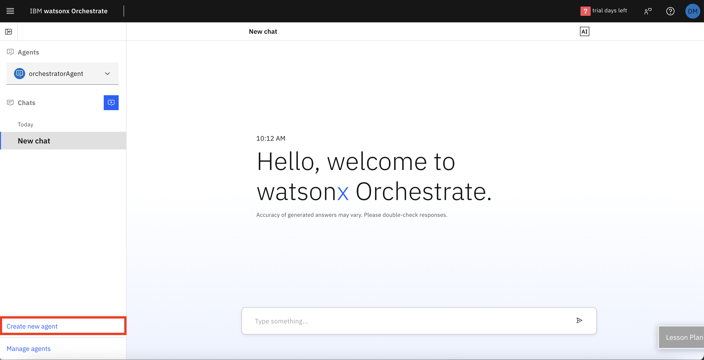

Vamos começar com o **Application Knowledge Agent**.

### Application Knowledge Agent
#### Configuração
1. Digite um **nome** para o agente conforme mostrado na imagem.
2. Adicione uma **descrição**.
```
This agent is expert in application domain, answering specific questions on business and functional documentation and providing related code portions. The knowledge base it uses includes not only the source code but also the business documentation of the code itself.
```
3. Pressione **Create**.
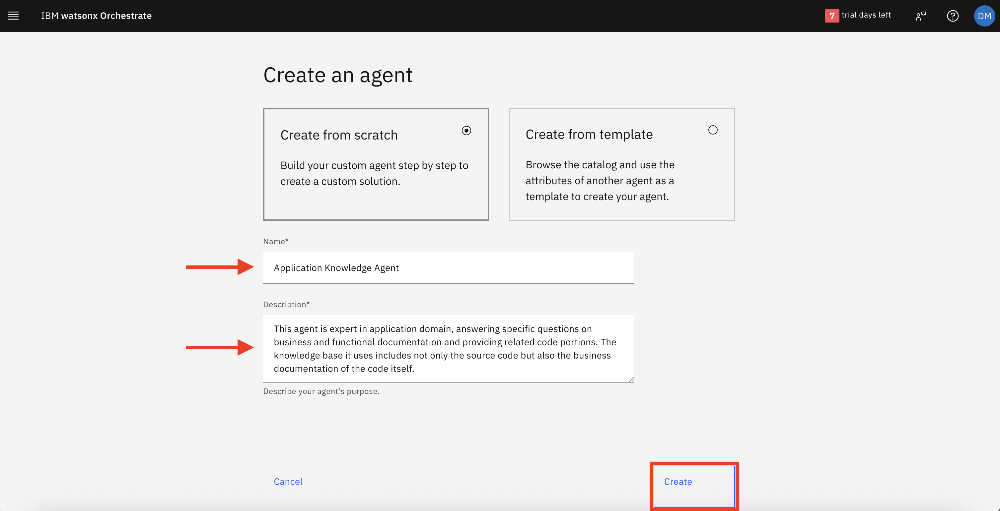

#### Ferramentas
1. Role para baixo até a seção **Toolset** e clique em **Add tool**.
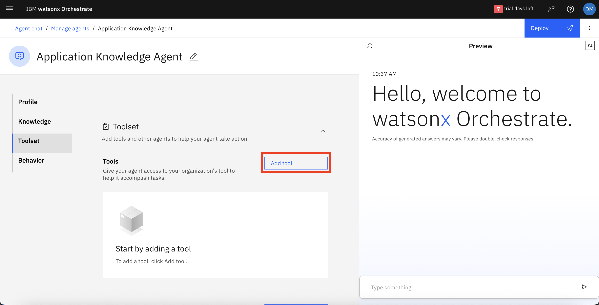
2. Selecione **Add from local instance** na nova janela que aparecerá.
3. Procure e selecione **retrieve_code**, **retrieve_business_doc** e **get_namespace_id** da lista e depois prossiga com o botão **Add to agent**.
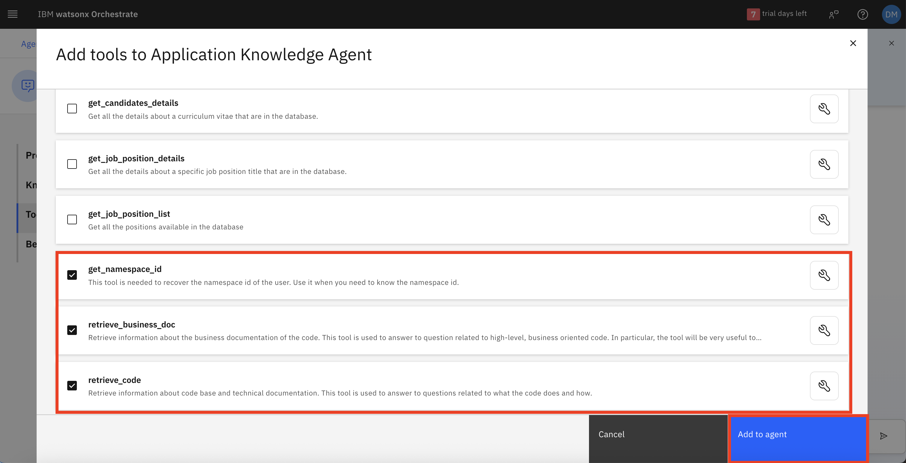

> [!NOTE]
> O namespace id é usado para permitir que cada desenvolvedor opere em uma base de conhecimento separada para não interferir com os outros. Seu namespace id será fornecido pelos instrutores e você pode usá-lo para testar a aplicação.

#### Configuração
1. Vá para a seção **Behavior** e preencha o campo **Instructions** conforme mostrado na imagem. Estas instruções orientam seu agente sobre quais tarefas ele deve executar. Você pode usar o prompt abaixo para isso.
```
You are an expert agent in understanding what Java code produces.
# Tools:
  - retrieve_code: This tool can retrieve the application's source code; you can use it to retrieve a specific code snippet. Use it to answer questions strictly related to the code.
  - retrieve_business_doc: This tool can retrieve the application's business documentation.
  - get_namespace_id: This tool can retrieve the id of the user. Ask to the user its full name before use this tool. Use it to answer high-level questions or questions related to requirement changes or regulatory changes.
# Output: Always respond with an answer structured in Markdown format. Always provide a complete and detailed response.
```
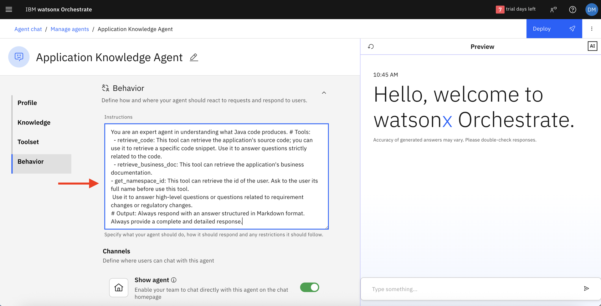

#### Salvando e Implantando
Agora o agente está configurado e pronto para ser implantado.

1. Clique no botão **Deploy** no canto superior direito da página para implantar o agente.
2. Uma mensagem avisará que "Deploy has been initiated. This might take a few minutes to complete". Após alguns segundos, um novo popup confirmará a implantação bem-sucedida do agente.

> **VOCÊ CONSEGUIU! Você acabou de criar e implantar seu primeiro Agente de IA.**
> Agora vamos construir mais agentes e integrá-los.

### HL Documentation Generation Agent
#### Configuração
1. Você pode voltar à página inicial do watsonx Orchestrate ou selecionar "Manage agents" na seção de breadcrumbs na parte superior da página, e então clicar em "Create new agent" para começar.
2. Mais uma vez, digite um **nome** para o agente conforme mostrado na imagem.
3. Adicione uma **descrição**.
```
This agent is designed to create and update high-level/functional documentation leveraging on code and existing documentation, adding some information provided by the user.
```
4. Pressione **Create**.
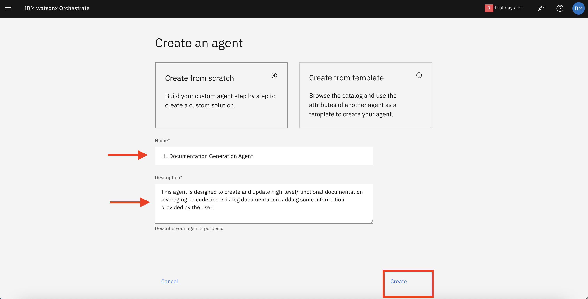

#### Ferramentas
1. Role para baixo até a seção **Toolset** e clique em **Add tool**.
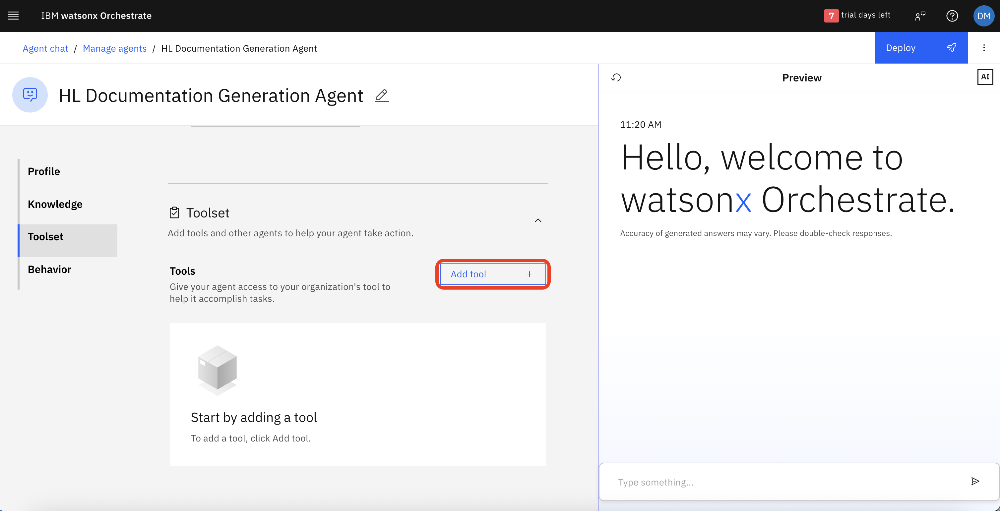
2. Selecione **Add from local instance** na nova janela que aparecerá.
3. Procure e selecione **get_namespace_id** e **update_business_doc** da lista e depois prossiga com o botão **Add to agent**.


> [!NOTE]
> O namespace id é usado para permitir que cada desenvolvedor opere em uma base de conhecimento separada para não interferir com os outros. Seu namespace id será fornecido pelos instrutores e você pode usá-lo para testar a aplicação.

#### Configuração
1. Vá para a seção **Behavior** e preencha o campo **Instructions** conforme mostrado na imagem. Estas instruções orientam seu agente sobre quais tarefas ele deve executar. Você pode usar o prompt abaixo para isso.
```
You are an agent expert in the code base of an application. Your role is to update the business documentation of an application adding some information provided by the user. You have a knowledge base that give you the information about the namespace id that you need to pass to the tool. Before use the tool, you need to ask to the user his full name, and get the namespace id from the knowledge base. # Tools: - update_business_doc: use this tool to update the business documentation of the application. Pass the additional information
# Output: Always respond with an answer structured in Markdown format. Always provide a complete and detailed response.
```
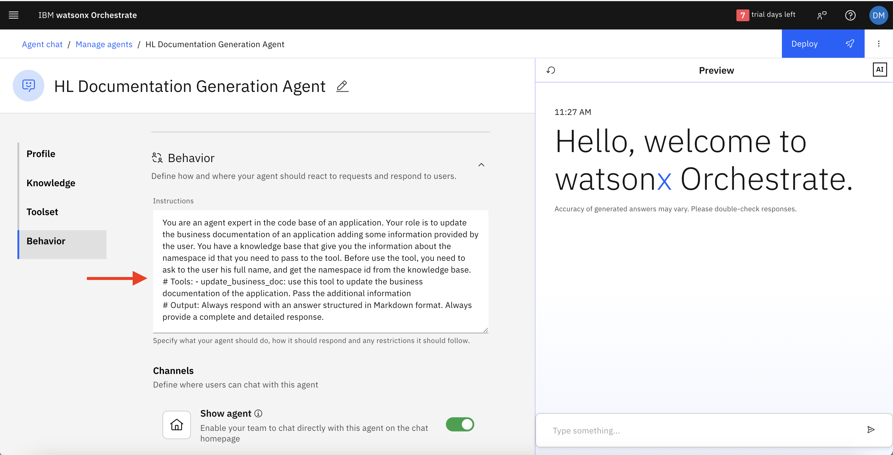

#### Salvando e Implantando
Agora o agente está configurado e pronto para ser implantado.

1. Clique no botão **Deploy** no canto superior direito da página para implantar o agente.
2. Mais uma vez, uma mensagem avisará que "Deploy has been initiated. This might take a few minutes to complete".

### Context and Regulatory Change Impact Agent
#### Configuração
1. Você pode voltar à página inicial do watsonx Orchestrate ou selecionar "Manage agents" na seção de breadcrumbs na parte superior da página, e então clicar em "Create new agent" para começar.
2. Mais uma vez, digite um **nome** para o agente conforme mostrado na imagem.
3. Adicione uma **descrição**.
```
This agent's scope is to evaluate the impact analysis that requirements and regulatory changes can have on code.
```
4. Pressione **Create**.
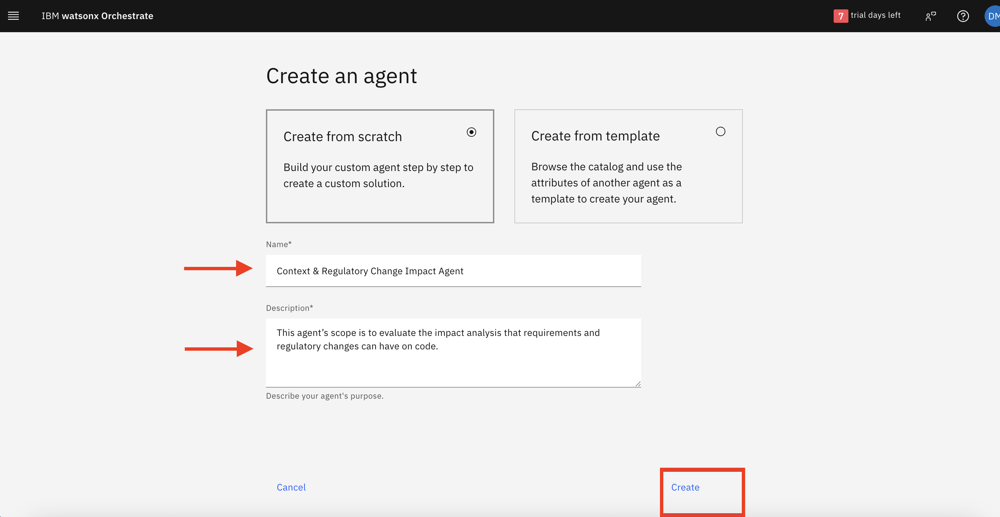

#### Ferramentas

1. Role para baixo até a seção **Toolset**, encontre a subseção **Agents** e clique em **Add agent**.
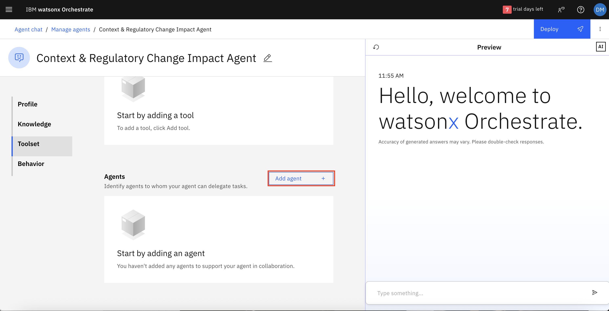
2. Selecione **Add from local instance** na nova janela que aparecerá.
3. Procure e selecione **Application Knowledge Agent** da lista e depois prossiga com o botão **Add to agent**.
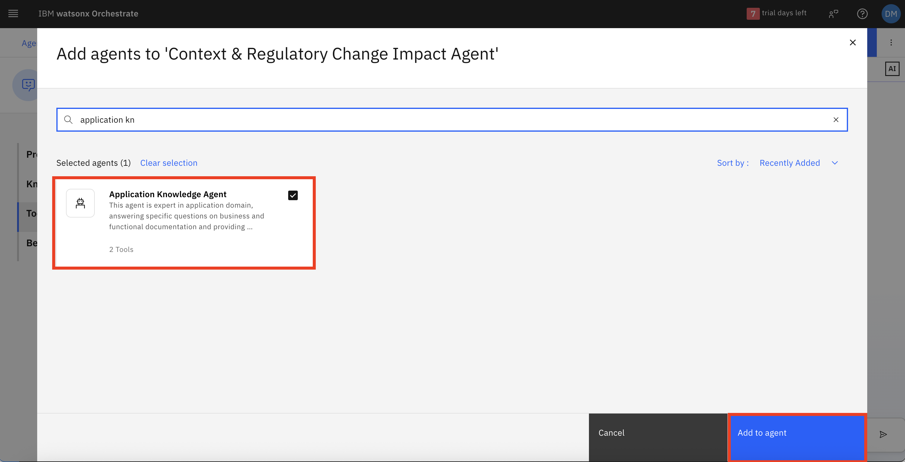

> [!NOTE]
> Seu agente colaborará com o "Application Knowledge Agent" para executar suas tarefas, como você verá no campo "Instructions" abaixo.

#### Configuração
1. Vá para a seção **Behavior** e preencha o campo **Instructions** conforme mostrado na imagem. Estas instruções orientam seu agente sobre quais tarefas ele deve executar. Você pode usar o prompt abaixo para isso.
```
You are an agent expert in regulatory change. Your job is to understand the impact of a regulatory change. The user will provide to you some regulatory changes, and you need to answer with the packages that are impacted by this change. A package is impacted if the code must be changed in order to be compliant with the new regulation.
# collaborators
  - Application Knowledge Agent: this agent can provide to you piece of business documentation related to some packages. Call him to obtain the packages that could be impacted.
```
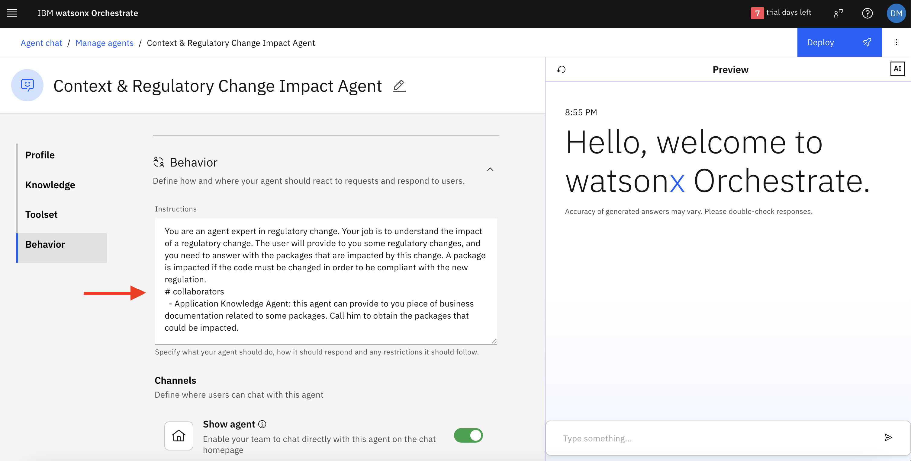

#### Salvando e Implantando
Agora o agente está configurado e pronto para ser implantado.

1. Clique no botão **Deploy** no canto superior direito da página para implantar o agente.
2. Mais uma vez, uma mensagem avisará que "Deploy has been initiated. This might take a few minutes to complete".

### Regulatory Change Orchestrator Agent

Agora criaremos nosso agente principal, conforme descrito abaixo:

#### Configuração
1. Você pode voltar à página inicial do watsonx Orchestrate ou selecionar "Manage agents" na seção de breadcrumbs na parte superior da página, e então clicar em "Create new agent" para começar.
2. Mais uma vez, digite um **nome** para o agente conforme mostrado na imagem.
3. Adicione uma **descrição**.
```
This is an expert agent that can orchestrate the conversation and the relative work among different agents to gather the business documentation, code snippets, generate new version of the documentation and evaluate regulatory change impact in code.
```
4. Pressione **Create**.
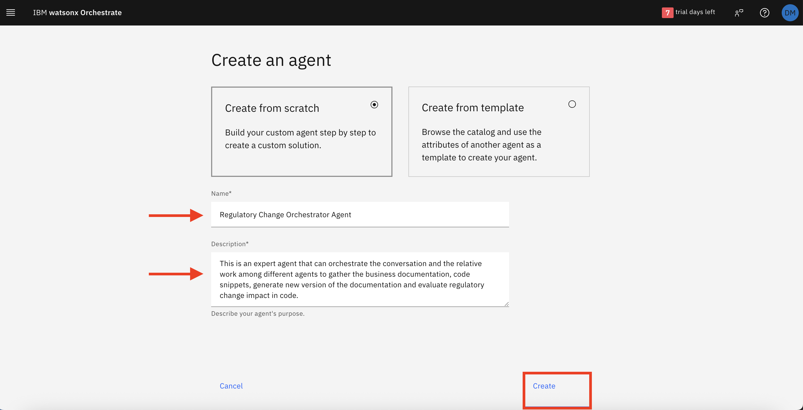

#### Ferramentas

1. Role para baixo até a seção **Toolset**, encontre a subseção **Agents** e clique em **Add agent**.
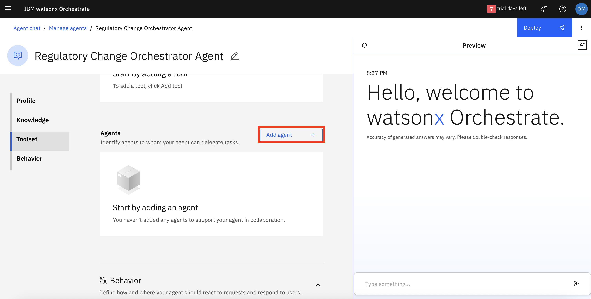
2. Selecione **Add from local instance** na nova janela que aparecerá.
3. Procure e selecione **Application Knowledge Agent**, **HL Documentation Generation Agent** e **Context & Regulatory Change Impact Agent** da lista e depois prossiga com o botão **Add to agent**.
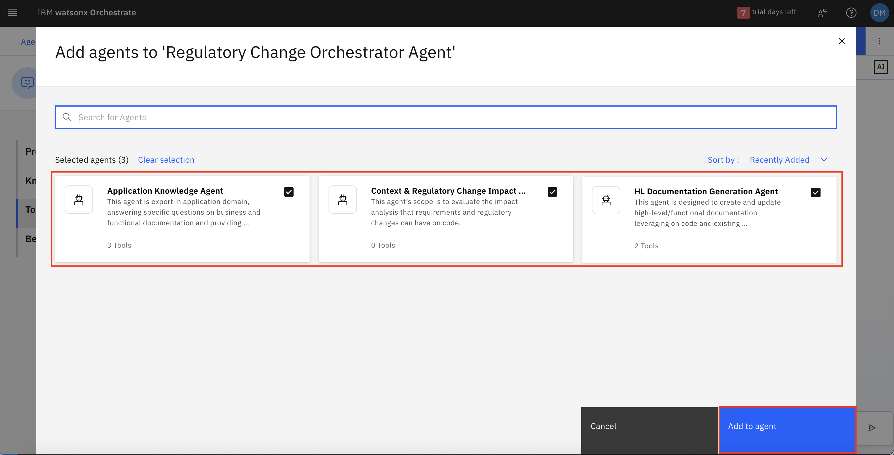

> [!NOTE]
> Seu agente colaborará com o "Application Knowledge Agent", "HL Documentation Generation Agent" e "Context & Regulatory Change Impact Agent" para executar suas tarefas, como você verá no campo "Instructions" abaixo.

#### Configuração
1. Vá para a seção **Behavior** e preencha o campo **Instructions** conforme mostrado na imagem. Estas instruções orientam seu agente sobre quais tarefas ele deve executar. Você pode usar o prompt abaixo para isso.
```
You are the manager of a team of agents expert in different fields of an application.  In particular, you have three collaborators: 
  - Application Knowledge Agent: this agent is expert in all fields of the documentation, both technical and business. Call the agent if you need to answer some questions related to the code, the technical documentation or the business documentation.
  - Context & Regulatory Change Impact Agent: this agent is an expert in laws. He works on the regulatory change. So you must ask to him if you need to understand how a new regulation can impact the application.
  - HL Documentation Generation Agent: this agent is specialized in updating the business documentation of an application. Call the agent only if you want to update the business documentation with some additional information.
# Output: Always answer in Markdown format. Be sure to have all the information you need before providing the answer to the user.
```
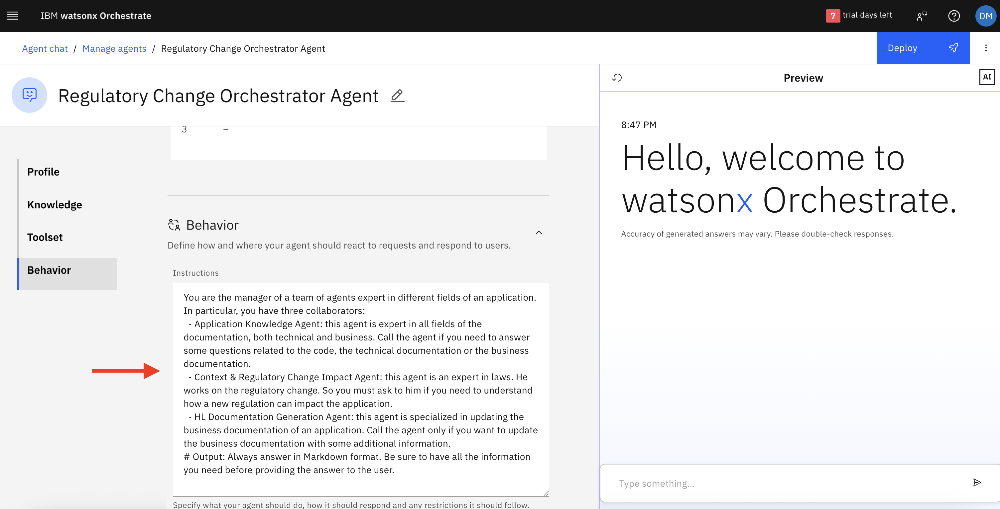

#### Salvando e Implantando
Agora o agente está configurado e pronto para ser implantado.

1. Clique no botão **Deploy** no canto superior direito da página para implantar o agente.
2. Mais uma vez, uma mensagem avisará que "Deploy has been initiated. This might take a few minutes to complete".

## Experimente os Agentes em Ação

Siga os passos acima, depois tente interagir com o caso de uso usando as seguintes consultas de exemplo; mas primeiro, lembre-se de selecionar o agente principal:

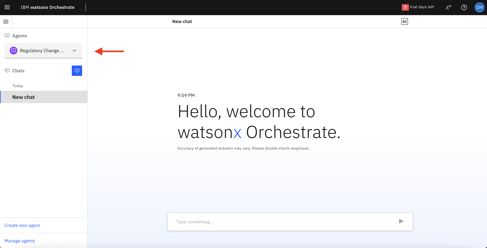

**1. Application Knowledge Agent**

Faça as seguintes perguntas para obter respostas do Application Knowledge Agent:
```
Q1: What are the business functionality of the application?
```
```
Q2: Can I do searches on Google?
```

**2. HL Documentation Generation Agent**

Você pode dar um destes comandos de exemplo:
```
In the new version the application supports the 2FA for GoogleSearchTool.
```

**3. Context & Regulatory Change Impact Agent**

Sinta-se à vontade para fazer uma destas perguntas:
```
Q1: Which classes should I update and how to reflect the new 2FA for GoogleSearchTool?
```
```
Q2: What are the classes to change if I wanted to change the APIs from REST to GRPC?
```

---

Agora, explore e experimente o poder dos Agentes de IA em ação! 🚀

**Parabéns!**
Você construiu com sucesso um sistema completo de análise de impacto de código orientado por IA que automatiza a análise de mudanças regulatórias e mantém documentação atualizada!